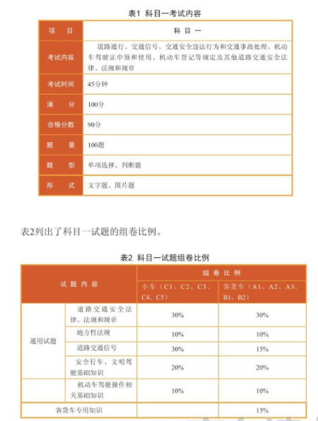
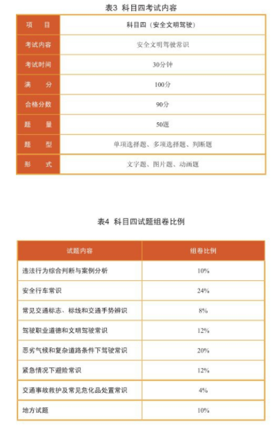
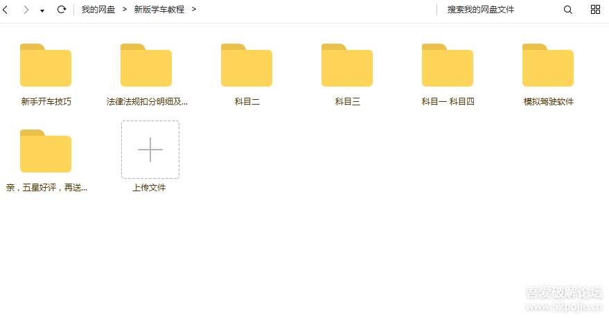
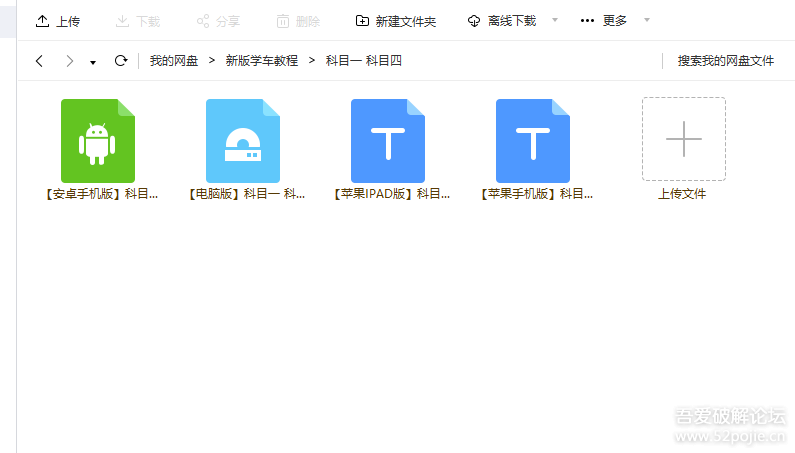
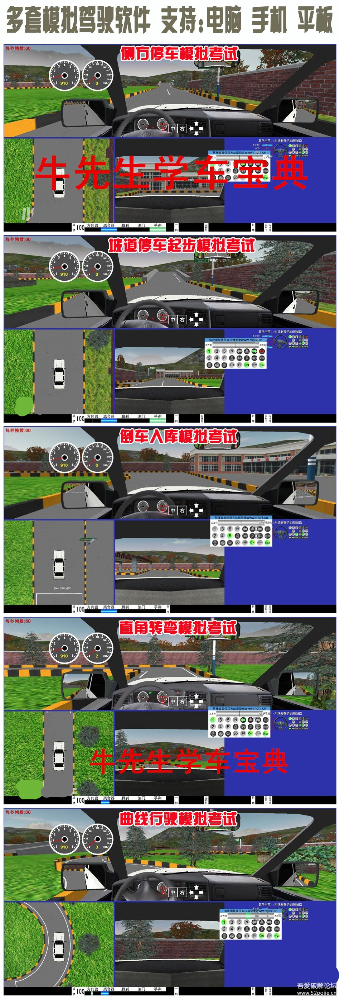
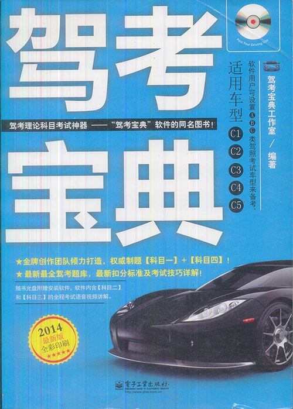

# skill-driving

## 本仓库内容

* 驾考记录-学习笔记~

```
Something I hope you know before go into the coding~
First, please watch or star this repo, I'll be more happy if you follow me.
Bug report, questions and discussion are welcome, you can post an issue or pull a request.
```

## 目录

* [读我](README.md)
* [道路交通安全法律+法规](docs/道路交通安全法律+法规.md)
    * [机动车驾驶证和机动车管理](docs/道路交通安全法律+法规/机动车驾驶证和机动车管理.md)
* [道路交通信号灯](docs/道路交通信号灯.md)
* [安全行车、文明驾驶基础常识](docs/安全行车、文明驾驶基础常识.md)
* [安全行车常识](docs/安全行车常识.md)
* [驾驶职业道德和文明驾驶常识](docs/驾驶职业道德和文明驾驶常识.md)
* [恶劣气候和复杂道路条件下驾驶常识](docs/恶劣气候和复杂道路条件下驾驶常识.md)
* [紧急情况下避险常识](docs/紧急情况下避险常识.md)
* [交通事故救护及常见危化品处置常识](docs/交通事故救护及常见危化品处置常识.md)
* [机动车基础知识](docs/机动车基础知识.md)
    * [前轮驱动还是后轮驱动](docs/机动车基础知识/前轮驱动还是后轮驱动.md)
    * [汽车发动基本原理](docs/机动车基础知识/汽车发动基本原理.md)
    * [机动车车载灯光](docs/机动车基础知识/机动车车载灯光.md)
    * [发动机基本原理](docs/机动车基础知识/发动机基本原理.md)
    * [离合器知多少](docs/机动车基础知识/离合器知多少.md)
    * [后视镜知多少](docs/机动车基础知识/后视镜知多少.md)
    * [方向盘知多少](docs/机动车基础知识/方向盘知多少.md)
    * [刹车知多少](docs/机动车基础知识/刹车知多少.md)
    * [abs知多少](docs/机动车基础知识/abs知多少.md)
    * [油门知多少](docs/机动车基础知识/油门知多少.md)
    * [档位知多少](docs/机动车基础知识/档位知多少.md)
    * [手刹知多少](docs/机动车基础知识/手刹知多少.md)
    * [速度表和转速表知多少](docs/机动车基础知识/速度表和转速表知多少.md)
    * [训练车型](docs/机动车基础知识/训练车型.md)
    * [坐姿知多少](docs/机动车基础知识/坐姿知多少.md)
    * [神奇的车感](docs/机动车基础知识/神奇的车感.md)
    * [雨刮的妙用](docs/机动车基础知识/雨刮的妙用.md)
    * [小型C1手动挡](docs/机动车基础知识/小型C1手动挡.md)
    * [桑塔纳](docs/机动车基础知识/桑塔纳.md)
* [科目二](docs/科目二.md)
    * [倒车入库](docs/科目二/倒车入库.md)
    * [侧方停车](docs/科目二/侧方停车.md)
    * [曲线行驶](docs/科目二/曲线行驶.md)
    * [直角转弯](docs/科目二/直角转弯.md)
    * [陡坡定点停车与起步](docs/科目二/陡坡定点停车与起步.md)
* [科目三](docs/科目三.md)
    * [模拟夜间场景灯光使用](docs/科目三/模拟夜间场景灯光使用.md)
    * [上车准备](docs/科目三/上车准备.md)
    * [起步](docs/科目三/起步.md)
    * [变更车道](docs/科目三/变更车道.md)
    * [直线行驶](docs/科目三/直线行驶.md)
    * [通过公共汽车站](docs/科目三/通过公共汽车站.md)
    * [通过学校区域](docs/科目三/通过学校区域.md)
    * [通过路口](docs/科目三/通过路口.md)
    * [通过人行横道线](docs/科目三/通过人行横道线.md)
    * [会车](docs/科目三/会车.md)
    * [超车](docs/科目三/超车.md)
    * [掉头](docs/科目三/掉头.md)
    * [加减档操作](docs/科目三/加减档操作.md)
    * [路口左转弯](docs/科目三/路口左转弯.md)
    * [路口右转弯](docs/科目三/路口右转弯.md)
    * [靠边停车](docs/科目三/靠边停车.md)
    * [桑塔纳照片](docs/科目三/桑塔纳照片.md)
    * [科目三易错点汇总](docs/科目三/科目三易错点汇总.md)
    * [手动变速器原理](docs/科目三/手动变速器原理.md)
* [科目四](docs/科目四.md)
    * [科目四易错点记忆](docs/科目四/科目四易错点记忆.md)
    * [常错题](docs/科目四/常错题.md)
* [学车模拟器](docs/学车模拟器.md)
    * [墨泥驾考软件](docs/学车模拟器/墨泥驾考软件.md)
* [绕口令](docs/绕口令.md)
* [学车记录](docs/学车记录.md)
* [考场信息](docs/考场信息.md)

## 考试大纲





## 参考教程








```
附上链接：链接：https://pan.baidu.com/s/1jTmRgB9qE2127oMPwa3cOw 密码：xf83
来源:<https://www.52pojie.cn/thread-713239-1-1.html>
```

```
D:.
|   参考教程来源.txt
|
\---新版学车教程
    |   内含破解版与原版公安部111号令理论模拟考试系统.rar
    |
    +---新手开车技巧
    |       1、机件识别.rmvb
    |       2、驾驶姿势.rmvb
    |       3、基础动作.rmvb
    |       制动距离加长.mp4
    |       学车.doc
    |       学车资料.doc
    |       怎样学开车.avi
    |       教你如何判断左右前后车距 .doc
    |       新手上路停车技巧？.avi
    |       新手上路如何跟车？.avi
    |       新手上路避免熄火.avi
    |       新手如何打方向盘，方向盘标准操作方法！ 高清.mp4
    |       新手开车技巧学习必备-最全收集(含停车技巧....pdf
    |       汽车原地驾驶（模拟驾驶）.flv
    |       汽车起步、换档、方向、制动.avi
    |       驾驶员培训资料.doc
    |       驾驶姿势.rmvb
    |       驾驶姿势和方向盘.flv
    |
    +---模拟驾驶软件
    |       【安卓手机版】墨泥模拟驾驶软件.apk
    |       【安卓手机版】驾考宝贝.apk
    |       【电脑安装版】墨泥模拟驾驶软件2.2.rar
    |       【电脑版】驾考宝贝模拟驾驶软件.zip
    |       【电脑解压版】墨泥模拟驾驶软件2.1.zip
    |       【苹果手机版】墨泥模拟驾驶软件.txt
    |
    +---法律法规扣分明细及各种标志解释
    |       全国最新最全交通标志大全-交警手势大全-交通标志和交警手势图解.doc
    |       常用交通信号图解.doc
    |       新机动车驾驶培训教学与考试大纲.doc
    |       新规电子化科目二扣分标准注意事项及操作技巧.doc
    |       最新交通标志大全图解.doc
    |       汽车硬件操作图解.doc
    |
    +---科目一 科目四
    |       【安卓手机版】科目一 科目四学习软件.apk
    |       【电脑版】科目一 科目四学习软件.exe
    |       【苹果IPAD版】科目一 科目四学习软件.txt
    |       【苹果手机版】科目一 科目四学习软件.txt
    |
    +---科目三
    |   |   最新录制 科目三 夜考版.mp4
    |   |   最新版科目三完整版.mp4
    |   |
    |   +---【供参考】科目三部分地区考试（视频）
    |   |       科目三.mp4
    |   |
    |   +---科目三图文详解
    |   |       不得不知道的实际道路安全驾驶考试技巧.doc
    |   |       夜间考试学员需注意什么？有哪些技巧？.doc
    |   |       实际道路驾驶考试过程需注意8项细节.doc
    |   |       科目三不同路况转弯技巧.doc
    |   |       科目三电子路考易出错知识点分析.doc
    |   |       驾考超车有技巧 做好三点超车不再难.doc
    |   |
    |   \---科目三必看视频
    |           【最新必看】上路考试【独家录制】.mp4
    |           【最新必看】最详细、实用的科目三考试视频教程.mp4
    |           【最新必看】科目三实际道路考试实时评判系统介绍.mp4
    |
    \---科目二
        +---3D动画科目二
        |       侧方停车动画教程.avi
        |       倒车入库动画教程 .avi
        |       坡道起步动画教程.avi
        |       曲线行驶动画教程.avi
        |       直接转弯动画教程.avi
        |
        +---新版科目二学车视频
        |       侧方停车.mp4
        |       倒车入库.mp4
        |       坡道定点停车与起步.mp4
        |       曲线行驶.mp4
        |       直角转弯.mp4
        |
        \---科目二 图文技巧讲解
            +---侧方停车
            |       新手侧方停车的实用技巧.doc
            |       详解侧方停车考试技巧之修正方法.doc
            |
            +---倒车入库
            |       倒车入库图片详解.doc
            |       学员分享几点倒车入库考试注意事项.doc
            |       新手驾驶必看的倒车入库技巧图解.doc
            |       新考规之倒库技巧图解.doc
            |       驾校教练自制科目二倒车入库示意图.doc
            |
            +---坡道定点停车和起步
            |       坡道定点停车与起步考试技巧文字解析.doc
            |       新考规之坡道定点停车技巧图解.doc
            |       过来人传授定点停车和坡道起步练车心得.doc
            |
            +---曲线行驶
            |       新考规之连续弯道技巧图解.doc
            |       曲线行驶考试攻略让你考试时不担忧.doc
            |
            +---直角转弯
            |       新考规之直角转弯技巧图解.doc
            |       直角转弯技巧攻略详解.doc
            |
            \---驾校评判标准
                    年驾校考试评判标准 最新扣分标准.doc
                    驾校科目二考试攻略 场内五项讲解.doc
```

## 参考书籍




## 总结

1. 理论联系实际
2. 安全第一
