# abs知多少

## abs定义

**制动防抱死系统（antilock brake system）简称ABS**。作用就是在汽车制动时，自动控制制动器制动力的大小，使车轮不被抱死，处于边滚边滑（滑移率在20%左右）的状态，以保证车轮与地面的附着力在最大值。

## abs产生原理-为了紧急制动的时候依然能够控制方向

为了刹车的时候，紧急刹车，避免车轮抱死，什么意思呢？拿玩具车做实验。

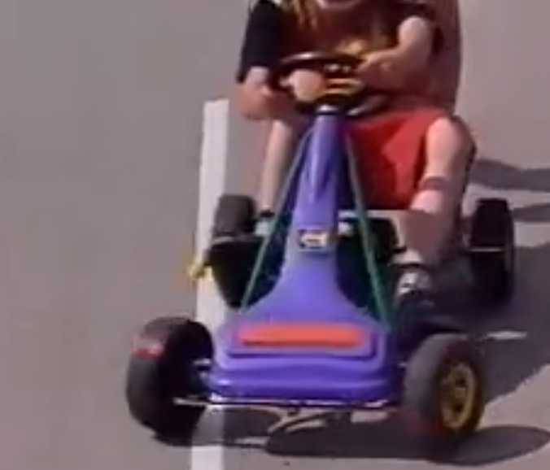

如果后推玩具车，前面怎么转弯，车子就往哪边走

如果将车轮暴死，就好比对没有abs系统的车子进行制动，无论怎么打方向盘，车子还是在原来轨迹运行，依然往原先方向直行！，注意看白线。

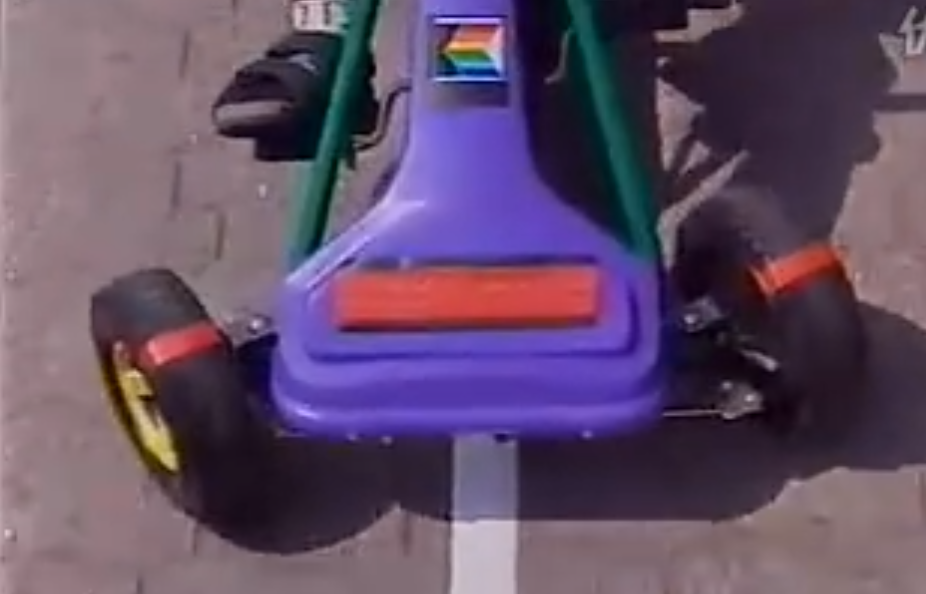

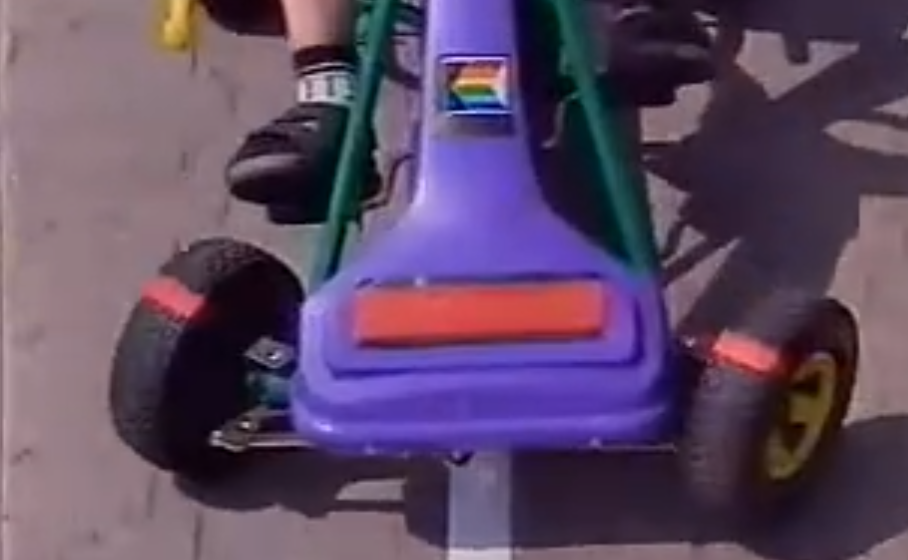

机动车也是如此，一旦车子抱死，无论怎么转向，车子依然无法控制方向，然后如图

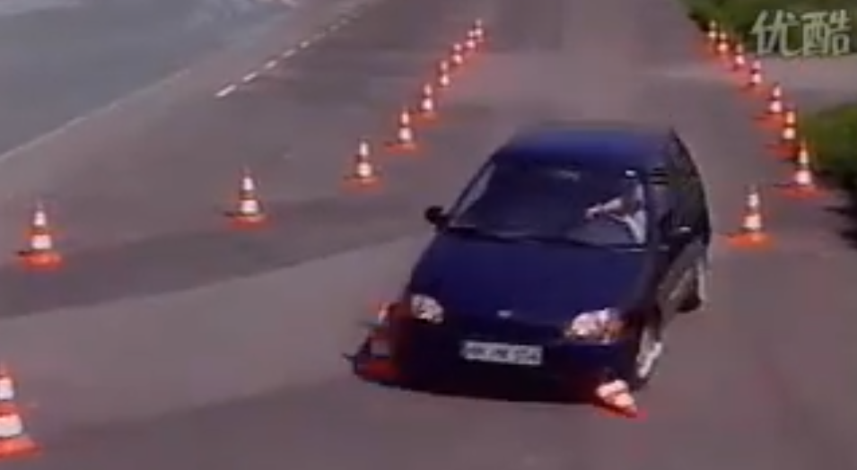

## 车轮如何抱死？

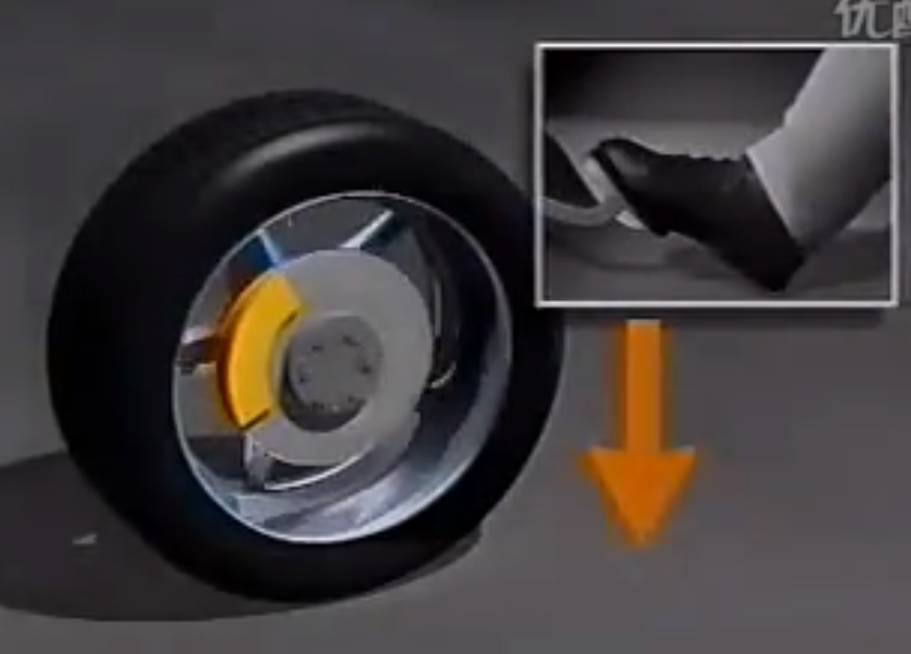

* 一方面施加在车轮的制动力
* 另一方面路面摩擦力

一旦制动力大于车轮与路面的附着力，车轮就会抱死滑行。由滚动变成滑动。湿滑的路面附着力大大减小，车轮容易抱死，没有abs，转向是不可能的。

没有abs，车轮抱死痕迹非常明显，路面会出现明显的车辙。尤其在冬天路面湿滑，得助于abs，在冰雪路面也能愉快行车。

## abs实现原理

* abs已经是成熟技术
* 通过传感器监视车轮转速，然后由电子控制系统控制油压，在抱死的时候加点油间断松制动，起到紧急制动方向可控

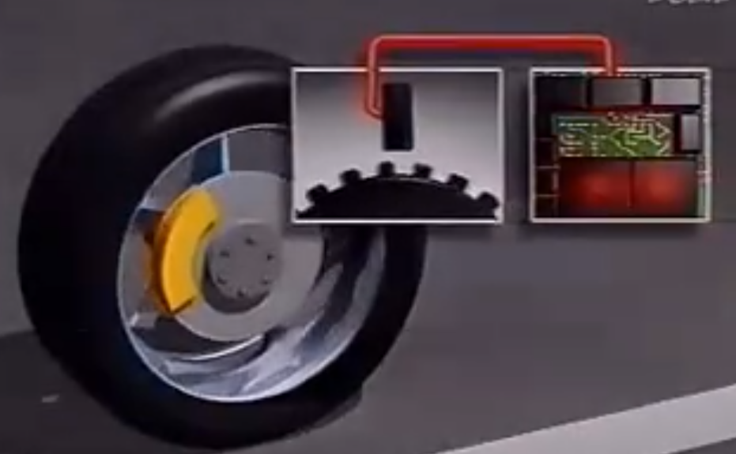

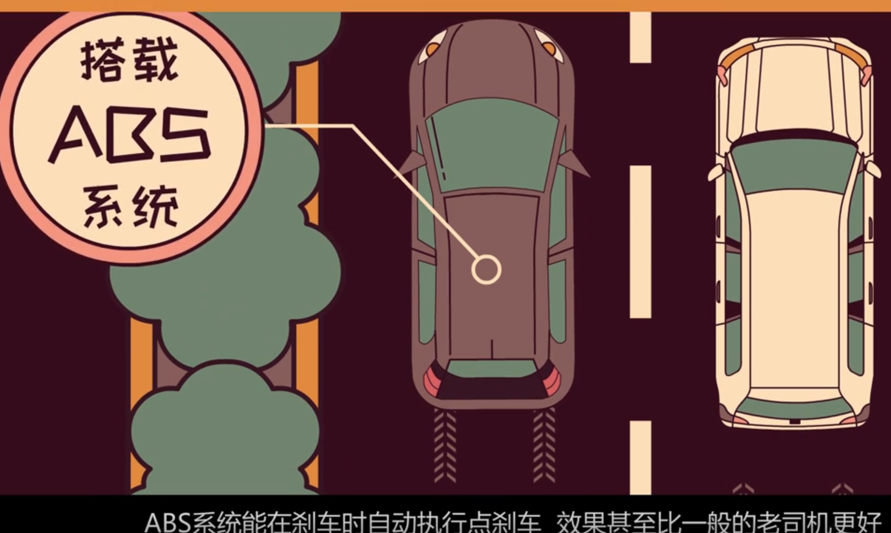

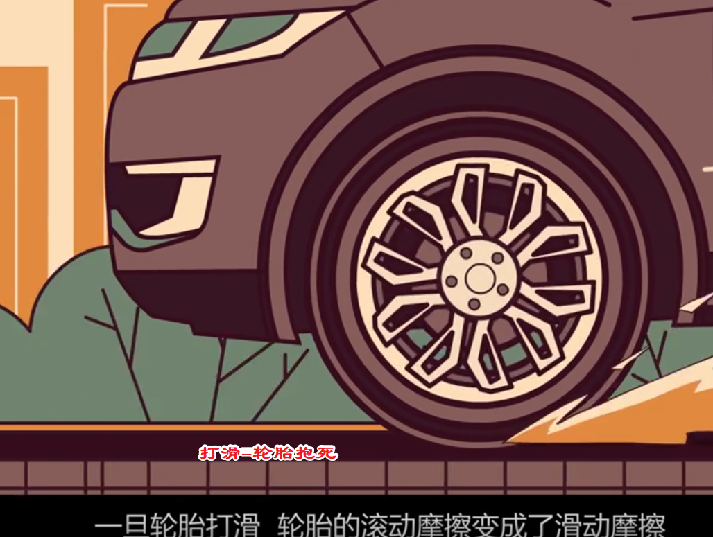

## 刹车前踩离合器？

原则上是的，但是如果速度过快

## 如何感知abs

1. 制动踏板有些抖动
2. 隐约听到控制器噪声的时候

## 没有abs会怎样？

1. 急刹车无法制动-严重的一批
2. 轮胎抱死，严重影响轮胎寿命，基本一次巨紧急刹车后轮胎不能用了。。因为，如图

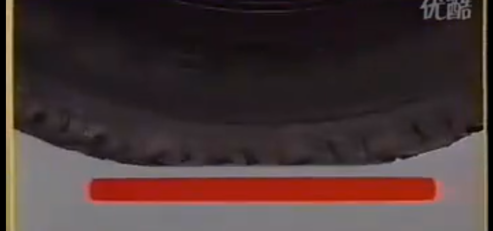

一套abs不会比买四个轮胎更贵

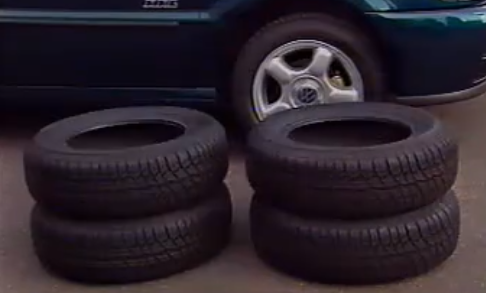

## abs弊端

* 增加刹车距离

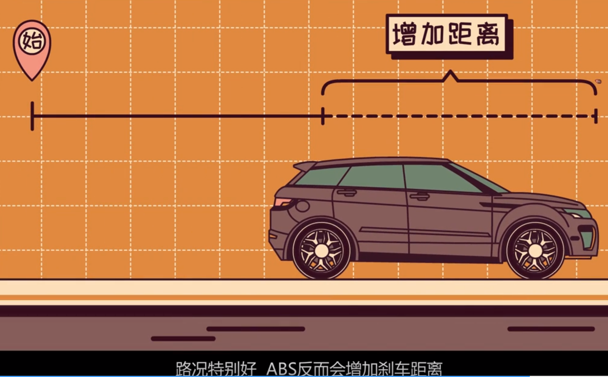

当然肯定是利大于弊

---

## 参考链接

<http://v.youku.com/v_show/id_XNTU5MjI4OTY=.html>
<https://baike.baidu.com/item/%E9%98%B2%E6%8A%B1%E6%AD%BB%E5%88%B6%E5%8A%A8%E7%B3%BB%E7%BB%9F/898133?fromtitle=ABS&fromid=16202#viewPageContent>
