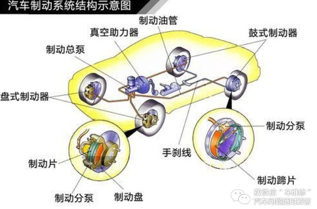
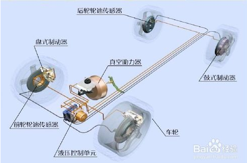
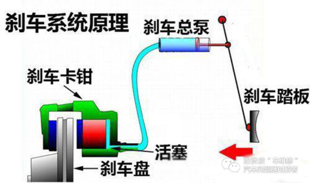
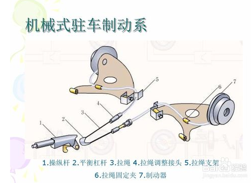

<!-- TOC depthFrom:1 depthTo:6 withLinks:1 updateOnSave:1 orderedList:0 -->

- [刹车知多少](#刹车知多少)
	- [刹车基本组成](#刹车基本组成)
	- [基本运作流程](#基本运作流程)
	- [机械式驻车系统-手刹](#机械式驻车系统-手刹)
	- [刹车时必须要踩离合器](#刹车时必须要踩离合器)
		- [离合器的作用](#离合器的作用)
		- [测试](#测试)

<!-- /TOC -->
# 刹车知多少

## 刹车基本组成

* 刹车系统由操控系统、液压系统和助力系统组成。
* 常见轮胎制动器分为鼓式刹车和盘式刹车。鼓式刹车主要是利用制动液推动摩擦片与制动鼓摩擦，进行刹车。
---
1. 操控系统：踏板，手刹等。
2. 液压系统：由液压油、刹车泵、液压油管组成。
3. 助力系统：真空助力泵
4. 电子控制系统 ：由ABS泵、ABS传感器、ABS电脑组成。
5. 执行系统 ：由刹车钳、刹车片、刹车盘组成。





## 基本运作流程

脚踩制动踏板----踏板的力通过真空助力器进行放大传导----放大的力推动制动总泵，对制动液加压-----制动液通过制动组合阀分配到前、后轮制动器，同时制动警示灯亮起-----前、后轮制动器制动




## 机械式驻车系统-手刹




## 刹车时必须要踩离合器

* 汽车低速刹车，先踩离合，再踩刹车，比如1-2档时停车。
* 高速时刹车，先踩刹车，等速度降下来了之后再踩离合，高速踩离合很伤离合片的。

### 离合器的作用

保证汽车平稳起步是离合器的首要功能。在汽车起步前，自然要先起动发动机。而汽车起步时，汽车是从完全静止的状态逐步加速的。如果传动系（它联系着整个汽车）与发动机刚性地联系，则变速器一挂上档，汽车将突然向前冲一下，但并不能起步。

刹车是要不要踩离合器，应根据车速快慢来决定先踩刹车还是先踩离合器。 无论是需要减速、还是停车，当 车的速度比较快时，应先踩刹车降低车速，待车速降低后，放开刹车（不放开就会熄火）。 如需要停车时，车速比较慢时，先踩离合器、再踩刹车停住。 开车逐步熟练以后，可以学习用油门控制速度，当需要减速时，就及时松开油门，脚放在刹车上（不踩刹车），根据情况再决定踩刹车，或是继续加油前进。这样开车就比较省油。
紧急刹车时，只踩刹车的效果好于刹车和离合一起踩。在同一路段，同一速度的情况下，只踩刹车时刹车距离是15.53米，而同时踩下离合和刹车，刹车距离为16.93米。两者相差了近1.4米。而在紧急情况下，1.4米的安全距离已经足以避免事故的发生。

** 在刹车时，我们为什么要踩离合器？那就是怕熄火 **

一般的短距离刹车指的是十米左右的距离，像这种情况下，提前踩下离合器对刹车是没多大影响的，而且这也是必须要做的事，不然车子就很容易熄火了，那么你就可以先提前踩下离合器。但长距离刹车就不能提前踩下离合器了，为什么？

因为长时间踩住刹车，刹车盘就会因为发热导致性能下降，那么就得不到一个很好的刹车功效，反而如果是带档刹车的话，除了可以让车子快点降速外，还可以延长刹车片的寿命。特别是对于下坡路段来说更为重要，不能踩着离合器下陡坡。

还记得科目一的一道理论题吗？**下陡坡不能踩下离合器**！也就是我们所说的**空档滑行**，有的人误以为空档滑行可以节省汽油，殊不知给自己带来极大的安全隐患。而且在刹车的时候全靠刹车片在起作用，根本不会利用发动机的牵制作用来辅助刹车，也就是我们所说的带档刹车。**在下陡坡时，带档刹车是最好的刹车方式**，运用好的，根本是不需要踩下离合器和刹车踏板的，全靠档位的牵制作用即可。

只要是老司机都会知道，在下陡坡时主要都是靠发动机的牵制作用来刹车的，在一档和二档的牵制下，这种刹车效果最为明显。反正我们只要记住一点就好，只要车子还在走，哪怕你是在任何一个档位上，那么车子都不会熄火，不用担心车子会熄火这个问题。这也就说明了，在长距离刹车的情况下，是根本不需要提前踩下离合器的！

1. 带档刹车制动效果好,还有发动机制动的辅助,空挡和踩尽离合是一样的道理,只不过空档是变速箱还有一轴在空转,踩了离合变速箱就完全不工作了(除了前驱的车,差速器和变速箱是一体的,差速器只要车动就工作)。
2. 空档刹车没有发动机制动，制动距离更长，特别是一些长距离下陡坡。空档刹车很危险，极易造成刹车失灵车毁人亡。
3. 加油时发动机产生牵引力，带挡刹车时发动机产生制动力，并且能控制两个驱动轮同步，防止刹车时跑偏。特别重要的是，空档时刹车助力器的辅助力会大大降低。所以任何情况下都要带档踩刹车，当车快要停下时，再踩下离合，退到空档，以防憋灭火。

速度降下来了，我们提前挂进相应的档位即可，不用早早就踩离合器，因为这样可以更快更安全的让车子停下来。而且这也是为什么说手动挡比自动挡更安全的其中原因之一，**在刹车失灵的情况下，手动挡的还可以带档刹车，而自动挡的却不能做到这一点。**

离合只有在换档时，或者速度很低刹车时才踩。如果这个不良习惯一旦养成，汽车始终相当于在空档的时候刹车，这样在高速路上（80公里/小时）、山路连续下坡的时候刹不住车、刹车过热、刹车距离延长很多等等，后果是非常危险的。正确的做法是，刹车的目的是减速，减速不用踩离合，当车速降到下一档位时，踩离合的目的是为了减档，减档后，要抬离合让汽车在档位上运行，这样才安全。

---

### 测试

```
正确的方法是：急刹车时离合器应与刹车一同踩下。
```

解释一下为什么：

1. 所有认为急刹车不应踩离合器的人都有同一个理由，就是松开油门减速时的发动机反拖作用，这个作用在急刹车时有多大呢？

首先随便挑一个急刹车测试视频（可以从22秒开始看）

[2014款 东风标致2008 1.6L 自动领航版 性能测试视频](http://v.youku.com/v_show/id_XNzM1MzEwMjQ0.html)            

在这个测试视频里，这辆车时速从100km/h降至0刹车距离42米左右。

我们都知道，汽车若在100km/h时松开油门带档滑行，只靠发动机反拖，可以滑行几百至一千米以上车辆还有比较高的速度，因此刹车的力量是发动机反拖的力量的十几倍甚至几十倍。

从视频中也可以得到，车辆100-0的刹车时间大约2秒左右，发动机反拖这么小的力量作用2秒，对车辆减速能有多大帮助。而且事实是，当用力踩下刹车后，发动机转速会在零点几秒内降至1000转以下，此时发动机接近熄火，反拖作用也就消失了，也就是说，微弱的反拖作用实际起作用的时间不到1秒。追求这点反拖力量有意义吗？

2. 发动机熄火会导致转向助力、刹车助力消失，是很危险的。现在的发动机都带有行车电脑，当发动机转速低于怠速时（约1000转），为避免发动机熄火，行车电脑会自动补油。上面说了，发动机在不到1秒的时间就可以降至1000转以下，也就是说，在急刹车的2秒时间里，微弱的反拖作用持续不到一秒后，发动机就会自动补油，带来的结果就是车辆向前剧烈的闯动，就像在垂死挣扎一样。若你踩刹车的力量略微不足，最后这点闯动可以把车辆再向前推进半米以上，差一点撞上的这会就撞上了。（这个经历我遇到过）

3. 前面两点解释了若不踩离合，发动机起到的正作用几乎没有，还带来些许副作用，现在我们再来说说养成**急刹不踩离合的危害**。我们可以去度娘搜一下“油门当刹车”的视频，若急刹的同时踩下离合，那么即便踩错油门，也不会造成事故扩大化。也许你会说，那是新手，但是不要忘了，常在河边走，哪有不湿鞋。我问过不少开过几十万公里的老司机，有很多都有过踩错油门的经历。当遇到紧急情况的时候，人的脚下动作和平常刹车时不太一样，会高高抬起（比平常抬起的高），然后重重踩下刹车，由于有抬高的这个动作，脚习惯踩下的位置和实际踩下的位置会有一些偏差，因此**急刹车时更容易踩错**。自动档车的刹车踏板做的很大就是这个原因，它没有离合这道防线，踩错很危险。

4. 还有人说了，急刹车时同时踩离合增加了操作难度，会导致反应慢。说实在的，连跑跳躲闪这么复杂的动作你都不在话下了，同时踩个刹车离合你练不会么？开车是个熟练工夫，平常把**“刹车到底同时离合到底”**、**“点火同时踩刹车”**、**“转向随手打转向灯”**这些好习惯练成条件反射，你这一辈子都会受益的，我还没见过这些东西练不出来的。最后上一个[国外的急刹车教学视频做佐证](http://v.youku.com/v_show/id_XNTU5MjI4OTY=.html)（看完对新手来说有好处，没耐心的可以从6:06开始看）

## 紧急制动

德国驾照必考科目之一：

紧急制动动作要领：

用腿部发力，双脚以最快的速度同时蹬踏离合和刹车踏板到底。双手握紧方向保持不动。**不踩离合的话，考试必挂无疑。**

紧急制动时发动机熄火有较大的安全隐患。

比如可能存在急刹后需要立马加速或者拐弯的情况。踩离合正是为了消除这一隐患。

自动档的车安全性更高，其中一点也是发动机永远不会熄火。


---
