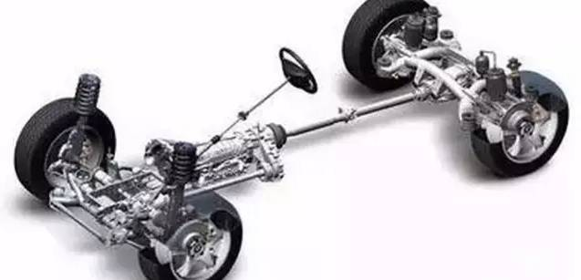

# 前轮驱动好还是后轮驱动好？

以汽车的驱动方式来说，**一般来说有前轮驱动、后轮驱动、四轮驱动这三种**。就前轮驱动和后轮驱动来说，是大部分车主都有疑惑的地方。汽车前轮驱动和后轮驱动有什么区别，哪个好，为什么有的人说后轮驱动比较高级？针对这些问题今天来解答一下车主们的疑惑。

## 爬坡对比

日常的行驶是看不出来的，物理课都上过吧，记得有一节课讲的就是在爬坡的时候前轮的抓地能力减弱，后轮的能力则升高。

也就是说明了：前轮驱动的车在爬坡的时候更容易出险打滑现象，而后轮驱动的就没有这个弊端。

上图这种情况就是加大油门后的结果（空转），也充分了解释为什么马力大的车都是后驱动和四驱动的，而前驱动的车就没有这种情况。

## 上马路牙子对比

在打个比方：上马路牙子

前驱车呢上马路牙子是非常轻松的，基本一下就上去。

而后驱动的车型是硬顶上去的，前车轮很受伤。

## 空间差异

首先要说的就是空间差异：后驱动的车采用的是纵向装置，这种装置会大大的占用车内空间。

前轮驱动的车型采用的都是横向装置，发动机在前面，给车内的空间留出了很大的地方，前后驱动的车有的时候看后排中间的鼓包处就能看出来了，有鼓包的肯定就是后驱动的车。

如果看内饰的话，前驱车当然是比较好的了。很明显公交车后面为嘛要突起？

* 一般汽油机的是前置后驱，柴油机的是后置后驱！
* 普通轿车都是前轮驱动，公交车是后轮驱动

## 操作控制方面差异

那操作方面呢？有什么差异。

说到这，一些懂行的就会说，转向不足和 转向过度这两种情况应该怎么理解。

转向不足这种情况一般出现在前驱车身上，它们的前轮负责转向和动力而且发动机还在前面，在转向的时候会带来很大的负担。

而后驱的车子完漂移可以，应为车尾比较重随之惯性也比较大，出险专项过度也是正常的。

漂移高手都是能够良好的控制后驱车进行甩尾进行漂移的。

## 总结

* 前轮驱动

1. 前驱车的缺点也是非常的明显，由于机械的主要部件集中在前面，后轮非常容易失去抓地力，不仅如此，前轮转向能力也比较差，尤其在高速情况下。
2. 说到操控性，也是前驱车的硬伤，因为车辆的前桥受压迫比较大。前排分配也比较大。前轮的磨损也会更加严重。乘客的舒适性也比较小！
3. 前驱车，也是有很多优点的，比如，制造成本比较低，动力传递比较直接，不需要传动轴的连接。车辆动力的损耗也比较少。由于机械构造比较简单，重量也比较轻。因为没有传动轴，所占的空间也比较小。

* 后轮驱动

1. 后轮驱动，其驱动的压力全部集中在后轮上边，那么这样一来，前轮就可以专注于转向了！因此，转向和操控是优势。
2. 车辆起步、爬坡重心都要后移，这时，后驱车的优势就发挥的淋漓尽致。稳定性和舒适性都非常不错！
3. 但是，后驱车的成本比较高！在转弯的时候，由于后面的重心前移，容易出现甩尾的情况。由于要使用传动轴，因此，动力是有一定的损失的。油耗也更高了！

## 怎样判断车轮位置，驾校里绝对学不到的

首先你得先了解你的车是前轮驱动，还是后轮驱动。前轮驱动指的是车头下面的两个轮胎是可以自由变换方向的，后轮是按前轮的轨迹前行的。后轮驱动正好相反。现在的车子基本都是前轮驱动，所以我们也主要以前轮驱动说一下车轮的方向。

坐在驾驶位置时，前行时方向盘往左打方向，前轮的朝向是向左边的，向左转弯一定要向左边打方向，转向灯是打的是左边箭头的方向，方向盘则是向左旋转，车轮也是顺势向左边弯曲的，如果实在不明白，打好方向后，下车观察车轮的方向，这样就能做到心中有数。

但往后倒车，很多人容易晕，不知道该往哪打方向，也不知车轮的方向，就是乱打一气。最后车子也不知道怎么往后倒了。**倒车时一定要先确认好车尾的方向，车尾的后屁股想往左边就向左打方向，而前轮的方向是朝右边的。听起来有点乱，实际上多操作几遍就会了。**

倒车对于新手很难，而且辨别不了车轮的方向，我这里可以教大家一招，就是请自己的亲戚或朋友是老司机的，在驾驶位置开车，你在外面看，每一个步骤都停下来给你说是怎么操作的，然后再看看车轮的方向。我觉得这个方法很有效，可以直观的了解车轮的位置。

还有确认车轮的位置还要看打方向盘几圈，也是上一种方法，别人开车，你先看，比如方向盘向左打半圈车轮在什么位置，打二圈在什么位置，自己先有个大概的了解，然后自己上车开车按照你自己的感觉来开，多开几次，对车轮的方向就会有比较清楚的了解了。

其实对于新手开车，车轮方向的辨别也只是一个方面。还有其它方面的如车距的判断，路宽是否能通过，以及碰到障碍物的躲避等等。这些都是新手开车所需要掌握的，只有多开多练，才能成长为一个开车老手。
