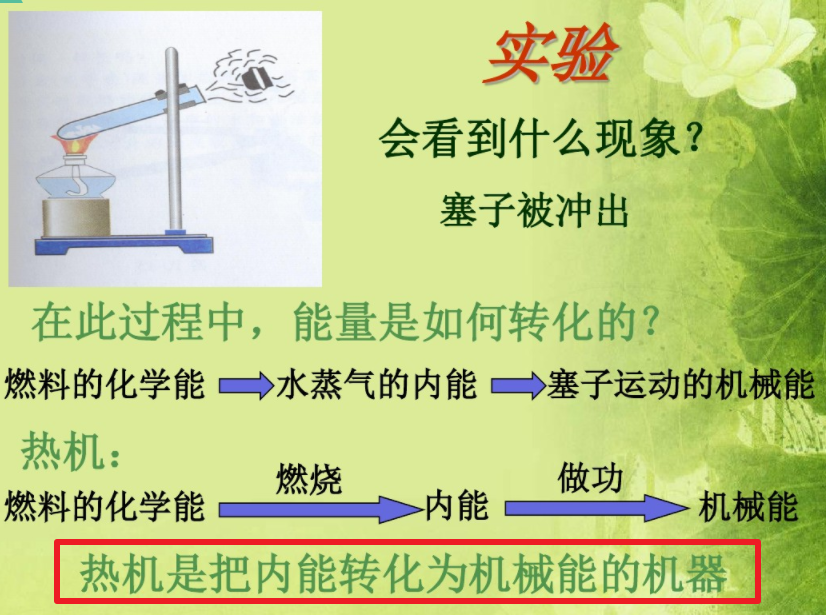
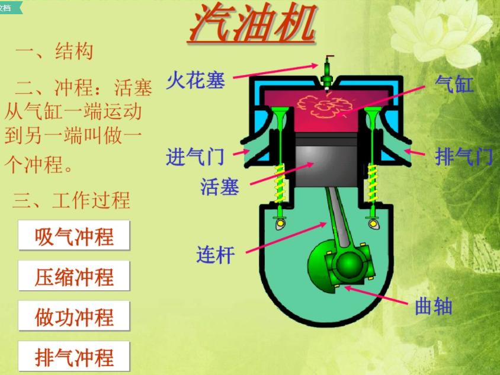
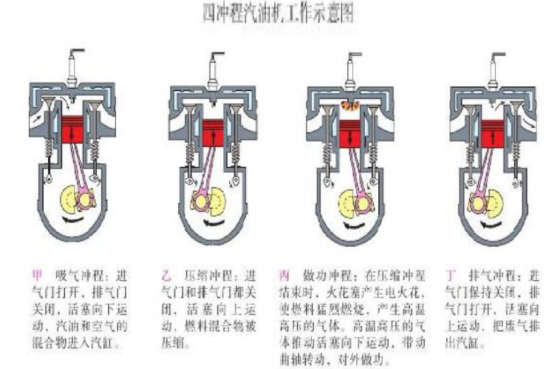
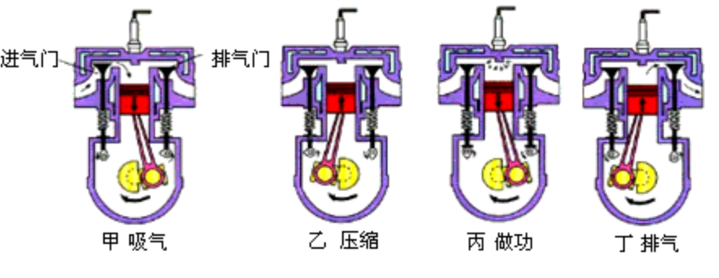

# 发动机基本原理

## 发动机的本质

初中物理知识

## 四冲程发动机

小车基本都是**四冲程发动机**

四冲程汽油机的工作循环由4个活塞行程组成，即进气行程、压缩行程、作功行程和排气行程。

### 进气行程

进气门开启，排气门关闭，活塞由上止点向下止点移动，活塞上方的气缸容积增大，产生真空度，气缸内压力降到进气压力以下，在真空吸力作用下，通过化油器或汽油喷射装置雾化的汽油，与空气混合形成可燃混合气，由进气道和进气门吸入气缸内。进气过程一直延续到活塞过了下止点进气门关闭为止。接着上行的活塞开始压缩气体。

### 压缩行程

进排气门全部关闭，压缩缸内可燃混合气，混合气温度升高，压力上升。活塞临近上止点前，可燃混合气压力上升到0．6～1．2MPa左右，温度可达330℃～430℃。
作功行程

在压缩行程接近上止点时，装在气缸盖上方的火花塞发出电火花，点燃所压缩的可燃混合气。可燃混合气燃烧后放出大量的热量，缸内燃气压力和温度迅速上升，最高燃烧压力可达3～6MPa，最高燃烧温度可达2 200℃～2 500℃。高温高压燃气推动活塞快速向下止点移动，通过曲柄连杆机构对外作功。作功行程开始时，进、排气门均关闭。

### 排气行程

作功行程接近终了时，排气门开启，由于这时缸内压力高于大气压力，高温废气迅速排出气缸，这一阶段属于自由排气阶段，高温废气以当地音速通过排气门排出。随排气过程进行进入强制排气阶段，活塞越过下止点向上止点移动，强制将缸内废气排出，活塞到达上止点附近时，排气过程结束。排气终了时，气缸内气体压力稍高于大气压力，约为0．105～0．115MPa，废气温度约为600℃～900℃。由于燃烧室占有一定容积，因此在排气终了时，不可能将废气彻底排除干净，剩余部分废气称残余废气。[1]
发动机为汽车提供动力。发动机还广泛应用于交通运输机械、农业机械、工程机械和发电机组等各个方面。发动机种类繁多，其中四冲程发动机是最常见的一种.

### 分类

四冲程发动机属于**往复活塞式内燃机**，根据所用燃料种类的不同，分为汽油机、柴油机和气体燃料发动机三类。

* 以汽油或柴油为燃料的活塞式内燃机分别称作汽油机或柴油机。
* 使用天然气、液化石油气和其他气体燃料的活塞式内燃机称作气体燃料发动机。

汽油和柴油都是石油制品，是汽车发动机的传统燃料。非石油燃料称作代用燃料。燃用代用燃料的发动机称作代用燃料发动机，如乙醇发动机、氢气发动机、甲醇发动机等。

四冲程汽油机经过进气、压缩、作功、排气四个行程完成一个工作循环，在这个过程中，活塞上下往复运动四个行程，相应的曲轴旋转两周。

四冲程柴油机的工作原理与四冲程汽油机相同，也是由进气、压缩、做功、排气四个形成组成。不同的是柴油机进气行程进的是纯空气，在压缩行程接近上止点时，由喷油器将柴油喷入燃烧室，由于这时汽缸内的温度已经远远超过柴油的自燃温度，喷入的柴油经过短暂的着火延迟后，自行着火燃烧，对外做功。

## 汽车动力

汽车的动力到底是不是发动机提供的呢？很多人认为是的。可是汽车的真正动力来源并不是发动机提供的。

我们用中学物理知识来解释一下汽车真正动力的来源。

中学物理最重要的内容之一是“力学”，力学中最基础部分是“受力分析”。

中学物理对汽车的受力时也经常是画出汽车受的牵引力，阻力、重力、支持力。通常把汽车的动力称为“牵引力”。

这个牵引力到底是什么力呢？

要弄明白这个问题，首先对汽车的结构需要有个基本的了解。汽车是通过车轮支撑在地面上的，在车轮与路面的接触处存在着摩擦力，但是前后轮的摩擦力所起的作用是不同的。发动机曲轴的转动通过纵轴、万向节和齿轮箱传递给后轮，它使后轮顺时针方向转动。如果后轮与路面间无摩擦力，发动机就只能空转而不能产生前进的动力。如果后轮与路面之间存在摩擦力，由主动轮与地面间的相对运动趋势可以知道，摩擦力是向前的。所以，汽车的牵引力实质就是路面对后面驱动轮的摩擦力。

路面对于前轮的摩擦力向后，这个摩擦力是阻力。

当汽车正常行驶时，车轮与路面之间的摩擦是静摩擦力，车轮的着地点相对地面的瞬时速度为零。刹车时，车轮不转，由于惯性继续向前滑行，这时路面对前后轮的摩擦力都变成向后的阻力，从而快速停车。

通过以上分析，可以知道汽车驱动轮受到的摩擦力提供动力，被动轮受到的摩擦力提供阻力，因此汽车的真正动力来源是主动轮所受到的摩擦力！

## 参考

<https://www.bilibili.com/video/av15699498?from=search&seid=17865156633704861037>
