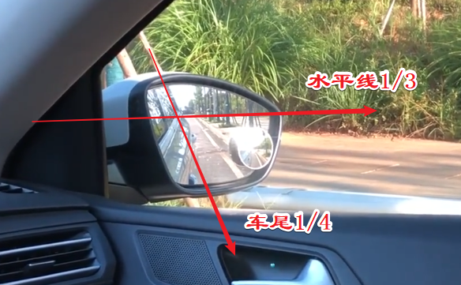
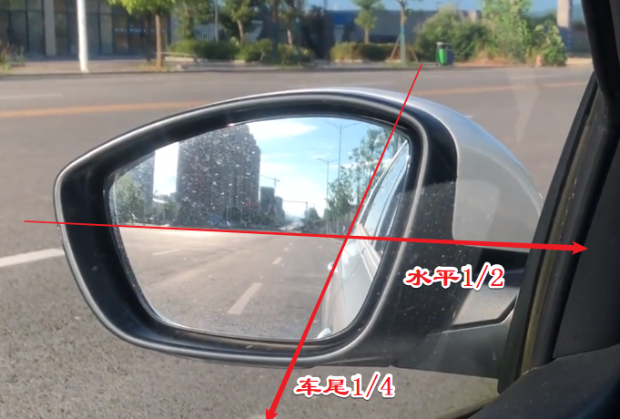
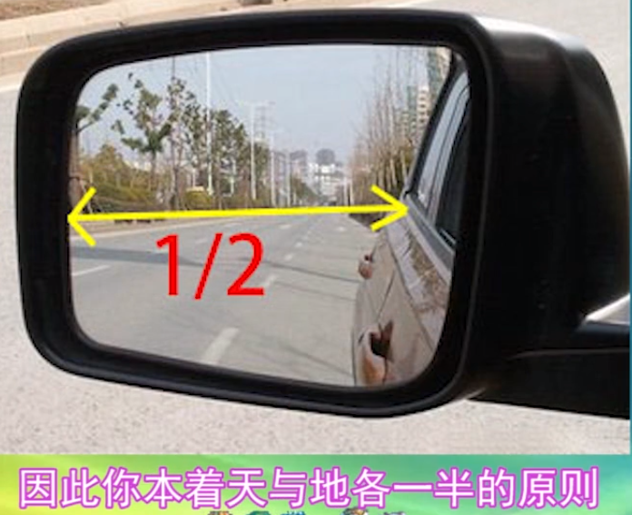
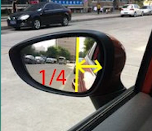
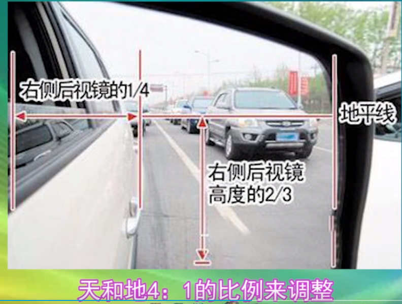
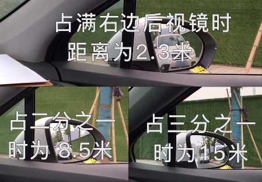

# 后视镜知多少

后视镜是驾驶员坐在驾驶室座位上直接获取汽车后方、侧方和下方等外部信息的工具。为了驾驶员操作方便，防止行车安全事故的发生，保障人身安全，各国均规定了汽车上必须安装后视镜，且所有后视镜都必须能调整方向。

不少学员跟小编抱怨，科二挂科好几次，但总是找不到挂科原因。其实，十有八九是因为后视镜没调好的原因。科二后视镜如果调不好，在找点、看点时就很容易出现偏差。今天小编便将老教练总结的科二后视镜调法教给大家，一定要看仔细咯！

## 后视镜原理

## 后视镜调整参数

---
