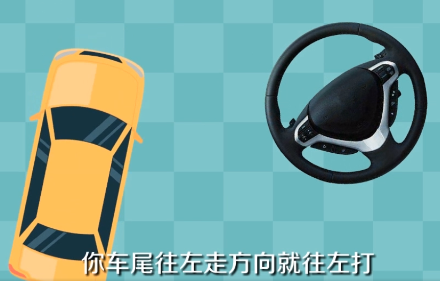
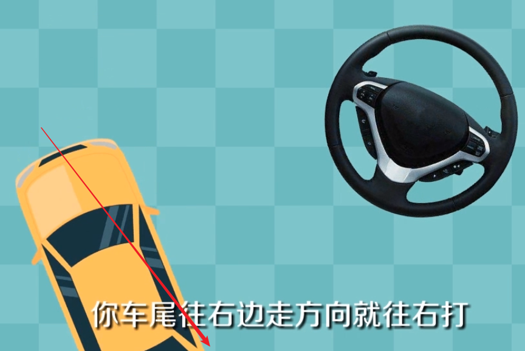
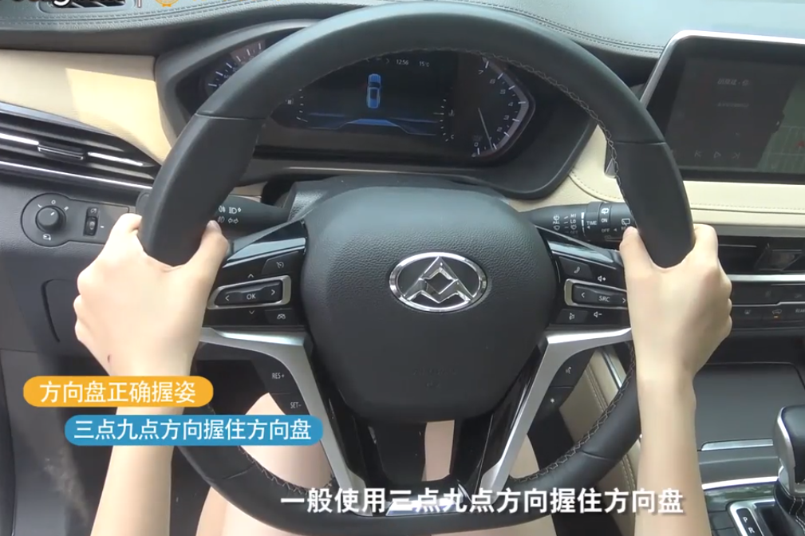
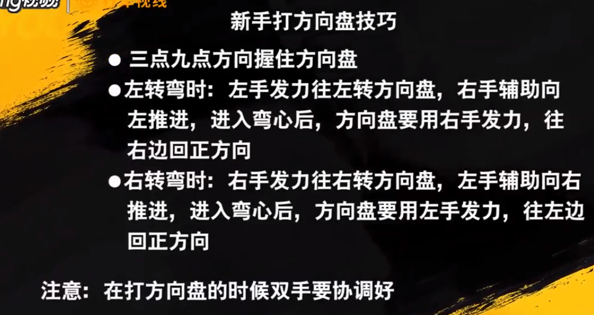
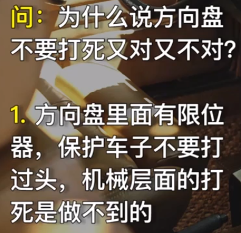

# 方向盘知多少

* 车固定为在正的位置，打完是一圈半，那你以一圈或则半圈为基准来打方向练习，才不会打乱，忘记了从哪边打的方向，你就观察前行时车是直走就是正的，左走就向右带，右走就向左带 。要反复在原地练习下打方向原地练习把方向左右打死后回正，只有反复练按一圈半圈的去练。

## 限位器的作用

开车不建议打死方向盘

就像军训左转弯右转弯，只有脚跟再转，脚掌和前脚跟不懂得。如果整个脚在转，那么摩擦太大了。
机动车也是这样，只转动一边。

## 为嘛有的可以打两圈有的只能打一圈半

如果转相同的角度，一圈半的车打方向不用很多，就可以转过来，两圈的相对要打的多一点，这是车设计的问题，转的多的，相对于方向机来说，齿会更密一点，也会更轻一点，但是有方向助力的车就很难分了。现在大多数的车都在一圈半到两圈之间，这里说的是车轮向前，向左或者向右打方向到底的圈数。

**方向盘可以转动的圈数是由转向系统的传动比决定的**。
* 传动比越大，方向盘可以转动的圈数越多，转向越轻巧，但是汽车操控不灵敏；
* 传动比越小，方向盘可以转动的圈数越少，转向越沉重，但是方向非常灵敏，方向盘转很小的角度，汽车就转了很大的弯。

方向盘可以打一圈半和两圈的区别也在于此。一般来说，可以打两圈的方向盘比可以打一圈半的方向盘更轻，但是操控的灵敏度不如可以打一圈半的车型。**一般来说，偏重于舒适性的车型方向盘的圈数更多，而偏重于操控性的车型方向盘圈数偏少。**

现在的家庭轿车越来越多的采用了电子助力转向系统和变传动比设计，可以根据实际的转向助力需求，自动的调整转向助力的大小和转向传动比。比如汽车在低速行驶时，或在倒车入库时，需要较大的助力，汽车会自动的增加助力，并减小传动比，以增加汽车方向的灵敏度；而汽车在高速行驶时，需要减小阻力，让方向盘变得沉重而又不敏感，保持汽车高速行驶的稳定性。

---
