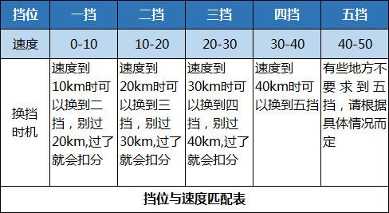
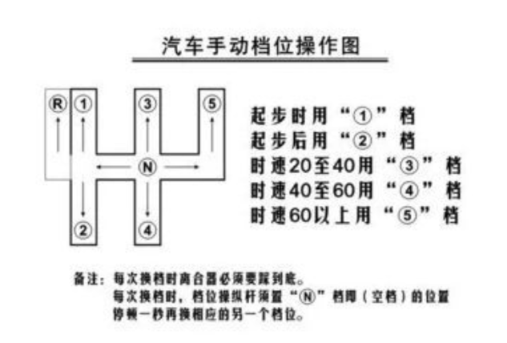
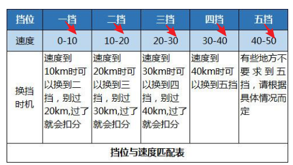
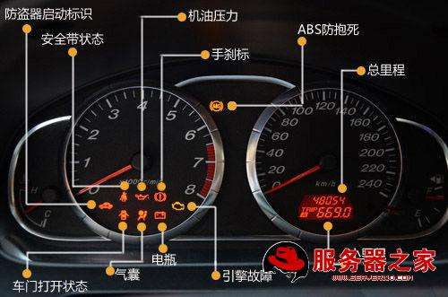

# 档位知多少








 学车首先就要学会挂档，挂档的时候千万要记住踩离合一定要踩到位，要不然离合分离不完全，容易伤变速箱，还容易烧离合器片、还坏齿轮等等很坏车，档位要与车速相匹配。
---

## 挂挡

* 车打着火，踩紧了离合器，把档位先从空挡移到左边，在往前推，一档就挂进去了，把手刹放下去。松离合起步。
* 车速在二十码到三十码之间，踩紧了离合器，把档位先移到左边，在往后推，二挡就挂好了。
* 车速在三十码到四十码之间，踩紧了离合器，把档位从二挡中拉出，移到中间，在往正前方平推，三档就挂好了。
* 车速在四十码到五十码之间，踩紧了离合器，从三档的位置平拉到后方。四档就挂好了。
* 车速在五十码到六十码之间，踩紧离合器，先把档位移到最右边，在往右前方推。五档就挂好了。
* 挂档位一定要记住，一松（松油门）、二踩（踩紧离合器）、三挂档。


```
说法不一，具体看你练什么车，教练怎么跟你扯犊子
```


## 参考链接




<>
