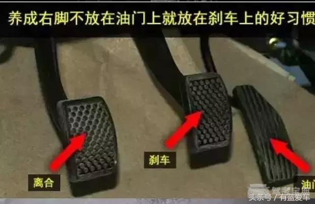
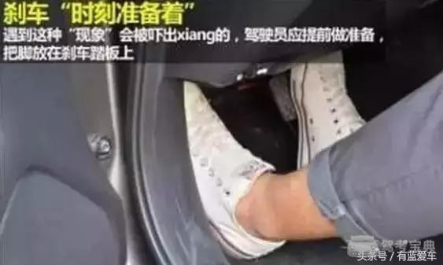

# 油门知多少

##  科目二学车为什么没油门

就是不让你用呗，想用油门，没门！

* 驾校的车都把怠速调到不用油门车在松离合时也能起步，不是没有油门，是教练把油门卡了不让踩，毕竟新学车的都没有基础，有油门会很危险，教练车只要保持能在低速行走就行了，想当年教练把油门用方向盘锁卡住也是这个道理，很怀念

* 驾驶学校的车子都是一样的，为了让学生更好的掌握车辆的驾驶他们都会把车子的油门调 下，把怠速调的很高，因为真正开车的时候那是要油门和离合器的配合，为了先让你一样一样的学，他会把油门控制好先让你学习怎么 控制离合器，那是驾驶学校的一种教学方法

**科二练车的时候，油门一般被顶住了，不能踩，到了科目三学员们就必须要学会踩油门加速了。如果踩重了，速度过快，容易发生危险，踩轻了，给油不够，速度不足，所以要控制好力度。**

## 如何踩油门？

刚开始学车时总是没轻没重，尤其是加油门的时候，会听到“轰”的一声，然后车就冲出去了，车上的人在惯性作用下会向前倾，如果是手动挡的车，也可能这一脚就熄火了，一般出现这种情况就是车主在换挡加油的时候猛踩油门了。

或者是由于操作不熟练，下脚太重了；或者是由于心理紧张，一下踩过了，总之，状况是出现了，少不了被教练骂！如果是又深又猛地踩油门，加速时会感觉有一股猛烈的顿挫感，坐在车上的人会感觉非常不舒服；如果持续性地猛踩油门还会导致发动机过热，引起水箱开锅，从而导致其它的发动机故障。当然如果是需要急速超车那就另说，但是在平时的开车过程中是不提倡这样开车。

**踩油门的时候不要用太大的力，要慢慢地、轻轻地踩，先轻轻地踩一点下去，待转速达到约2000转的时候抬脚，放开油门，之后再一次踩油门，这次仍然要慢慢地、轻轻地踩，只不过踩的油门踏板的自由行程要长，这样车速就会平稳地增加了。**

踩油门的时候用这种一浅一深的方法，车辆加速会更加地平顺，司机和乘客都会更加舒服，而且对车子也没有伤害。

## 制油门的正确姿势

* 坐姿：双手伸直能够扣住方向盘12点钟方向，背部轻靠座椅就行。
* 座椅调整：三个踏板都能踩到底，脚还能保持持续发力。
* 踩油门的动作：和踩离合器一样，不熟练的学员可以看下，轻踏缓抬。

## 科三油离配合，是重点

A、起步，离合踩到底，松手刹，挂一挡，慢慢松开离合器，当车子抖动并向前移动后，左脚不要动，右脚稍微踩下油门，再继续慢松离合，直至彻底松开，使车辆平稳起步。

B、加挡，先给点油，车速和档位匹配后，松开油门，左脚离合踩到底 ( 速度要快点 )，然后挂挡 ( 不要太用力，容易挂错 )，挂完后，松离合 ( 速度适中就行 )再踩油门。

C、减挡，先松油门，再点刹，速度合适之后，左脚把离合踩到底进行换挡。完成以后，慢松离合再给油。

---
