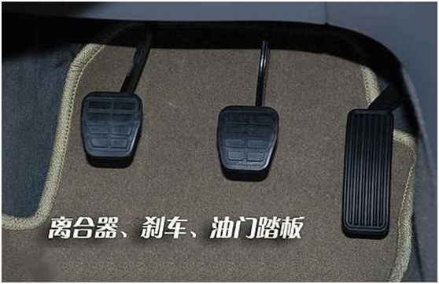
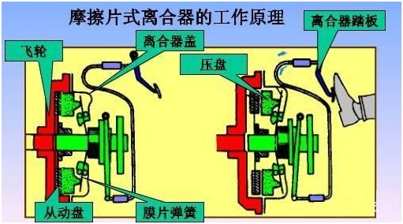
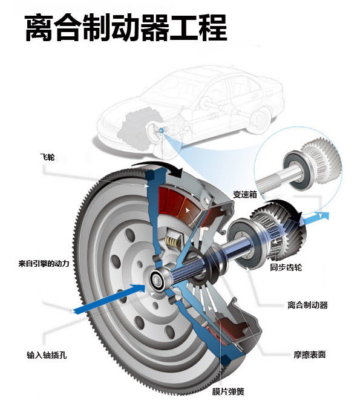
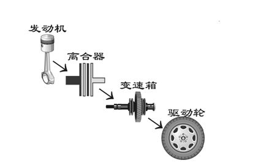
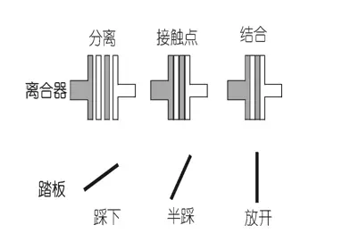

<!-- TOC depthFrom:1 depthTo:6 withLinks:1 updateOnSave:1 orderedList:0 -->

- [离合器知多少](#离合器知多少)
	- [离合器踏板](#离合器踏板)
	- [离合器基本原理](#离合器基本原理)
		- [离合器三种状态](#离合器三种状态)
		- [接触点-临界点](#接触点-临界点)
	- [起步时的应用](#起步时的应用)
	- [加/减挡时的处理](#加减挡时的处理)
	- [参考链接](#参考链接)

<!-- /TOC -->
# 离合器知多少

离合器，这是一个动力“开关”，作用是把发动机的动力送出或者切断。如果送出动力，那么汽车就前进或者后腿，否则，汽车就停车（或滑行一段距离后停车）。

当今道路上跑着的车辆中，绝大多数是手动变速器类型。而要操纵使用手动变速器的车辆，就少不了要使用离合器。

常言说，开车的要领是一把方向加一脚刹车。可是新手们在上路之初，可能既没怕过方向盘，也没怕过踩刹车，而是被离合器操作时的不得要领而搞得焦头烂额

## 离合器踏板

离合器踏板是手动挡汽车离合器总成的操纵装置，是汽车与驾驶员“人机”交互部分。在学车中或在正常驾驶中，是汽车驾驶“五大操纵件”之一，使用频次非常高，为方便起见，人们直接称为“离合”。其操作正确与否，直接影响着汽车的起步、换挡和倒车。

** 离合器踏板、制动踏板、转向盘、加速踏板和换档操纵手柄(变速杆)汽车五大操纵部件。**

---

## 离合器基本原理

所谓离合器，顾名思义就是说利用“离”与“合”来传递适量的动力。离合器由摩擦片，弹簧片，压盘以及动力输出轴组成，布置在发动机与变速箱之间，用来将发动机飞轮上储存的力矩传递给变速器，保证车辆在不同的行驶状况下传递给驱动轮适量的驱动力和扭矩，属于动力总成的范畴。在半联动的时候，离合器的动力输入端与动力输出端允许有转速差，也就是通过其转速差来实现传递适量的动力。

**两个硬家伙之间的软调节：汽车是由发动机产生动力，然后经过离合器这个中介，交给变速箱进行速比变换后，最终传送到底盘上去驱动车轮。**

发动机可以在一两秒钟的时间内把自身的运转速度从静止状态增加到每秒钟几千转，发生非常迅猛的变化。

而车辆的车身，因为其质量比起发动机大了无数倍，惯性作用也是非常之大，它在短时期内是能以发生很大的变化。

虽然变速箱可以用来调节发动机与车身之间的速度差异，可是它不能通、断两者之间的动力传输，如果硬性地用它来进行速比变换（换挡），结果将导致齿轮损坏，甚至于车辆损坏，从而会惹出大麻烦。(引出离合器的中间作用)

因为发动机与车身这两个“硬家伙”谁也不会让谁，而随着车辆在不同阻力的道路上行驶，发动机与车身之间在速度与动力的匹配上的矛盾随时都需要调整。

### 离合器三种状态

* 完全分**离**状态：可以切断发动机所产生的全部动力。
* 若即若离（离合器**半联动**状态）：可以只传输发动机所产生出的全部动力当中的一部分动力。
* 完全结**合**状态：可以不折不扣地传输发动机所产生的全部动力。

正是因为离合器“刚柔相济”的特殊能耐，才能把发动机与车身之间经常性的不平衡矛盾加以缓和下来，使车辆能开行得稳稳当当。

离合器的接触点：离合器工作起来只有完全分离、若即若离与完全结合三种方式，让我们先来分别进行了解：

1. 彻底分离：当把离合器踏板全部踩到底时，离合器的各摩擦片之间也被彻底地分立开，此时动力传输被完全中止，发动机与车身实现了动力传输上的完全脱离。

此时哪怕发动机的转速高达每秒钟上万转，也不会有任何动力从离合器的A组摩擦片传输到另一组摩擦片B组上去。从发动机到变速箱，以及驱动轮的动力传输通道也全部中断，犹如变速箱处于空挡的位置。

2. 完全结合：当把被踩下的离合器踏板完全放出来时，或者说把左脚从离合器踏板上全部移开时，那么A、B两组摩擦片在弹簧的作用下将最为紧密地结合在一起。

只要变速箱不挂在空挡上，那么发动机所产生的全部动力都将不折不扣地传输到车身上去。

3. 半连动：除了以上的接通或者断开两种工作方式外，离合器还可以工作在一种若即若离的状态：

说它结合，只是“蹭着点皮”，因为此时左脚以一定的力度踩在离合器踏板上，使得摩擦片之间存在着一定的间隙，于是来自发动机的动力经过离合器时，并不能不折不扣地全部传输，而是要打点折扣。

说它分离，此时离合器踏板有没有全部踩下，或多或少总有动力要往后传。

而离合器对车辆平稳运行的调节作用，即使用离合器的学问，主要也就在这半连动上面了。

### 接触点-临界点

从前面的分析中我们可以看出，在离合器的使用过程中，从分离到结合，从结合到分离的过程并不是一蹴而就的，而是有着很多的层次与过渡期。

但在这个若即若离的半连动过程中，又以哪一个时刻的影响最大呢？这就是到达接触点的一刹那。

以起步为例，并非在半连动过程的前期离合器的摩擦片之间没有接触，而是间隙太大、折扣太多，此时尽管发动机的动力十分充沛，但是传输到车身的实际动力小于车身的阻力，于是车辆是巍然不动。

又当实际传输动力与阻力相等时，或是略微大于阻力时，车身将会微微运动，此时就是到达了接触点。

如果再把离合器向完全结合状态靠拢，车身将克服阻力，开始运动。

对离合器使用熟练的人，你根本感觉不出他在起步、换挡，犹如驾驶无级变速的自动挡车辆。

其实关键在于他深深地懂得，所谓的半联动是一个过程，而接触点是这个过程中最重要的转折点。而**对从接触点到完全结合状态那一段行程地正确处理，即是离合器使用的精髓所在。**

一进一出与分清楚谁进谁出：从上面的讨论中，对离合器的构造和功能可以做到既知其然，也知其所以然。问题是：怎样在实战中用好、用活它。

## 起步时的应用

**起步时的特点是，车辆要克服静止惯性，以及道路、机械摩擦等各个方面的阻力。**

* 如果发动机的转速与输出功率不够，就不能驱动车辆，此时松开离合器使它们相连结，就会造成发动机熄火；
* 而发动机的转速与输出功率过高，突然松开离合器，驱动处于静止状态的车身时，将会造成严重的冲动或是机件损坏。

从图中可以看出，离合器一旦到达接触点后，如果离合器踏板放得太快：

1. 发动机的转速很高，动力充沛，车辆将发生冲动，一头向前“彪”出去。
2. 发动机的转速不足，动力不够充沛，又不能及时加大油门，那么发动机马上就会被熄火，俗称把发动机“呛死”。

这时要协调的关系是：**发动机要逐步提高转速、升高功率以推动车辆运动；离合器则要缓慢地结合，使发动机与车身相连动。即是常言说的，离合器踏板与油门踏板间的一进一出。**

可如果两者同时处理的话，油门是一个变量，离合器又是一个变量，老手们尚且难以兼顾，何况是新手？

* 所以大多数情况下是油门给得太小，而离合器回得太快，造成发动机熄火，起步失败。
* 反之又矫枉过正，油门加得太大，而离合器迟迟不能放出，发动机因转速过高而造成无谓的磨损，车辆却迟迟不能起步。

或是在惊慌失措中把离合器踏板回出来又踩进去，又回出来又踩进去，在反反复复之中，车辆踉踉跄跄，就像“打摆子”。

而普天之下的教练们在讲述怎样使用离合器时，都教导学员们对油门与离合器这两块踏板，要做到“一进一出”，如同背口诀一般。

在对大量的新手作指导的过程中笔者通过归纳与总结发现，只能采取分而治之的办法，即在某一时间内，只能确定一个变量，其效果改善非常显著。

方法是先把油门缓慢地加到一定的位置上，然后轻放离合器找到接触点，此时车辆将微微运动，立即固定住离合器踏板不动。

然后再把油门逐渐加大，让车辆平稳起动后，再缓慢地放出离合器踏板的剩余部分。

因为把同时处理两个变量的问题，化解为了同一时间内只处理一个变量，于是可以从容应对，不会乱了方寸。所有被指导的新手和生手们，由此而来都对起步找到了“感觉”。

你不妨按此方法认真地去练一练，看看发动机会不会熄火、车身会不会颤抖，整体效果怎么样！

## 加/减挡时的处理

换挡又分为加挡和减挡，也必须暂时中断动力传输才能进行。

与起步时所不同的是，此时车辆已经处在运动中，具有一定的惯性，因此离合器使用不当虽然不至于使发动机熄火，但也会产生冲动和机件磨损，其中：

1. 在加挡时，如果离合器放得太快，此时车辆将在发动机的带动下向前一冲，像是被向前推了一把。
2. 减挡时，如果离合器放得太快，此时车辆将在发动机的阻碍下向后一顿，像是被什么东西扯了一把。

怎样来消除这种影响呢？还是老办法，到了接触点，先定住离合器，使发动机与车身在新的变速比上达到平衡时，再缓慢地放出离合器踏板的剩余部分。

离合器使用得好，车辆都会运行得四平八稳，开车的人潇洒，坐车人的舒适，同时对车辆的爱护也才能落到实处。

---

## 参考链接

<https://zhuanlan.zhihu.com/p/35834664>
