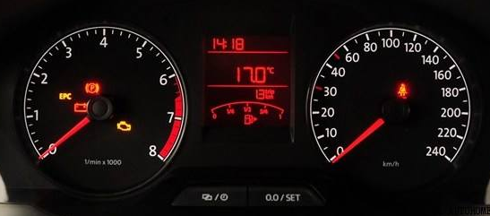
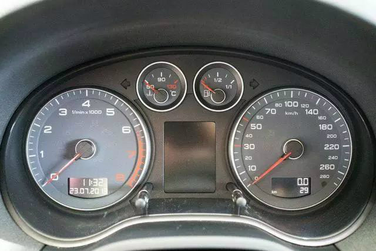

# 速度表和转速表知多少

## 公里和km

1千米(km)=1公里(km)

1. 1790年5月由法国科学家组成的特别委员会，建议以通过巴黎的地球子午线全长的四千万分之一作为长度单位——米，千米等于1000米。
2. 千米又称公里，是长度单位，通常用于衡量两地之间的距离。
3. 千米是一个国际标准长度计量单位,符号km，源自于kilometre这个英文。

## 图示速度表和转速表

* 速度表指示汽车行驶速度，单位为千米／小时(km/h)，速度表指针所指的数字显示当前车辆的行驶速度。

* 转速表一般为指针式仪表，极少一部分是数字式的。其计量单位符号为r/min，单位名称为转每分。转速表的量程反映了发动机的转速范围，其中，刻度为白色的部分是安全的转速范围，刻度为红色的部分是危险的转速范围。一些性能车和柴油车为了更好的使用车辆，还在转速表上标注了**绿色区域，这段区间是发动机最经济的使用区间。**

车速反映的是汽车整体的工作状况，发动机转速反映的就是发动机的工作状况，它是发动机最重要的参数之一。发动机的各种性都与转速有直接的关系，比如速度特性、负荷特性及万有特性等。

发动机的怠速转速、最高转速、经济转速区间与汽车的日常使用是息息相关的，正确合理的控制发动机的转速，可以更好的操控汽车。比如汽车电脑会根据发动机转速和车速的关系决定自动变速箱是否换档，**驾驶手动变速箱车型要根据发动机转速来换档等**。

## 转速表有什么用？该如何看转速表呢？

1. 显示发动机转速，反映发动机工作是否正常

转速是发动机工作状态的晴雨表。发动机在怠速及空挡下，转速应稳定并处于合理范围；

在空挡时踩加速踏板，转速应随踏板的平稳升降而平滑的变化，当稳住加速踏板时，转速表指针应保持在某一转速刻度不变。

若发动机怠速偏高或偏低、转速不稳定，转速表抖动，说明发动机存在故障。

2. 做为手动变速箱换档时的参考，选择合适的换档时机，让发动机始终工作在最经济的工作区间。

发动机的扭矩只是在某一区间内具有最大值，超出了这个范围，扭矩就会大幅度降低，发动机动力不足，汽车加速无力，甚至拖档、熄火等。

所以变速箱在发动机最大扭矩区间换档是最合理的。而这个区间我们只要看转速表才能知道。

有人说老司机凭经验听发动机声音能够听出来，我觉得不太准确。现在的汽车静音性那么好，发动机的声音很难传到驾驶员的耳朵里了。

现在的汽车一般都控制在2000转左右增挡，低于1200转时就要减档，速度对应关系大概是，2档2000转速度28可升三档，三档速度42可升4档，4档速度60可升5档。现在有些手动档车型也非常智能了，可以根据发动机转速、车速等信号提示换档，这对于一些新手来说，真是一个福音。

3. 根据发动机转速来判断汽车的故障

转速反映的是发动机的工作状态，如果转速不稳，忽高忽低，那一定是发动机出故障了。还有就是发动机的转速与车速不匹配。这种情况一般车主是发现不了的，在修理人员检查故障时却经常用到。

现在有两类车型没有转速表。一种是特别低端的车型，比如QQ、比亚迪F0、一些低端皮卡以及农用车等，这些车型受成本的限制，就把它们减配掉了。还有一种就是动力任性的豪华车。这种车动力可以任意挥霍，根本不需要节衣缩食。

有些车型代之以引擎输出动力百分比表，其作用和转速表差不多。不论是否有转速表，作为驾驶者的我们，都要根据发动机的特性来合理使用车辆，发动机转速与车速的匹配，是我们应该掌握的驾驶技能之一。所以，在开车时经常观察转速表，可以更好的掌控汽车，也可以及早的发现汽车的故障
