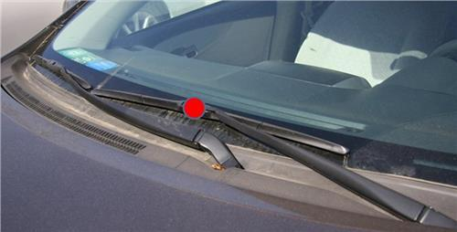
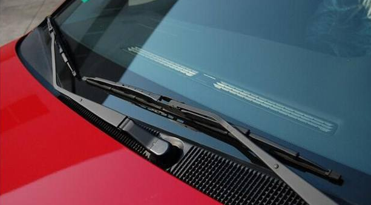
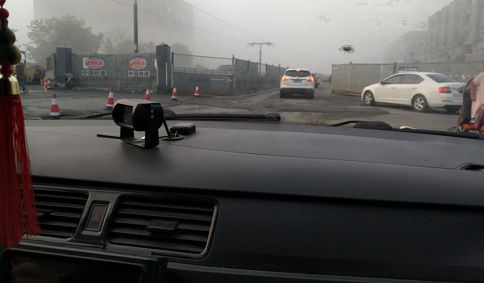
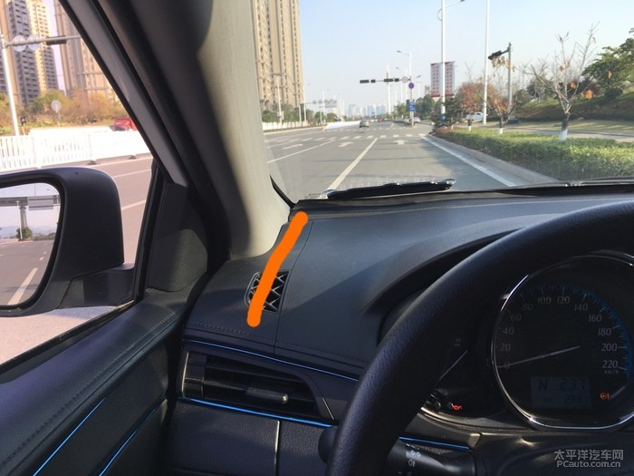
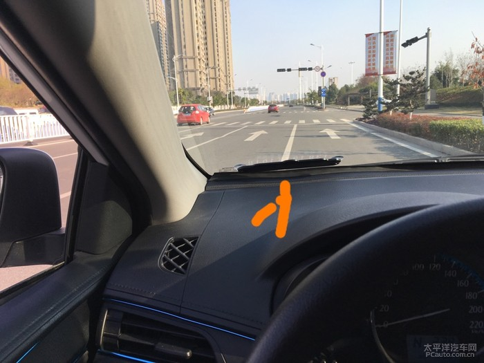
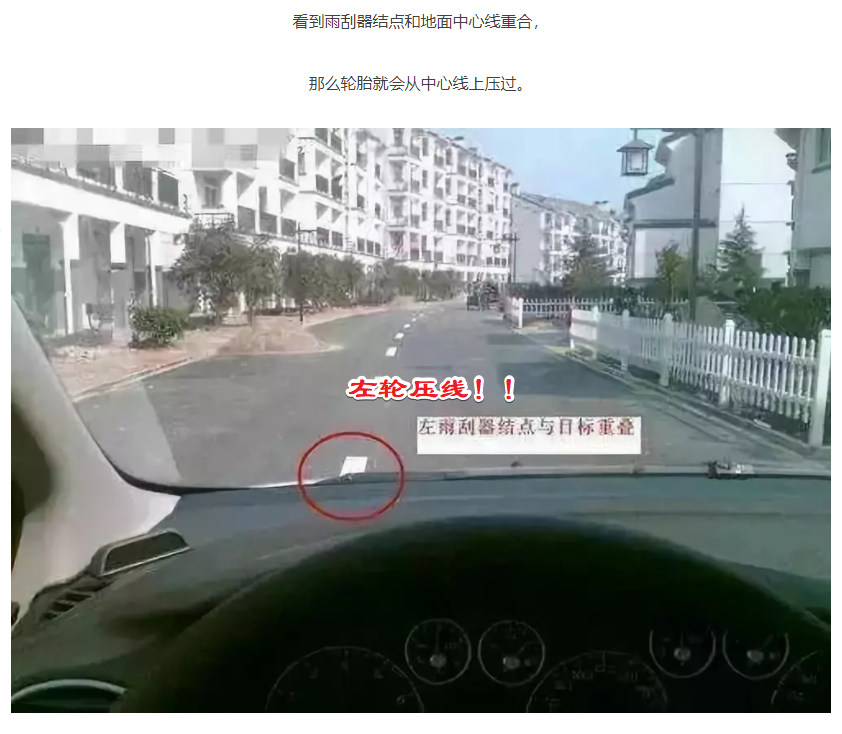
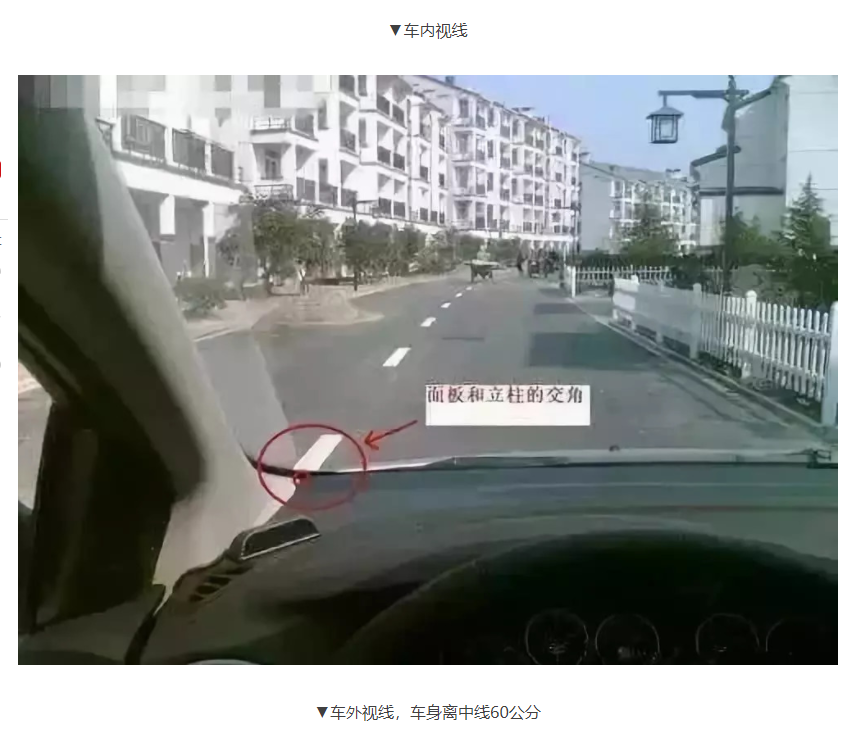
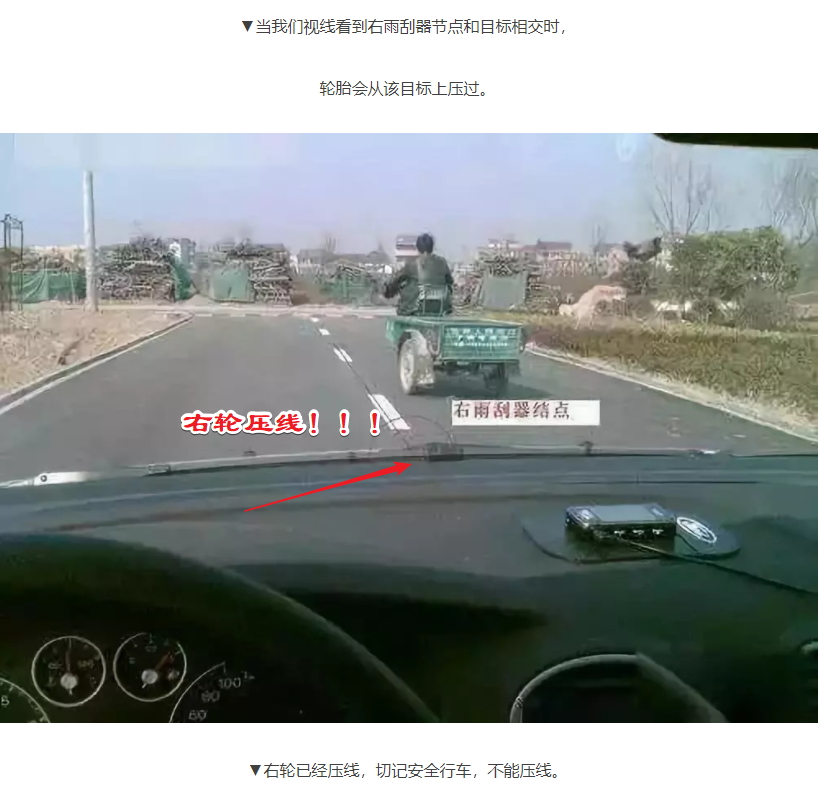
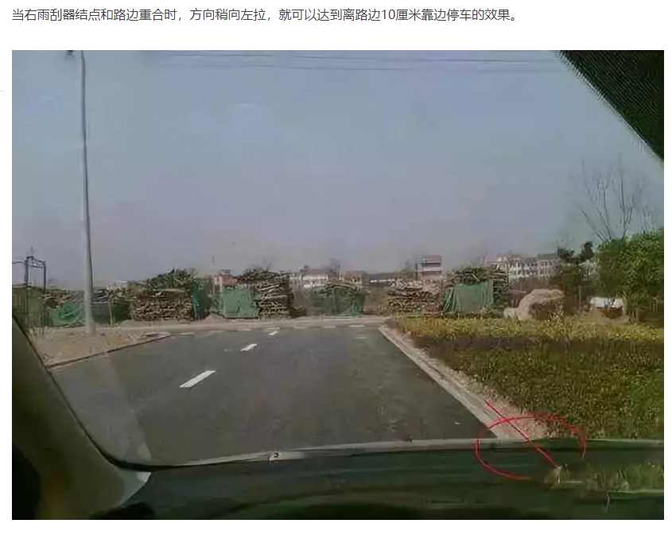
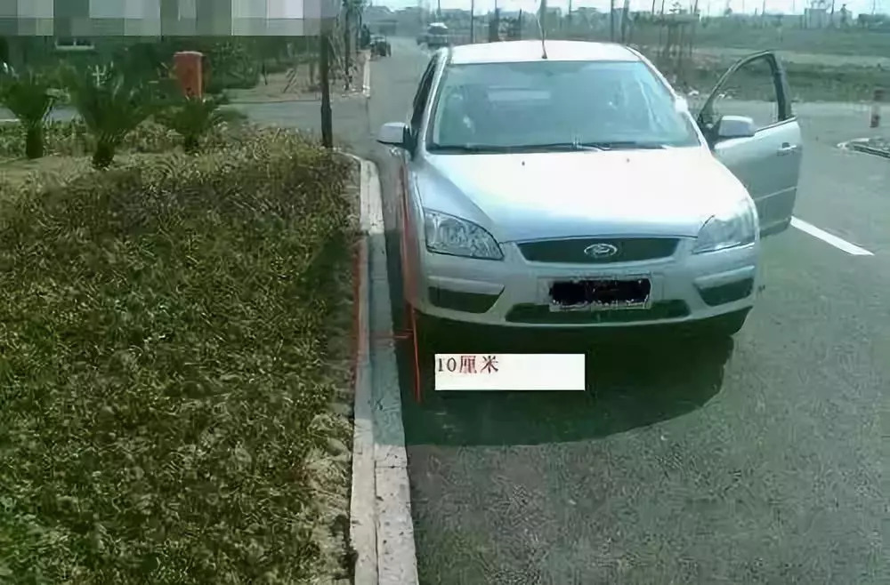

# 雨刮的妙用

## 左轮位置的判断

在驾驶室左边黄色的位置对出去和马路白线重叠，左后视镜里可以看到白线的状况！这时左轮离白线有60厘米左右，安全距离，车辆在马路中间

就是黄色线的位置和左白线重叠时左轮压线上了

当我们正常行驶时，离中心线60厘米是比较安全的。当我们的视线看到面板和A柱的交角和中线重合时，车身正好离中线是60公分。

## 右轮位置的判断

##  右方靠边泊车

---

## 参考链接

* <http://www.sohu.com/a/259279645_428861>
