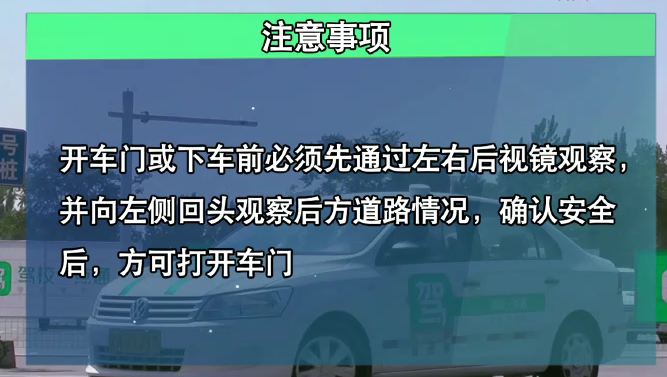
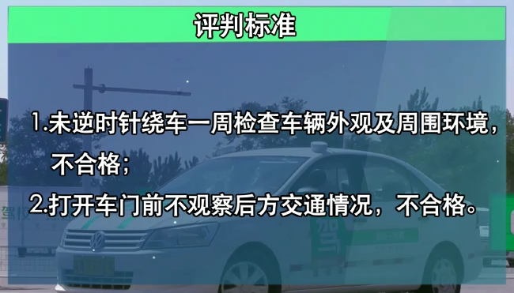
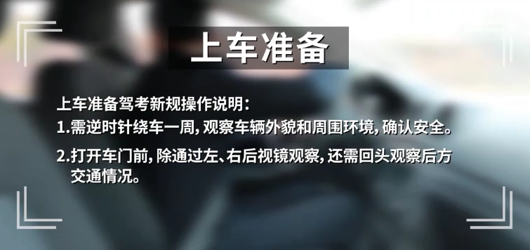
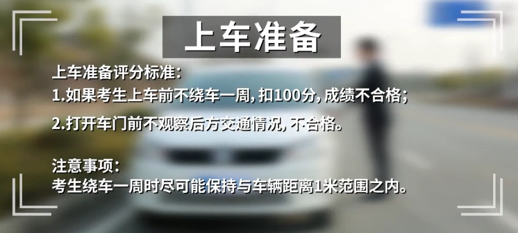
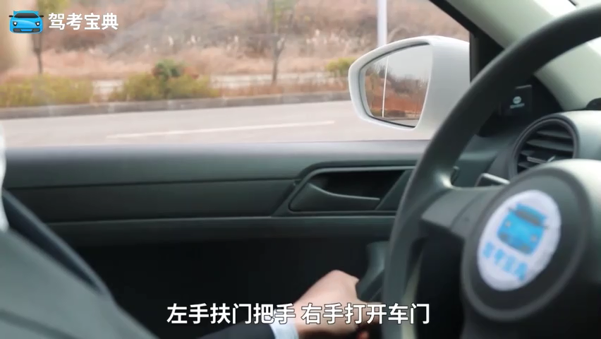
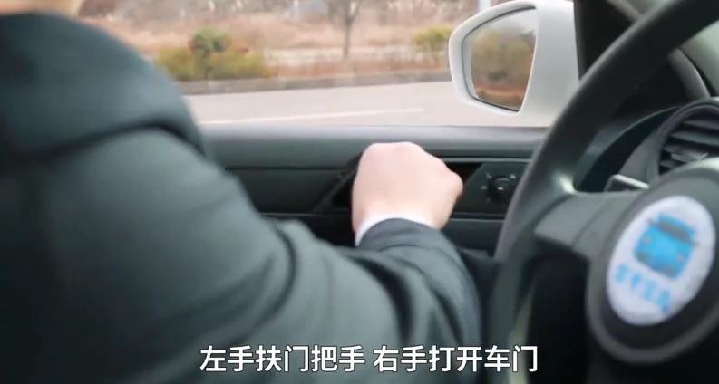
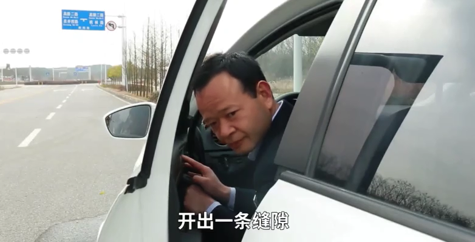

# 上车准备

* 绕车一周，观察车辆和周围环境。必须**逆时针绕车**，必须距离1m以内让感应器正常感应
* 观察后方车辆情况，确认安全后方可上车
* 打开车门必须观察后方车辆情况，不然不合格










## 荷式开门法

“荷式开门法”是荷兰的驾驶员开车门的一种方法，即开车门时总是用距车门较远的那只手开，从而减少视觉盲区。

```
简单来说，也就是左驾用右手开车门，右驾用左手开车门。
```

* 这样上半身也惯性地转动，头部和肩膀也就自然转动，转动的过程中，眼睛首先会通过后视镜观察车后的情况，转身后眼睛也就自然而然地往外和往后看了。
* 这个完整的动作就能更好地看到车后是否有行人或者行车了，进而避免很多不必要的事故。
* 相反，用距车门较近的手开门，若没特别注意后方状况，驾驶员会很自然将车门直接推向外，来不及观察后方情况。








---
