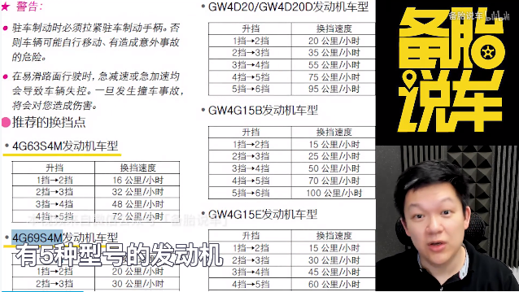

# 加减档操作

* 上坡、下坡、加速减速全都用低挡，高档只是为了维持高速运行而已
* 全程不可以用空档滑行
* 尽量使用能够满足当前行驶速度及加速度的最高档位
* 档位越低发动机功率越高，扭矩越强，车加速越快。需要加速度越大约需抵挡
* 六档加速会非常慢，这时候用抵挡加速，高档维持速度。低档加速高档维速
* 最科学的换挡应该看转速表而不是时速表


六档 1500转


四挡 2500转，更加费油


这时候用六档会很明显感觉车载抖动。车不抖动能用高档尽量用高档


## 手动挡怎么把握换挡时机

```
最科学的换挡方式是，根据转速换挡。换挡时机根据车子有没有劲。
一般转速越高扭矩越大，车子越有劲
```


## 手动挡可以跳档么?

```
可以跳档，但是转速和车速要匹配
```





速度要匹配哦。

跳档降档一定要进行补油。


## 手动挡的哪些功能自动挡做不到

1. 手动挡便宜
2. 手动挡弹射起步没有限制，自动挡有安全系统限制
3. 自动挡发动机制动不稳定
4. 手动挡跳档方便，能适应不同需求
5. 手动挡和发动机是硬连接，可以推车启动。自动挡是软连接无法推车启动
6. 手动挡的驾驶乐趣取决于驾驶员水平

## 手动挡买来不能干的10件事

1. 停车熄火后不能挂空挡。一档发动机传动比大，发动机只需要小的牵引力就尅带动车子
2. 堵车不建议一档半联动，分离轴承部件损耗。半联动会磨损离合片
3. 平时不要把左脚放在离合器上。莫名其妙过早换离合器
4. 不要经常玩弹射起步
5. 手动挡加速时不要跳档
6. 不要空挡滑行
7. 开车时不要把手放在排挡杆上
8. 车还没停稳的时候不能挂倒挡，会对变速箱齿轮造成损害
9. 高档文的时候不要重踩油门急加速。高档位踩油门耗油，可以不加油

## 参考链接

* <https://www.bilibili.com/video/av22340053/?spm_id_from=333.788.videocard.1>
