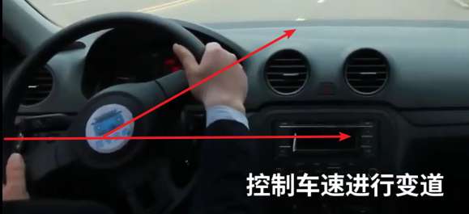
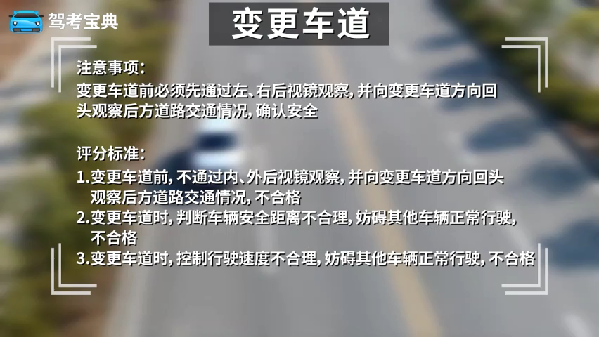
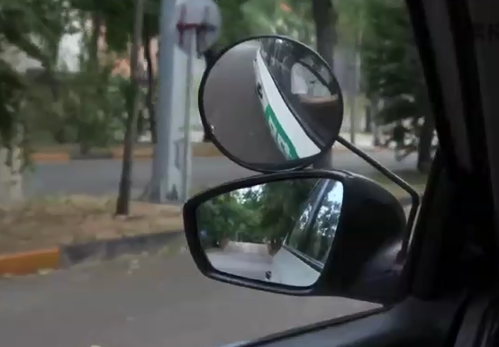
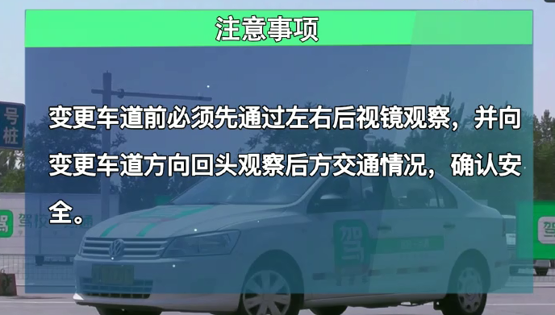
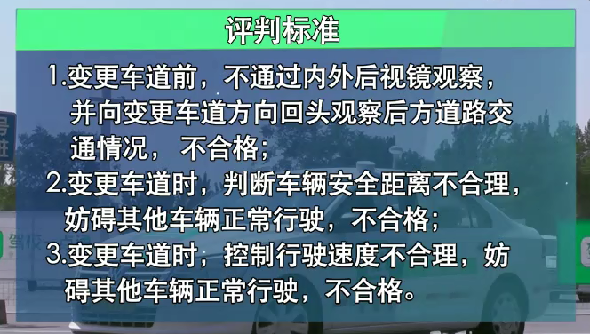

# 变更车道

1. 听到语音指令，**必须打开左转向灯超过3s**，不然直接挂掉
2. 凡事变更车道必须左/右侧观察
3. 变更一条车道后行驶几十米后方能再次变更，再次变更也必须打转向灯超过3s不然直接挂掉
4. 必须确认安全，然后回过头看前方缓慢变更车道，不需要快速变更车道

45度角转方向盘，不宜过多！

## 变更车道要不要减速?

最好是二档变更车道，速度慢一点稳妥

---
