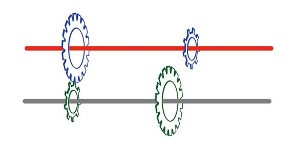

# 手动变速器原理

##  汽车换挡原理

首先讲下什么是力矩：

看下图


假定：

螺母中心点到扳手末端的距离是0.1米。

转动扳手需要用到的力是2牛。

则转动这枚螺丝的力矩为：```M = F * L = 2 * 0.1 = 0.2 牛/米```

现在增加扳手长度至0.2米，同样握住末端转动扳手，需要用多少力呢？

```F = M / L = 0.2 / 0.2 = 1牛```

可见力臂增加一倍，同样效果，力减少一半。

力矩的大小说明了，达到同一效果，要更省力的话需要增加多少施力距离来实现，

同理要更节省施力距离的话，需要施加多大力来实现。

下面看看手动挡是如何换挡的：


假设现在有台只有1档及5档两个档位的汽车。上图中橙色转动杆为动力输入端，它与蓝色齿轮中心固定带动蓝色齿轮转动。

灰色转动杆与绿色齿轮中心固定，末端与车轮连接，其转动会带动车轮滚动。

当1档时，小的蓝色齿轮与大的绿色齿轮对接。下图为横截面图


可以看出蓝色齿轮转动一圈，绿色齿轮才转半圈，其带动的轮子滚得比较慢，车速较慢。

这时施力点在左端箭头处，红色双箭头线为力臂的长度。

* 在力矩既定的情况下，力臂较长能产生较大的驱动力，车子可以拉动重物或上坡，但以牺牲速度为代价。

当换到5档时，如下图



这时大的蓝色齿轮与小的绿色齿轮对接。


从上图看出，蓝色齿轮旋转一圈，它可以带动绿色齿轮旋转两圈，同样的输入动力，车速较快。

施力点在红色箭头左端，可以看出对比1当时红色双箭头力臂要短，力矩既定的情况下得到了较快的车速但车子的驱动力却降低了。

## 迷你换挡模型


此时速度最快


## 马力和扭矩有什么区别?

* 加速和最高速度都和马力有关系。马力就是功率，单位时间做工物理量。
* 扭矩是衡量力对物体的转动产生了多大作用的物理量
* 马力是决定动力性能关键指标
* 扭矩对性能没有直接影响。扭矩大不代表动力好
* 最大扭矩影响发动机发力时间
* 马力和扭矩成正比


## 参考链接

* <http://mini.eastday.com/mobile/180206222320552.html>
* <https://www.bilibili.com/video/av3954294?from=search&seid=9099864002904631801>

---
