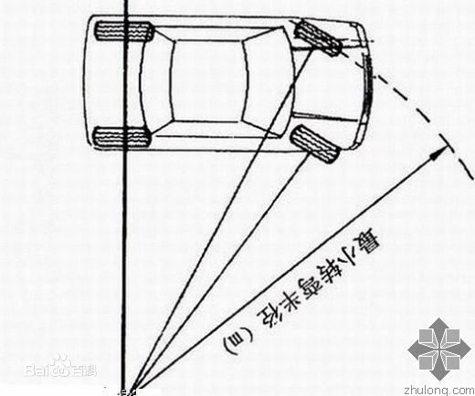
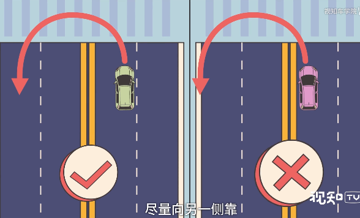
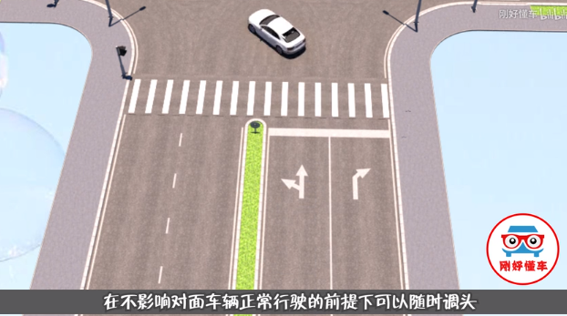

<!-- TOC depthFrom:1 depthTo:6 withLinks:1 updateOnSave:1 orderedList:0 -->

- [掉头](#掉头)
	- [转弯半径](#转弯半径)
	- [掉头情况](#掉头情况)
		- [有掉头指示灯](#有掉头指示灯)
		- [没有掉头指示灯](#没有掉头指示灯)
		- [黄色网格区域允许掉头](#黄色网格区域允许掉头)
		- [禁止左转](#禁止左转)
		- [斑马线区域严禁掉头](#斑马线区域严禁掉头)
		- [直行车道](#直行车道)
	- [禁止掉头](#禁止掉头)

<!-- /TOC -->

# 掉头

1. 提前打开左转向灯必须超过3s
2. 必须观察左侧道路情况。一打二看三刹车四减档五掉头
3. 掉头最好用二档
4. 转向灯超过3s并且观察左侧道路交通情况，确认安全后看前方掉头
5. **越慢的车，向前动能越小，越容易掉头**
6. 尽量向另一侧靠
7. 转弯半径出厂的时候直接固定了
8. 路灯必须越过斑马线掉头
9. 实现不准掉头，虚线可以，如果靠近的时虚线可以掉头
10. 黄色网格线是禁止停车，但是你可以掉头。黄色网格其实就是用来掉头的
11. 反正特么的不准在斑马线上掉头


## 转弯半径

```
最小转弯半径,方向盘向左打死后，外侧前轮画圈圈半径.

最小转弯半径是指当转向盘转到极限位置，汽车以最低稳定车速转向行驶时，外侧转向轮的中心在支承平面上滚过的轨迹圆半径。

它在很大程度上表征了汽车能够通过狭窄弯曲地带或绕过不可越过的障碍物的能力。

转弯半径越小，汽车的机动性能越好。
```







## 掉头情况

### 有掉头指示灯

### 没有掉头指示灯

正常情况，在不影响道路交通的时候你可以在红绿灯的情况下掉头。



### 黄色网格区域允许掉头


### 禁止左转


禁止左转=禁止左转+禁止掉头

### 斑马线区域严禁掉头


### 直行车道


不得掉头!!!


## 禁止掉头


直行道不准掉头哦


因为掉头半径问题有些地区最左侧是禁止掉头的，只能开到中间车道。

掉头尽可能掉到最左侧车道

---
