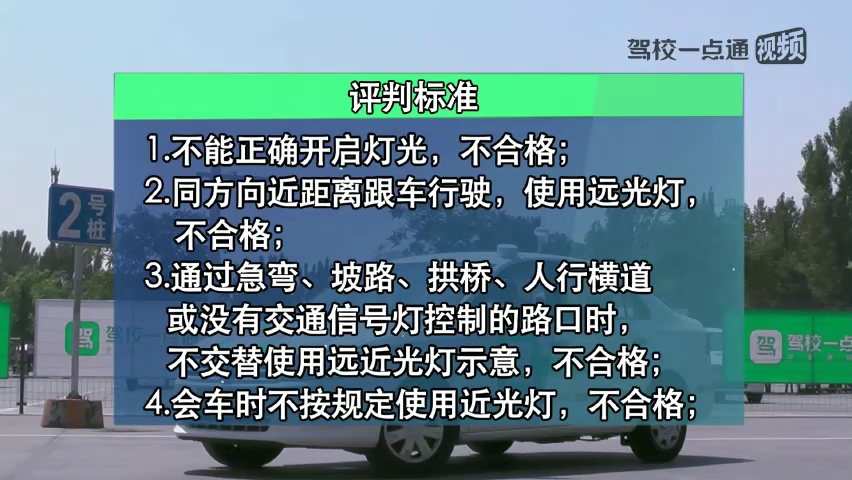
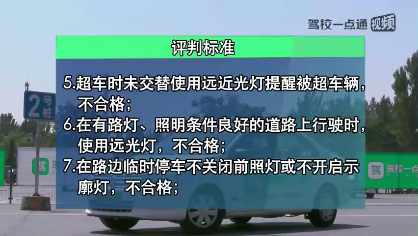
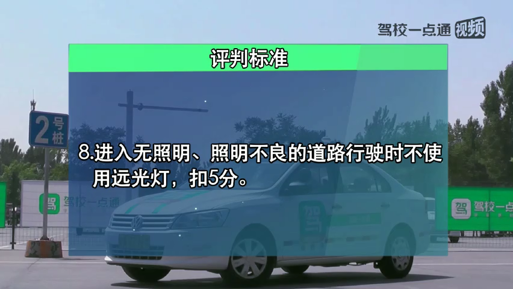

# 模拟夜间场景灯光使用

---

---

## 基本套路

1. 示廓灯必须和危险报警闪光灯一起使用，场景为夜间路边临时停车
2. 会车，跟车都是近光灯，默认近光灯，不要动就是
3. 超车，通过XXX都要远近光灯交替。（除了通过有交通信号灯的路口，否则其他通过都是这样）
4. 通过有交通信号灯控制的路口，近光灯。

## 考试语音播报

1. 夜间在没有路灯，照明不良条件下行驶。
2. 夜间在窄路与非机动车会车
3. 夜间与机动车会车
4. 夜间经过急弯、坡路
5. 夜间同方向近距离跟车行驶
6. 夜间超越前方车辆
7. 夜间在道路上发生故障方案交通又难以移动
8. 夜间通过没有交通信号灯控制的路口
9. 夜间通过拱桥、人行横道

（1） 夜间在没有路灯，照明不良条件下行驶； (远光灯)

（2） 夜间在窄路与非机动车会车；（近光）

（3） 夜间同方向近距离跟车行驶；（近光）

（4） 夜间与机动车会车 （近光）

（5） 夜间通过拱桥、人行横道；（远近光交替）

（6） 夜间通过急弯、坡路；（远近光交替）

（7） 夜间通过没有交通信号灯控制的路口；（远近光交替）

（8） 夜间在道路上发生故障，妨碍交通又难以移动。(示宽灯、危险报警灯）

（9） 雾天行驶（雾灯、危险报警灯）

## 要点

1. 切记不要抢答，在语音播报完成后5秒内完成指定操作即可，语音未播报完毕抢答的情况按考试失败处理。
2. 仔细听指令不要慌是最重要的，要头脑清晰。
