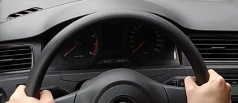

# 直线行驶

1. 保持直线形式，以每小时不超过30公里左右的速度行驶
2. 适时左右观察
3. 不能用一档。

## 直线行驶为嘛会挂科？

方向盘这么握

这样握住方向盘容易造成用力过猛

## 直线行驶评判准则

* 轮胎在车道上，正负不能大于50公分(厘米)
* 车偏移25公分，再回25公分，就JJ了
* 以不低于25公里的速度去开直路线，用三挡

1. 当语音提示：“直线行驶”考试时，考生应稳定控制车辆，方向保持直线行驶。方向有任何大幅摆动，都会评判为“方向控制不稳，不能保持车辆直线运动状态，不合格”。

2. 考生听到“直线行驶”考试口令后，应提前选定驶入一条离前车较远和没有前车的车道或没有占道不能移动障碍的车道进行考试。

3. 直线行驶路段若遇前车阻挡时，可以停车，但在整个150米的直线行驶路段，要以5公里/小时以上速度保持直线行驶。

档位在三档，速度超过20，低于40，方向保持不动，行驶距离150米

---
