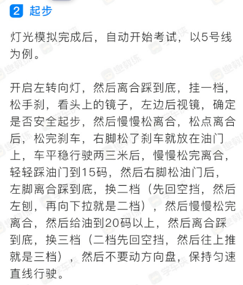

# 科三模拟提问

1. 直线行驶可否微调方向盘

## 考试流程

* 考3号线，进门坐在左手边，候考大厅，坐在左手边
* 考官拉倒3号线起点。站在驾驶座旁边，听考试开始，逆时针绕车一圈，按车上按钮

按下按钮会播报考生经过车尾，车头

3. 然后上车准备，先调座椅靠背，再调前后视镜，系上安全带。安全带是开始灯光考试的开始标志。
4. 灯光考试后，起步
5. 3号考试线路起步后立马升档，二档，三挡，四挡。4挡保持5s以上，心里默数。4挡速度提升到40保持不动，左右观察
6. 直行通过路口，
7. 通过路口后会通过通过学校区域，减速减档，车速控制30码以内，最好27、28
8. 直行一阵子后会右转，开启转向灯，靠近路口换二档。转向灯必须超过3s以上。右转到中间车道
9. 然后继续直行一阵后会要求变更车道，变更到左边，必须开启转向灯超过3s以上。变更之后关闭转向灯
10. 直行一阵后要求前方选择合适地点掉头，必须开启左转向灯超过3s，在虚线中间停住，挂一档，方向盘打死，然后缓慢松离合掉头在右侧车道
11. 继续直行一阵后要变更到左边，因为前面是左转弯
12. 前方路口左转，轻踩刹车，如果不可以直接停车一档起步，开启转向灯超过3s，交通允许，开始起步一档转弯。转弯到中间车道就可以了，不需要左边，左边要变道。
13. 前方路口直行。路口停车线要踩一下刹车，尽量到路口时候换二档。车速不超过30码
14. 通过公交车站，距离公交站牌前踩刹车，速度不超过30码。中间车道直行
15. 前方路口右转，打右转向灯，轻踩刹车，尽量换到二档。必须观察左右。转弯不要踩油门。靠近右边车道，实线旁边
16. 靠边停车，打右转向灯。必要时候停车，一档起步靠右，车身距离边缘线不超过30cm
17. 拉手刹，挂空挡，熄火关灯
18. 成绩合格，请回中心打印成绩

* 在没有告诉你考试合格之前不要取安全带，取了安全带就不合格了，一定要等语音说考试合格后才能取安全带。
* 模拟指导员告诉我们最好是在25码左右
* 转弯和掉头的时候脚是放在刹车上，不能放在油门上
* 速度在25码左右并不需要点刹车和左右看，我自己考试的时候为了保险起见是把脚放在刹车上，左右观察车子两边的情况
* 千万不要在车上说话不管你说什么你都连累全车人的成绩，就算之前有人考试合格但你一说话全车人考试成绩取消，这是考试的时候指导员一再强调的
* 高新西区考场真的是通过率极高的考场，只要你平时掌握了技巧，考试的时候平稳发挥，基本都没的问题。

## 图解3号线考试

1. 起步。快速进入四挡模式

2. 前方路口直行。距离人行横道轻踩刹车减速直行。经过两个路口

3. 没有语音-通过学习区域。减速减档，车速控制在30码。两个牌子中间点。速度跑27、28

4. 前方路口右转。打右转向灯超过3s，轻踩刹车，挂二挡走，必须二档。不管红灯，靠右车道

5. 请变更车道。打左转向灯超过3s

6. 前方选择合适虚线处停车，一档，右打满方向盘，变更到右侧车道。掉头后变更到左边

6.1 这里可能会要求变更车道，不是前面就是这里

7. 前方路口左转。打左转向灯超过3s，轻踩刹车，挂二挡走

其实这里可有转到右边中间车道

8. 前方路口直行

9. 没有语音-通过公交车站-一脚刹车搞定

10. 前方路口右转。打右转向灯超过3s，轻踩刹车，挂二挡走

11. 靠边停车。打右转向灯超过3s，轻踩刹车，挂二挡走

12. 拉手刹，挂空挡，开关车门，熄火关灯，解安全带。轻开车门。

## 档位

## 文字技巧

## 模拟人说

1. 30以上就要减成三挡
2. 斑马线箭头那里点刹车

---
