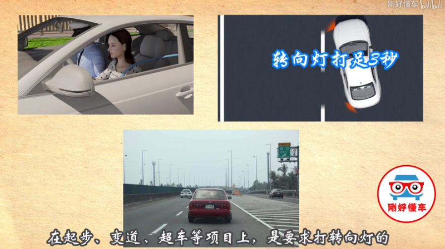
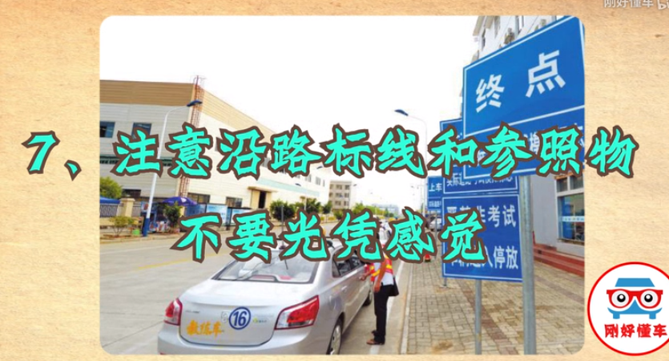
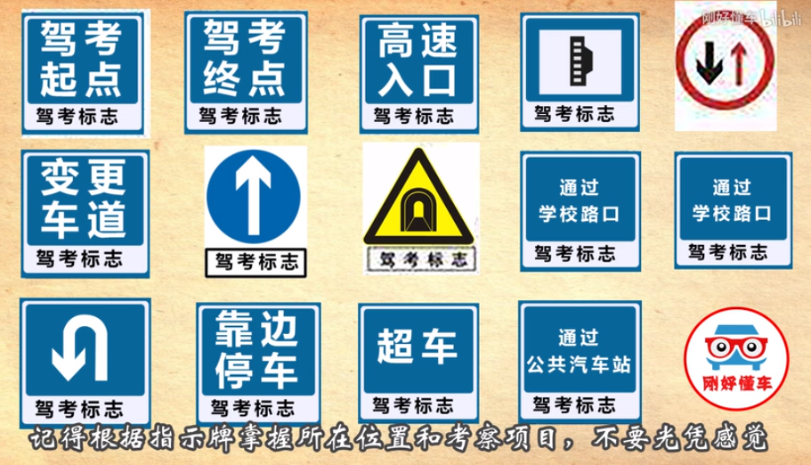
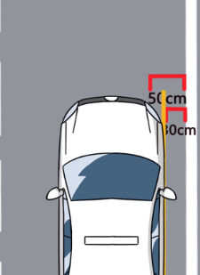
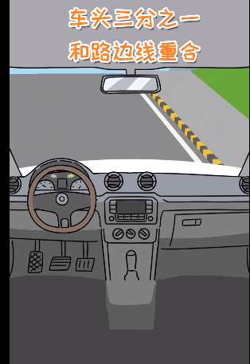
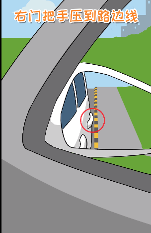

# 科目三易错点汇总

1. 一般来说，二档是不能超过200米的，这个是通常的规定，可能有些地方不一样。

但是要记住一定：二档不能使用过久，起步后速度达到就要挂到三档。

2. 最后的靠边停车也是需要用二档的，靠边停车也不要驾驶距离过久，否则也很容易超过200米。

3. 除非的掉头的时候车很多或者路比较窄，或者突然遇到了前方障碍的车辆，否则不要轻易用2挡。

4. 靠边停车不要急，先打灯，换二档，缓慢前行。靠边停车关键在于车速要稳住

