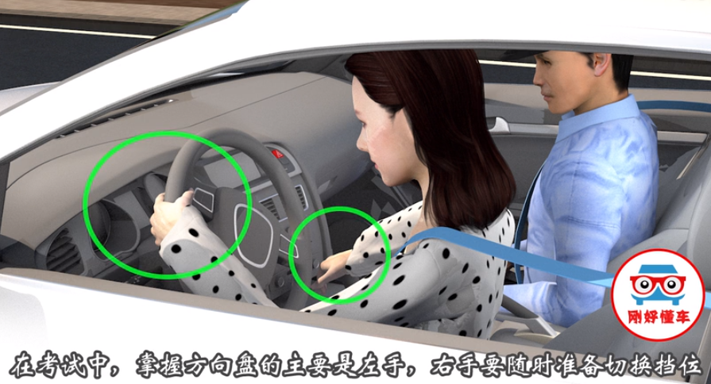

# 科目三易错点汇总

1. 一般来说，二档是不能超过200米的，这个是通常的规定，可能有些地方不一样。

但是要记住一定：二档不能使用过久，起步后速度达到就要挂到三档。

2. 最后的靠边停车也是需要用二档的，靠边停车也不要驾驶距离过久，否则也很容易超过200米。

3. 除非的掉头的时候车很多或者路比较窄，或者突然遇到了前方障碍的车辆，否则不要轻易用2挡。

4. 靠边停车不要急，先打灯，换二档，缓慢前行。靠边停车关键在于车速要稳住

5. 最近武汉科目三出了新规定，除了新增了一条线路以外，靠边停车项目难度也增加了。从开始的只测前轮与边线的距离，改成了现在的前后轮取最大值测量距离。30公分的把握，越来越难了!

认安全的情况下向右靠边，在行驶减速的过程中观察车头盖右边三分之一处与右边道路边缘线重合的情况下，缓慢前进车平行后停车。

保持车速，不要忽快忽慢，只要发动机盖右边三分之一处与右边道路边缘线重合，那么车身右侧和道路边缘线之间的距离就是30厘米，为了确保安全在考场上一定要随机应变，假设前面科目没有扣分，这里只要不超50厘米就是合格的，不要一味追求30厘米而导致碾压道路边缘线。

说难不难，靠边停车这个项目学员一定不要为了应付考试去学，在现实中的应用很重要。

另外，科目三全程几乎每一个项目都有一个盲点，很容易就出现挂科，在学车或准备学车的朋友，可以关注武汉来驾校公众号，在公众号上每天会更新练车和考试的技巧。

---
