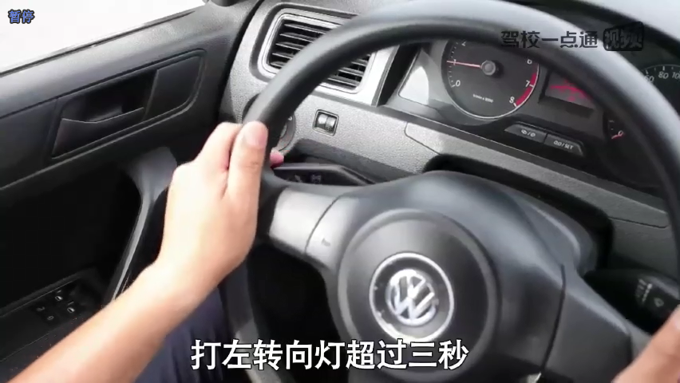

# 超车

1. 必须打左转向灯超过3s，不然直接挂掉
2. 确认安全后才能打方向盘，方向盘左打不超过45度
3. 不具备超车条件时候不得超车
4. 严禁右侧超车，听到超车你就打左转向灯
5. 超车的时候骚微提速一下下

## 驾考宝典

**左打方向盘不超过45度**

**只有在条件允许的时候完成该动作，条件不允许，你特么就乖乖慢速或者停车等前车都跑完了**

条件允许的话整个过程在250m内完成。

## 驾校一点通

不具备超车条件时候许耐心等待，条件允许时候完成超车动作。

---
