# 路口右转弯

要点

1. 观察左及左后方和右前方交通情况，必要时候停车瞭望。
  * 转弯必须要让直行，不然都是你转弯的过错
2. 必须打转向灯超过三秒才能动
3. 必须要提前开到右转弯车道
4. 遇到交通阻塞时候不要进入入口，必须在停止线前等待
5. 听到语音指令后踩刹车减速，同时打右转向灯必须超过3s
6. 右转转小弯，方向盘不超过45度
7. 反正听到语音指令踩一下刹车没毛病，如果三挡换二档，如果二档也要踩一下刹车

## 驾考宝典

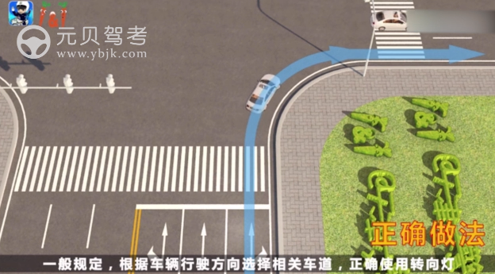

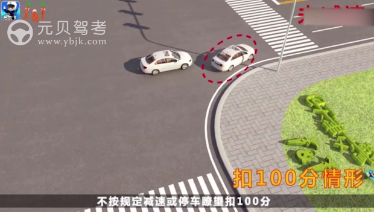

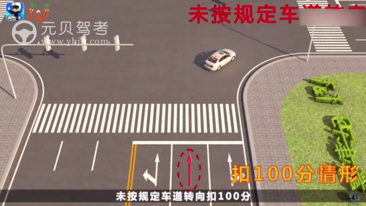

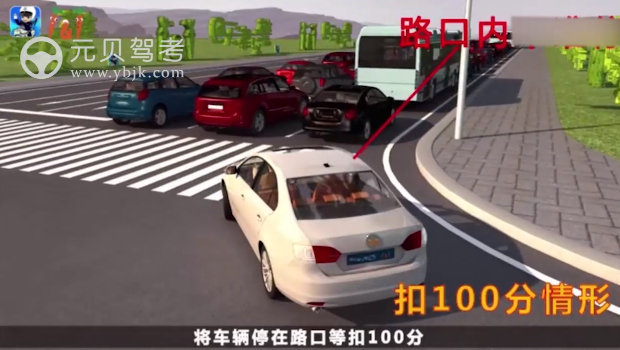

## 驾校一点通

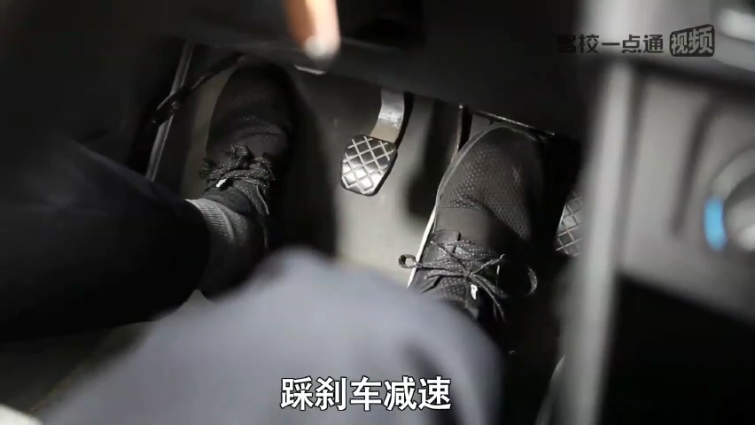

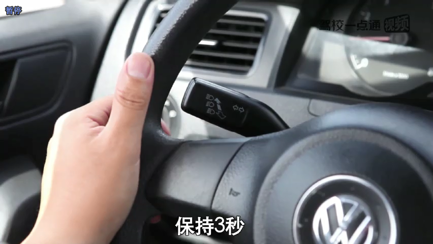

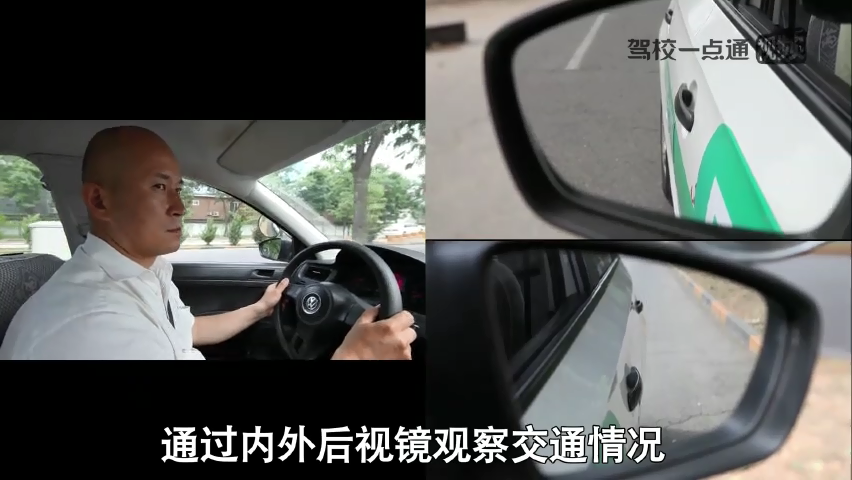

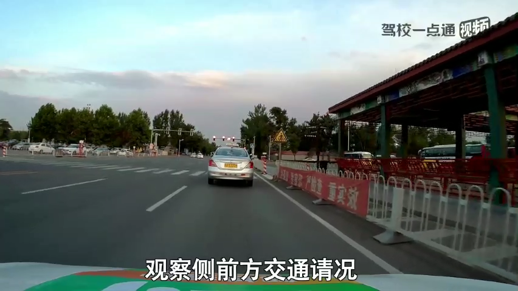

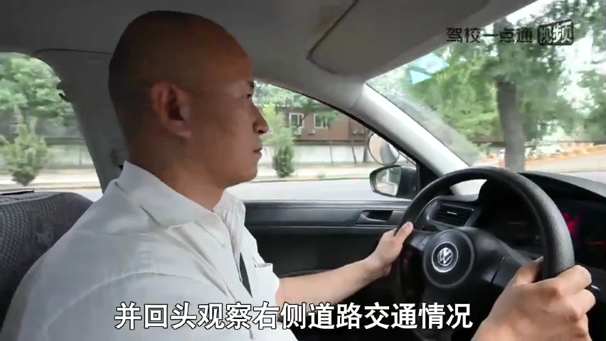

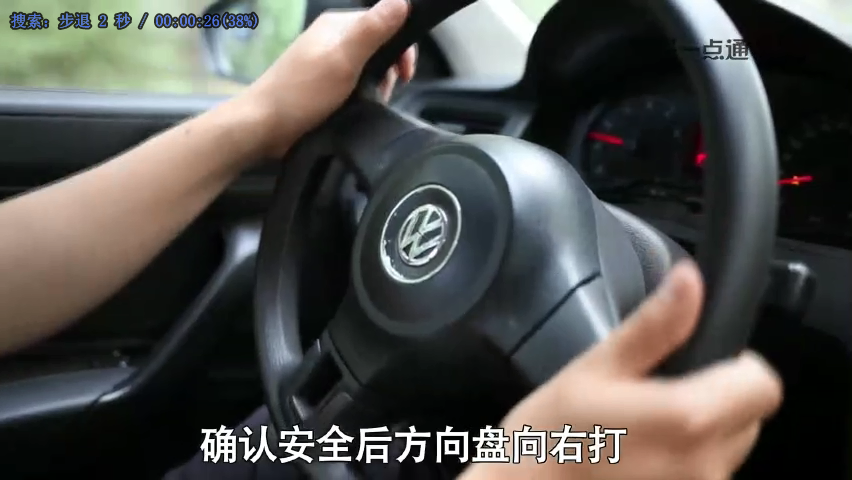

路口内禁止停车!!!!

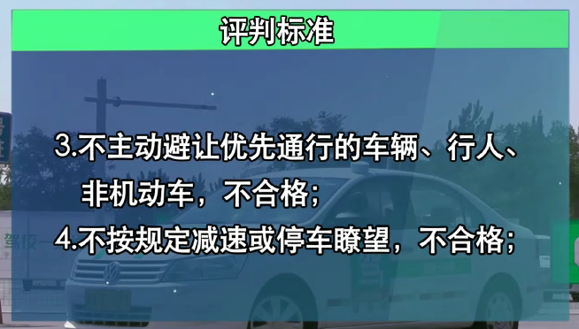

* 路口内交通拥堵不得进入入口内，必须在路口外停止线前停车等待

---
