# 通过路口

1. 学校区域不进行语音播报!!!!
2. 看到快要到路口主动减速，主动踩刹车，主动避让行人
3. 快到入口需要挂二挡
4. 禁止鸣笛

## 驾考宝典

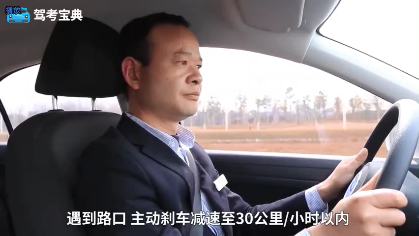

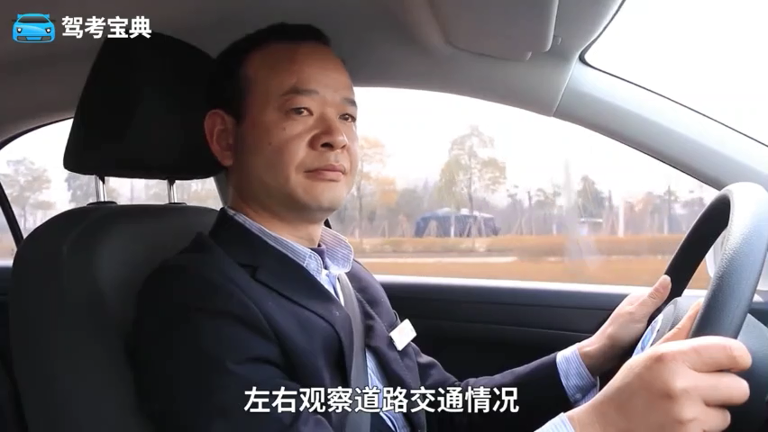

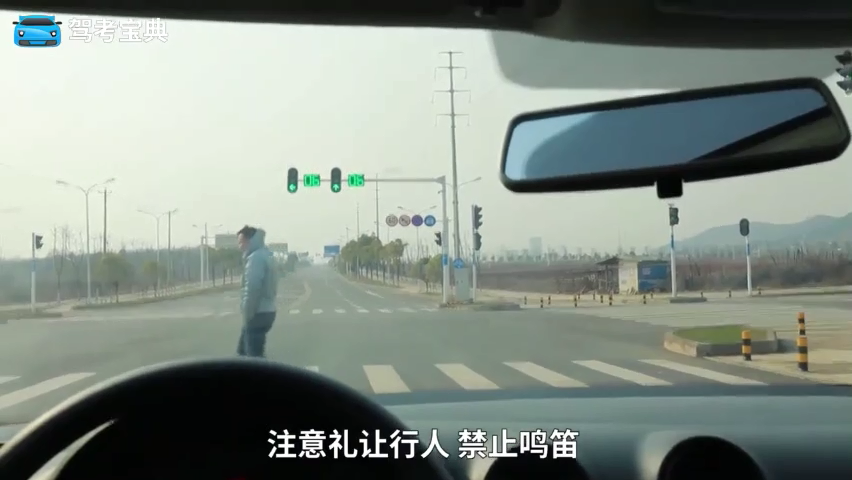

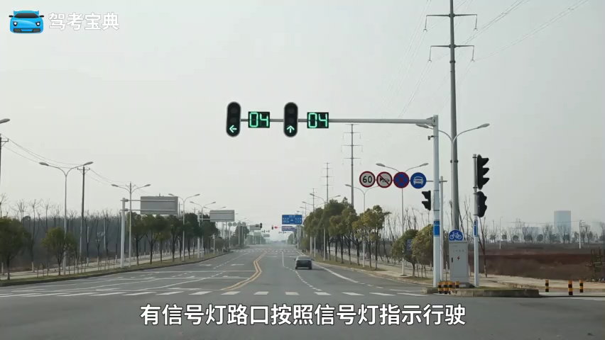

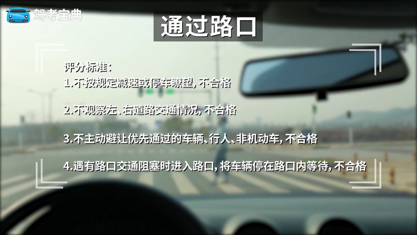

* 前方道路拥堵，必须停在路口外等待。

## 驾校一点通

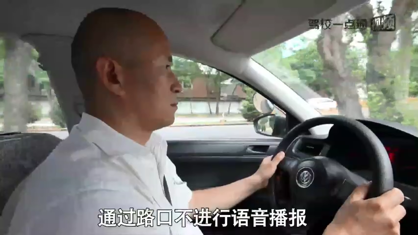

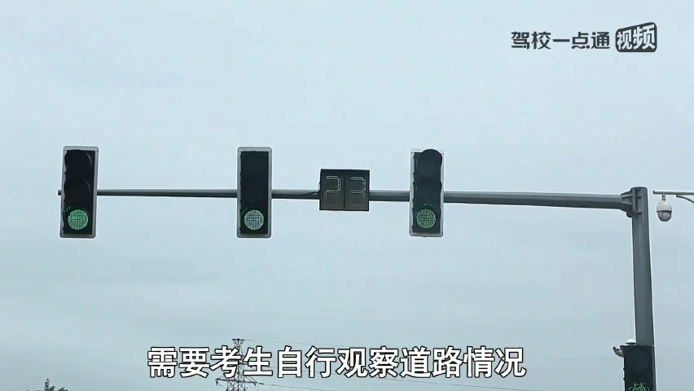

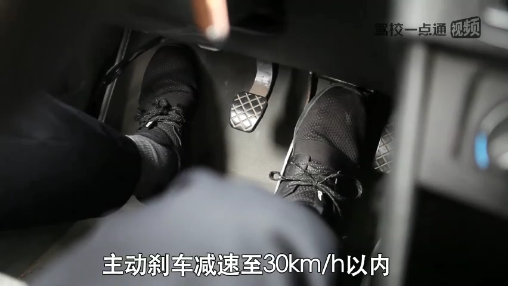

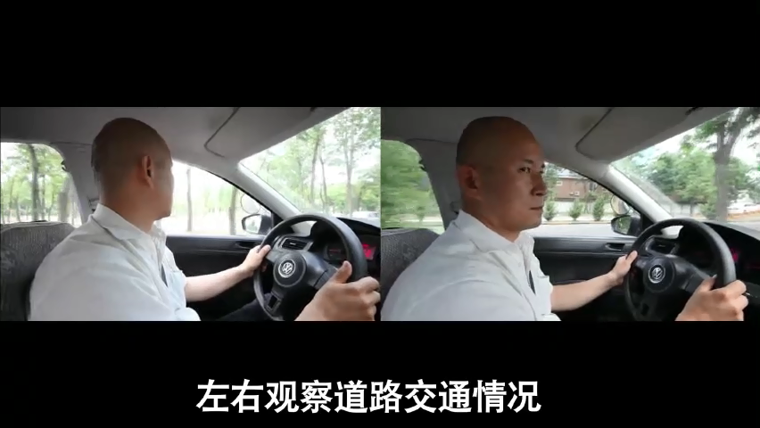

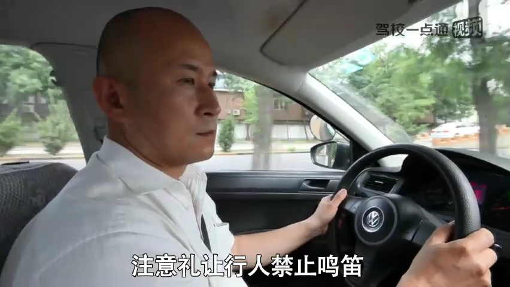

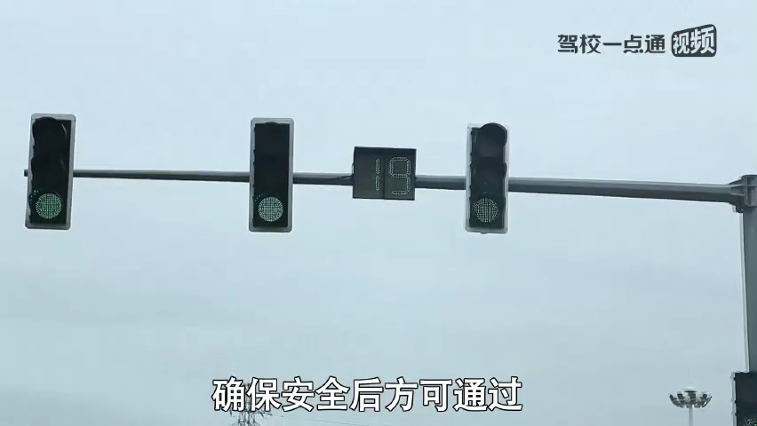

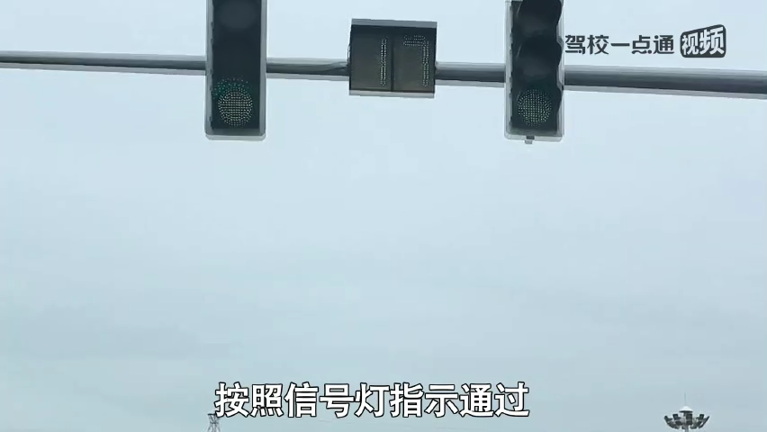

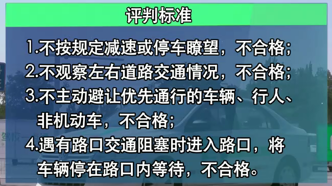

路口内交通堵塞不得进入入口

## 通过交通路口到底该看哪里?

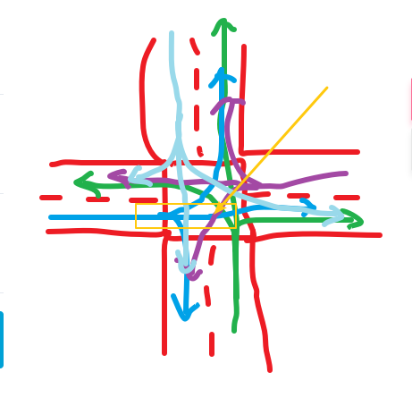

转弯让直行，如果你是直行，那么你就应该看左侧和右侧。因为如上图所示。

倘或你是绿色线路，那么左侧

## 路口踩刹车30m范围

保证范围内才行，速度与档位匹配
