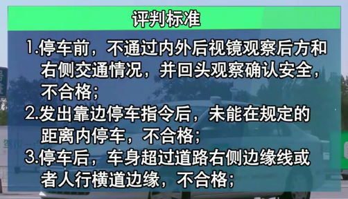
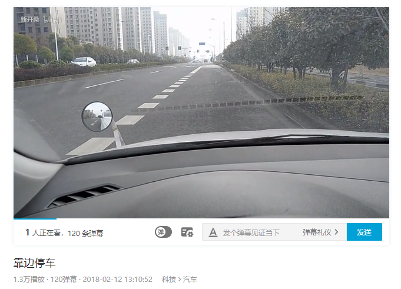
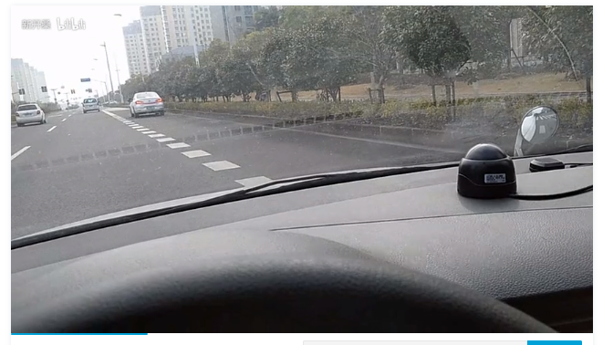
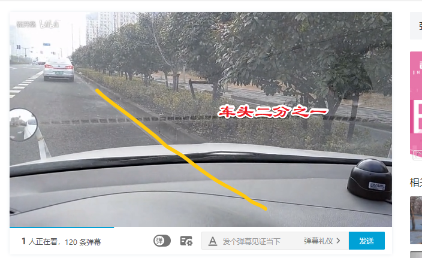
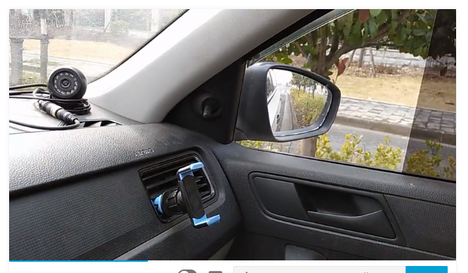
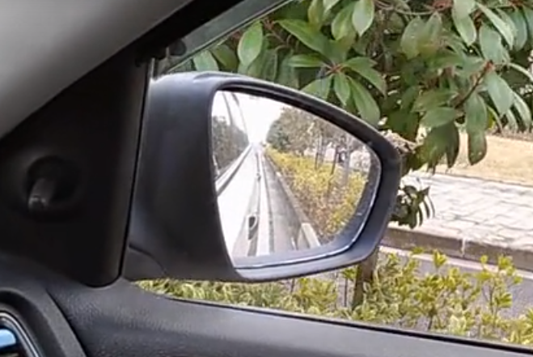
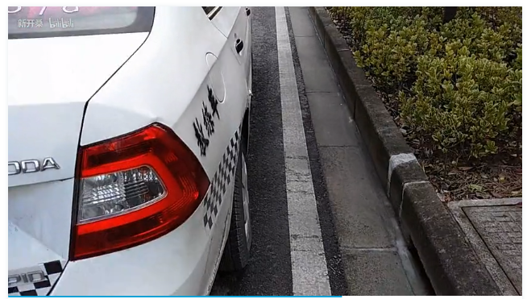
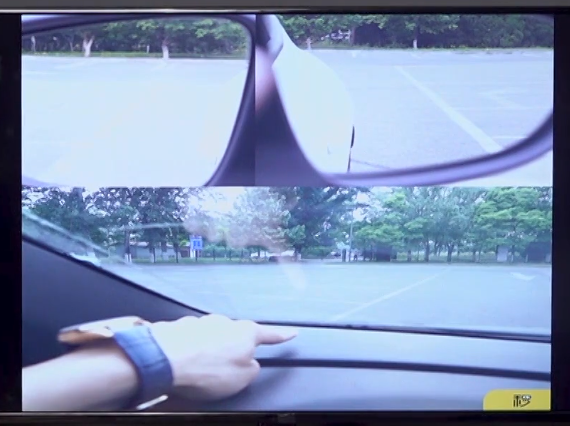

# 靠边停车

1. 听到语音指令后先减速，打开右转向灯超过3s
2. 必须要挂空挡，拉手刹，关闭发动机，关闭电源

## 驾考宝典

## 驾校一点通

## bilibili中二教练教程

* 轮胎不能压白线

* 缓冲距离是150m

## 参考

* <https://www.bilibili.com/video/av19489753/?spm_id_from=trigger_reload>
---
