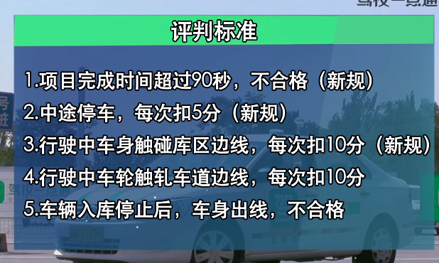

# 侧方停车

## 操作步骤

### 步骤一

挂一档，低速进入考试区域

右侧距离边缘线30到50厘米

当车尾与库区左前角1到1.5m时停车

### 步骤二-挂倒挡

看右后视镜，当库区左前角线消失时，方向盘向右打满

### 步骤三-看左后视镜

当车边条刚接触黄色虚线时，向左回轮1.5圈，即回正车轮
当轮胎接触黄色虚线时候，方向盘向左打满

### 步骤四-看左后视镜

车边条与黄线平行时候，车正停车。
