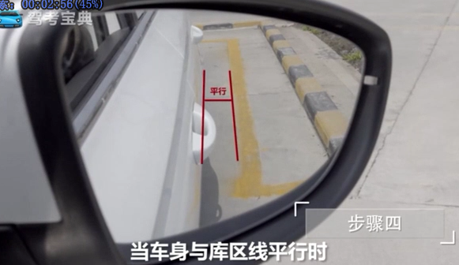

<!-- TOC depthFrom:1 depthTo:6 withLinks:1 updateOnSave:1 orderedList:0 -->

- [倒车入库](#倒车入库)
	- [右倒库步骤](#右倒库步骤)
	- [左倒库步骤](#左倒库步骤)
	- [为什么要倒车入库而不是顺车入库？](#为什么要倒车入库而不是顺车入库)
	- [高手技巧](#高手技巧)
		- [高手拆解](#高手拆解)
		- [阶段1-起步+出库或停车](#阶段1-起步出库或停车)
		- [阶段2-后轮接近库角(重中之重)](#阶段2-后轮接近库角重中之重)
			- [2.1-车后轮离库角距离太宽](#21-车后轮离库角距离太宽)
			- [2.2-车后轮离库角距离太窄](#22-车后轮离库角距离太窄)
		- [阶段3-方向盘回正阶段](#阶段3-方向盘回正阶段)
	- [参考](#参考)

<!-- /TOC -->

# 倒车入库


## 考试要求

## 基本步骤

## 基本方法

## 常见错误

## 要点


* 三分半啊，停车扣分啊。。主要还是踩离合！！！

## 右倒库步骤


* 大于30cm时候，向右打轮
* 小于30cm时候，向左打轮



## 左倒库步骤

* 大于30cm时候，向左打轮
* 小于30cm时候，向右打轮


平行时候回正

## 为什么要倒车入库而不是顺车入库？


**之所以要屁股超后倒进去而不是头超前开进去，说到底是为了避免发生和旁边车的碰撞。（也有人说是为了离开的时候更方便）**


你先走如上图的绿色线路，你的车头右前方有足够的空间避开你的右侧车辆时，车身左侧就可能撞到左侧车辆的左前角。左侧这个倒霉的车车头越靠外，车身越靠近你的车位，你撞他的可能性越高，于是他的前保险杠要喷漆，你的左侧后门要钣金+喷漆。


于是，你为了避开这个倒霉蛋，只好先往前多走了半米，然后再往车位里开，这时候你成功避开了你左侧车辆然而悲剧再次发生，因为你车头的右前角蹭到了你右侧车辆，于是你保险杠要喷漆，他右后车门要钣金+喷漆。

以上悲剧在车位越窄的时候越容易发生。


正确的姿势是这样的


直接把车身开过车位，然后挂倒挡，看着后视镜往里倒，倒的时候基本原则是让靠近圆心的后轮贴着旁边的车头。比如上图，假设你走绿色线路往里倒，那你的左后轮要贴着下排左2这辆车的车头右前角，
如果你走蓝色线路，那你的右后轮就要贴着上排左2这辆车的左前角。这两个角在你的后视镜中都是可以看到的，所以你只要确保不撞着这两个位置，就可以放心大胆的打死方向往里倒了。
如果你在后视镜中看不到这两个位置，基本上可以肯定你后视镜调的角度不对，你肯定能通过后视镜看到自己的一大半车身，这是错的，这两个后视镜是用来看你左右两侧车道的，不是用来看自己车的屁股的，屁股自己跑不了。

再来说侧方停车。


如果你也是用头往里扎，结果往往很感人，会有3中情况免费任你选：

你的右前轮胎蹭了马路牙子，或者你的前保险杠需要喷漆
你的左后屁股明显伸出停车位，被别的车给撞了
你蹭到了前面或后面的车


正确的姿势是这样的：


直接把车身开过车位，然后挂倒挡，看着后视镜往里倒，倒的时候基本原则是让右后轮贴着右侧车辆的左后角，同时要瞅一眼自己车的左前角，别蹭到左侧的墙壁、车辆、行人。等自己的左后轮进了停车位的线时就到了过渡状态，此时车辆和停车位的夹角大约是45°左右。然后继续倒，但是一边倒一边把反方向打方向盘，此时要密切关注自己车的右前角不要蹭到前方的车，以及自己的右后轮不要蹭到马路牙子。所以请记住：除非万不得已，否则任何时候不要车头朝里往车位里开，哪怕你左右两侧都是空的也不要这么干，因为你根本看不见你车头的右前方离其他车（或障碍物）有多远。


## 高手技巧

“不知道怎么修车身与库线的距离”是核心难点。因此很多人反映，倒车入库总是压线，或者总是一边宽一遍窄，怎么办？  

**解决方案：**核心在于入库时，控制后轮与库角的距离。

**结果：**在周围亲朋好友普遍反映科二尤其入库难的暗示阴影下，从第一次上驾驶位忐忑不已，到经过15学时练习，最终一个半月后（17年2月底）一次满分过。  

**感受：**其实很简单。 最初因为看到大部分人吐槽倒车入库难，自己偏不信，因此在练车过程中会有意识地找问题和规律，发现“不知道怎么修车身与库线距离”是核心难点。针对这个问题，专门分享一些经验。  

**背景：** 坐标深圳，倒车入库被安排在最后一项练习，即已经通过训练直角转弯、S弯，半坡停车与起步和侧方入库，掌握了一定的方向控制和速度感觉，即完成了基础层面的熟悉。这种安排个人非常认同，由易入难逐步进阶，因此倒车入库上手相对较快。  刚开始练倒车入库，光机械地听从教练往左打方向、往右打方向，一旦教练下车找别人聊天，自己一个人在车上完全不会控制，要么左边宽，要么右边宽甚至压线，直到找到规律。  

### 高手拆解

**具体拆解：**具体其实右入库左入库原理都一样，都可拆解为三个阶段。  

### 阶段1-起步+出库或停车

简单不表。只要停车时车头过感应线，车歪点就歪点，只要不至于太歪，就不影响，因为后面你至少有两次机会能调整。  

### 阶段2-后轮接近库角(重中之重)

这个阶段不同教练有不同方法，比如右入库，有的教练建议方向盘右打满，我的教练方法是一圈+90度。我觉得1圈+90度好，原因接下来讲。

#### 2.1-车后轮离库角距离太宽

入库时，如果车后轮离库角距离太宽，咋办？ 这时候我们的目的是让后轮与库角距离变小，**一圈+90度**的优势就出来了。 以下重点在于理解规律，具体操作都是契合规律的，之所以写出这些并不重要的操作，只是为了加深规律理解。   


* 如果是右入库，右后轮离库角距离太宽，那就将方向盘往右稍打，车后轮与库角距离会越来越小。离得越宽，打得越多甚至可以打死。打完了先不用回方向盘。
* 如果是左入库，左后轮离库角距离太宽，那就将方向盘往左稍打，车后轮与库角距离会越来越小。离得越宽，打得越多甚至可以打死。打完了先不用回方向盘。  
* 如果按某些教练一开始就方向盘打满的方法，这里就没办法调了。  

#### 2.2-车后轮离库角距离太窄

入库时，如果车后轮离库角距离太窄，咋办？ 这时候我们的目的是让后轮与库角距离变大。

PS:以下重点在于理解规律，具体操作都是契合规律的，之所以写出这些并不重要的操作，只是为了加深规律理解。  


* 如果是右入库，后轮离库角距离太窄，就将方向盘往左稍打，车后轮与库角距离会越来越大，目测距离合适后，方向盘回至初始阶段（打满或一圈+90度状态）。   
* 如果是左入库，后轮离库角距离太窄，就将方向盘往右稍打，车后轮与库角距离会越来越大。目测距离合适后，方向盘回至初始阶段（打满或一圈+90度状态）。  那位同学问了，如果没利用好这个阶段，还有救吗？答案是，有。  

### 阶段3-方向盘回正阶段

入库时，方向盘何时回正？普遍说法是，车身正了就回正。 我不这么认为。这得分情况。如果入库时恰好左右适中，可以车身正就回方向盘正。 但是，如果车身，距左右库线距离不一，你又是个强迫症患者，非要让车居中，那么还有大招二。  

3.1 快回正了，车后轮仍然离边线太宽，咋办？

这种情况，**不管是右入库还是左入库，我们的目的是让车后轮与边线距离变小。** 答案是，从后视镜中看到车身平行后，过1-2秒，方向盘再回正，即稍晚约1秒-2秒（视距离宽窄，越宽越晚回）。  有同学会问，那这样我的车身这时不就歪了吗？没错，就是要让它歪啊。歪着进库，后轮和边线的距离才会越来越小啊。如果一开始就平行着进来，后轮和边线的距离岂不是不会变了吗？  

经过1-2秒，距离适中后，迅速调直车身与左右库线平行。   


关于这里调直车身，有一个原则参考：**从后视镜中看，车屁股离哪边库线宽，方向盘就往哪边打。**   


3.2 快回正了，车后轮仍然离边线太窄，咋办？

答案是，从后视镜中看到，车身将平行还未平行时，方向盘就回正，即稍早约1秒-2秒（视距离宽窄，越窄越早回）。  因为早1-2秒就回正，车身会稍歪着进库，后轮和对应库边线的距离会越来越大，我们的目的就达到了。目测距离适中后，迅速回正方向盘，再调直车身平行即可。  你可以拿一本书在桌上模拟车身入库轨迹，体会稍歪着入库时，书角和线的距离变化。  此为大招二。  

```
总结：
一、要控制车身与左右库线距离，只要控制好后轮与库线距离。  
二、你一共有两条命： 第一条命，后轮入库角阶段，利用打方向调整； 第二条命，方向盘回正阶段，早回或晚回，再调车身平行。  
三、车速要慢而不停，慢到你自己都有点受不了开始怀疑自己是不是太有耐心，就基本差不多了。所以这意味着离合你得踩稳定。  
```

鱼不如渔，重要的是理解汽车运行轨迹和规律。从规律发散出自己的操作习惯将是很自然的事。  


---

## 参考

* <https://www.zhihu.com/question/56691858/answer/150638066>
* <https://www.zhihu.com/question/27759224/answer/146992145>
