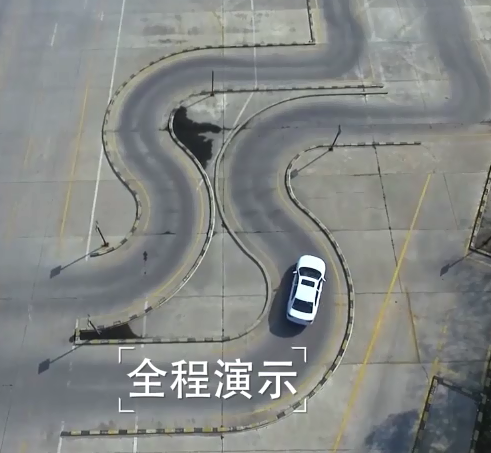
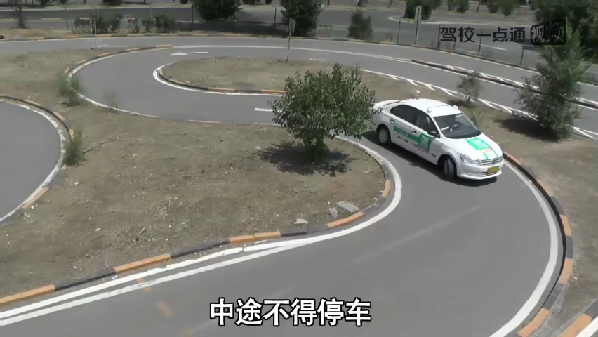
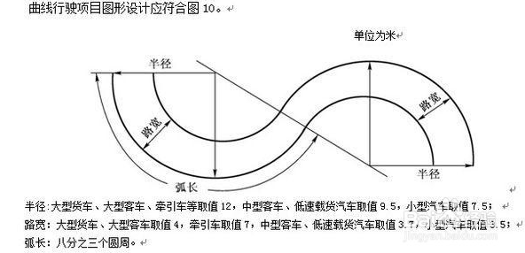
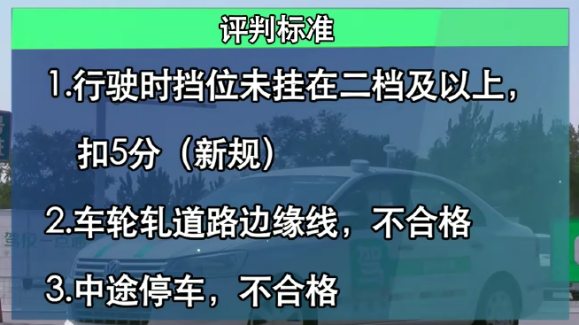

<!-- TOC depthFrom:1 depthTo:6 withLinks:1 updateOnSave:1 orderedList:0 -->

- [曲线行驶](#曲线行驶)
	- [项目简介](#项目简介)
	- [考试要求](#考试要求)
	- [基本步骤](#基本步骤)
	- [基本方法](#基本方法)
	- [常见错误](#常见错误)
	- [要点](#要点)
	- [左贴右靠顶到底](#左贴右靠顶到底)
	- [参考链接](#参考链接)

<!-- /TOC -->
# 曲线行驶

号称科目二中最简单的一个项目技巧，曲线行驶

## 项目简介

曲线行驶，又叫S弯。这是公认的在科目二中最简单的一个项目，只要有好的车感，控制好速度，S弯是很好过的。但S弯也是有一个难点的，S弯和其他的项目不一样，其他的项目你可以找到一个死的点，在到点之后直接将方向打死来通过，S弯更注重的是在**行驶过程中的微调**。

曲线行驶是要求在7.5米半径圆弧的基础之上，弧长为八分之三个圆周，宽为3.5米。其实3米多已经很宽了。

## 考试要求

* 没有说打转向灯，不是所有地区都要求转向灯的哦

## 基本步骤

1. 进入曲线前

在进入曲线时，挂1挡用半联动控制速度，前行过程中不能停车。一定要通过观察车头盖的位置，尽量使车辆外前轮靠近曲线的右侧边缘线行驶。**具体判断方法如下：以车头盖右边的缝隙为参照点，使其靠近曲线右边缘线为准，则车身基本处在曲线靠右的合适位置。**

2. 进入曲线，前半段为向左转弯

曲线的前半段为向左转弯，具体方法如下：**保持车辆相对靠近右边行驶，以左雨刷器的大螺钉为参照点，当车辆行驶至大螺钉与右边缘线重合(或者快触碰)时，慢慢微调方向，始终保持着大螺钉和右边缘线基本重合(这就好比以大螺钉为画笔，控制车辆，一直沿着曲线画圈)，沿着右曲线向左转弯，车辆就不会压线或出线了。**

3. 何时准备右转弯

当车辆以雨刷大螺钉为参照点沿曲线右边缘线，向左转弯行驶完成后，保持方向不变，行驶至车头**引擎盖左边缝隙**快触碰或是接近曲线左边缘线时，回正方向让车辆前行。

4. 如何进行向右转弯

原理和左转弯类似，保持车辆前行至**雨刷大螺钉**重合(或快触碰)曲线左边缘线为参照点，慢慢微调方向，始终保持着大螺钉和左边缘线基本重合(这就好比以大螺钉为画笔，控制车辆，一直沿着曲线画圈)，沿着曲线左边缘线向右转弯。

5、最后出曲线时

当车头已看不到曲线，并无参照点来观察时，说明车辆已完成向右转弯并即将驶出曲线，这时候，切不可大意，车头对准出口，向左回方向的同时，一定要通过后视镜观察车辆与曲线的间距，特别是保持右边车距曲线边缘线30公分(30cm)为最佳。

## 基本方法

## 常见错误

## 要点

* 车速一定要缓慢，不能过快。车速快特容易压线。
* 一定不能让车角与边缘线重合，不然会后轮压线。

## 左贴右靠顶到底

车头左转的时候向右靠，右转的时候向左靠，每次靠的时候离路边大概30cm

因为前轮的转弯半径比后轮大，所以要向外侧让，为内侧的后轮里留出足够的转弯空间，防止后轮碰马路牙子(线)，这就是左贴右靠

顶到底指的是S型弯道中的直行点，需要使劲往前扎，视觉上上了草坪(过了线)才转弯，实际上刚刚好

---

## 参考链接

* <https://www.bilibili.com/video/av8995749/?p=2>
* <https://www.bilibili.com/video/av11299759>
