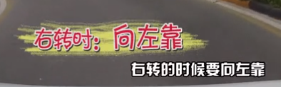
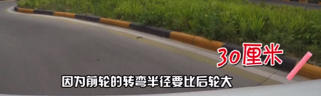
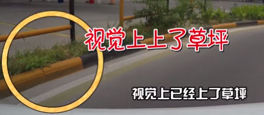

<!-- TOC depthFrom:1 depthTo:6 withLinks:1 updateOnSave:1 orderedList:0 -->

- [曲线行驶](#曲线行驶)
	- [左贴右靠顶到底](#左贴右靠顶到底)
	- [科目二曲线行驶,新捷达看不到车头,找不到点,怎么办?](#科目二曲线行驶新捷达看不到车头找不到点怎么办)
	- [参考链接](#参考链接)

<!-- /TOC -->

# 曲线行驶

科目二中最简单的一个项目技巧，曲线行驶

曲线行驶，又叫S弯。这是公认的在科目二中最简单的一个项目，只要有好的车感，控制好速度，S弯是很好过的。但S弯也是有一个难点的，S弯和其他的项目不一样，其他的项目你可以找到一个死的点，在到点之后直接将方向打死来通过，S弯更注重的是在**行驶过程中的微调**。

## 左贴右靠顶到底

车头左转的时候向右靠，右转的时候向左靠，每次靠的时候离路边大概30cm

因为前轮的转弯半径比后轮大，所以要向外侧让，为内侧的后轮里留出足够的转弯空间，防止后轮碰马路牙子(线)，这就是左贴右靠

顶到底指的是S型弯道中的直行点，需要使劲往前扎，视觉上上了草坪(过了线)才转弯，实际上刚刚好

## 科目二曲线行驶,新捷达看不到车头,找不到点,怎么办?

---

## 参考链接

* <https://www.bilibili.com/video/av8995749/?p=2>
* <https://www.bilibili.com/video/av11299759>
