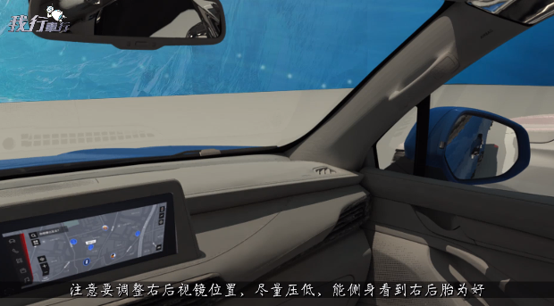
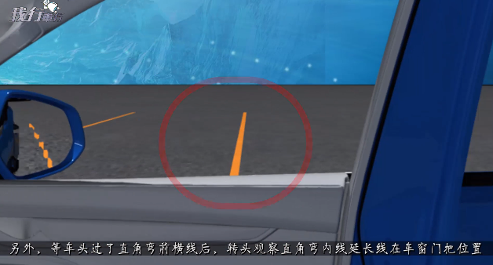
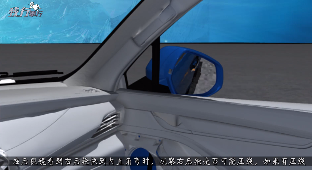
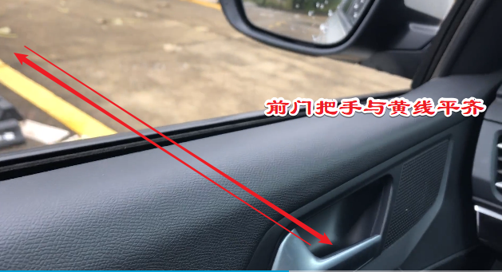
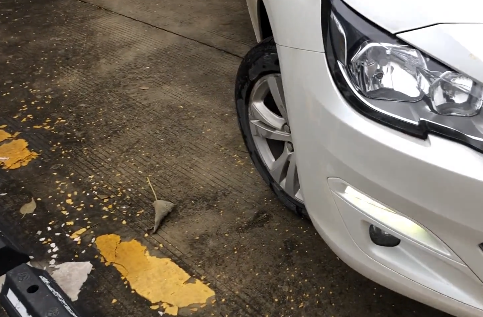

# 直角转弯

## 快速要诀

1. 调整后视镜位置，尽量能看到后轮胎为好
2. 进入转弯口放慢速度。
3. 左转弯往右靠一点，右转弯往左靠一点，但是不要压边线，注意看反光镜。轮胎与边线在15~20公分。并且保持车身正。
4. 车头过了直角弯前横线后，观察直接弯内延线延长线在车窗门把手位置。方向盘向右/左打满
5. 最好能注意观察对侧后视镜，观察后轮会不会压线，如果要压线，马上回转方向盘一些，待车子前行一些，后轮过直角弯，马上打死方向盘。完成转弯。

## 详细解释

1. 左转弯往右靠一点，右转弯往左靠一点，但是不要压边线，注意看反光镜。

2. 前门把手与黄线平齐。快速左侧打满方向盘

---

## 参考链接

<https://www.bilibili.com/video/av13525522?from=search&seid=17425229871199395178>
