<!-- TOC depthFrom:1 depthTo:6 withLinks:1 updateOnSave:1 orderedList:0 -->

- [训练车型](#训练车型)
	- [捷达-一汽大众](#捷达-一汽大众)
	- [新桑塔纳-上海大众](#新桑塔纳-上海大众)
	- [爱丽舍](#爱丽舍)
	- [大众历史](#大众历史)

<!-- /TOC -->
# 训练车型

* 考试车型包括： 捷达 新桑塔纳 爱丽舍
* 驾校考试基本都用捷达和桑塔纳

---

## 捷达-一汽大众

捷达（Jetta）是德国大众汽车集团在中国的合资企业——**一汽-大众汽车有限公司生产汽车品牌**，捷达(Jetta-MK1)于1979年在欧洲上市。就其结构来看Jetta（包括后来的Vento/Bora）都是加了车尾行李箱的Golf，Jetta可以看作是Golf的衍生型。

1991年12月5日第一辆国产[ 捷达 ]A2在一汽-大众轿车厂组装下线，是大众在1983年第二代德国捷达A2的基础上改观和升级的版本。从此，捷达在近26年的时间里，不断在中国市场突破自我，截止到2016年累计销售超过3600000台，有“公路精品”、“神车”、“中国家轿第一品牌”的美誉。

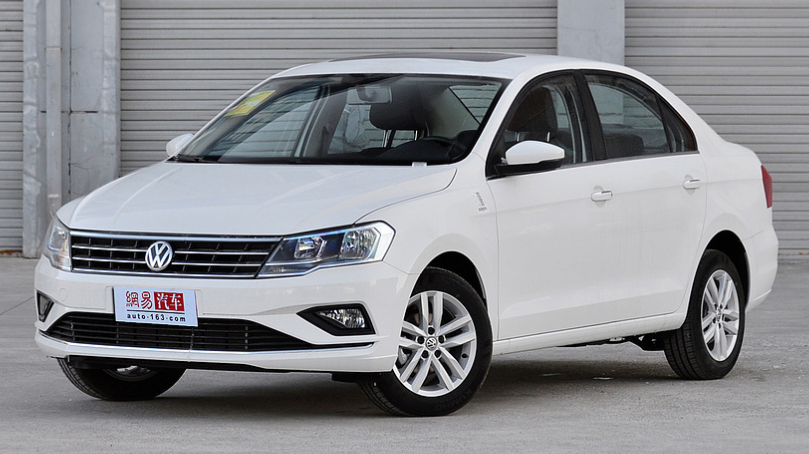

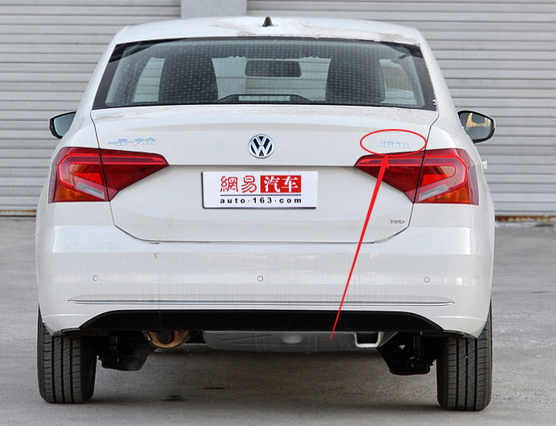

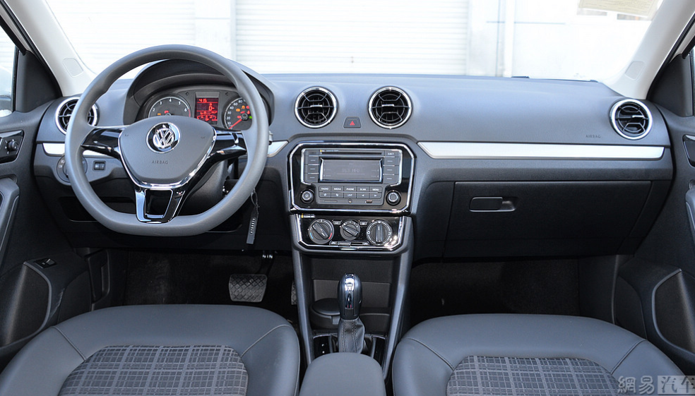

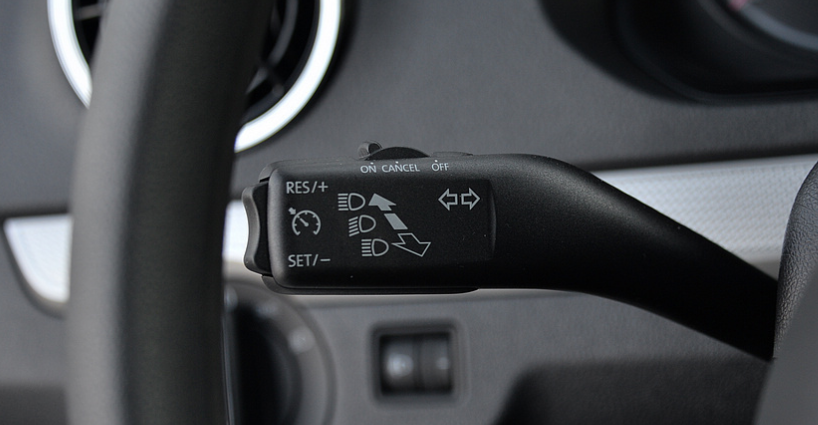

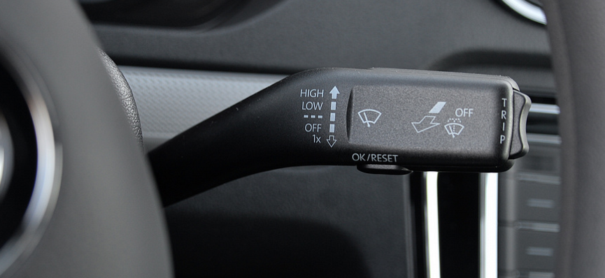


---

## 新桑塔纳-上海大众

2012年12月16日，上海大众宣布，全新桑塔纳正式上市，新车共推出1.4L和1.6L排量共8款车型选择，售价区间为8.49-12.38万元。

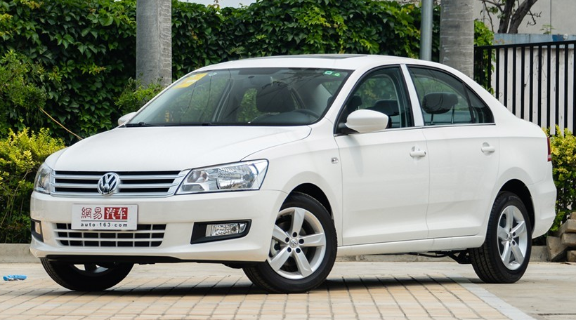

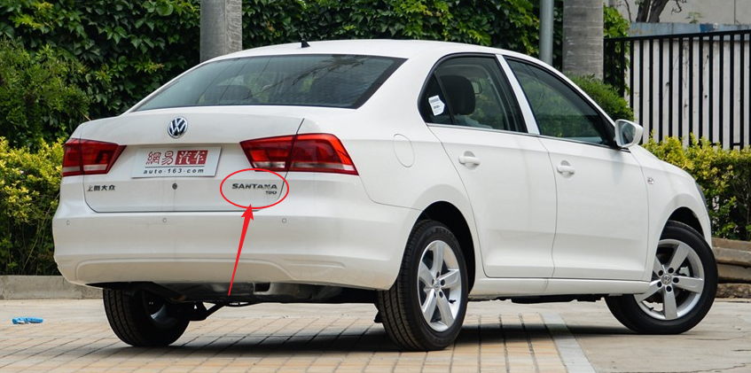

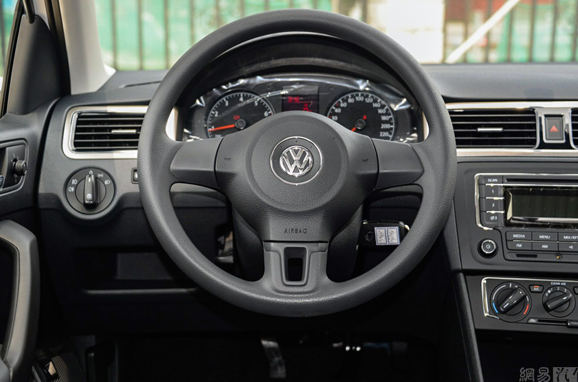

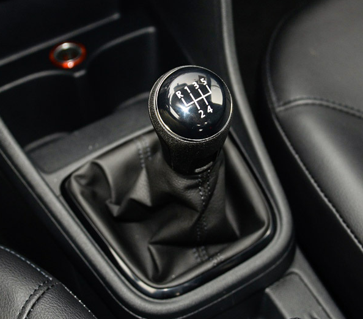

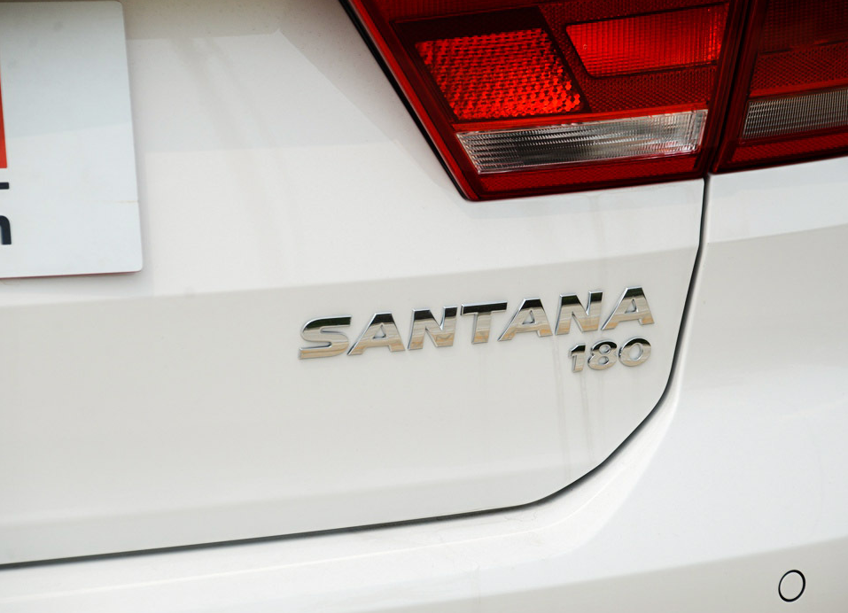


---


## 爱丽舍


爱丽舍是**法国雪铁龙汽车公司**2002年推出的一款家用轿车，流畅而现代的造型完全传承了雪铁龙轿车的特有风格，东风雪铁龙联合推出的爱丽舍轿车将法国风情与中国时尚完美结合起来。

爱丽舍在中国屡创传奇佳绩，以“可靠品质、使用经济性和安全性”赢得了六十万家庭的信赖与肯定。经过长时间的品质见证和口碑积累，爱丽舍已化身为中国车坛的“常青树”，随着2013年09月26日基于PSA EMP1全球同级最新平台制造的首款车型全新爱丽舍在北京国家会议中心的上市，全新爱丽舍将以崭新的姿态延续着爱丽舍的辉煌，东风雪铁龙也将正式将老款车型更名为“经典爱丽舍”，以彰其经久荣耀。

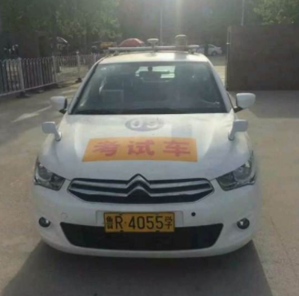

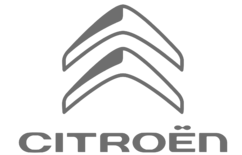

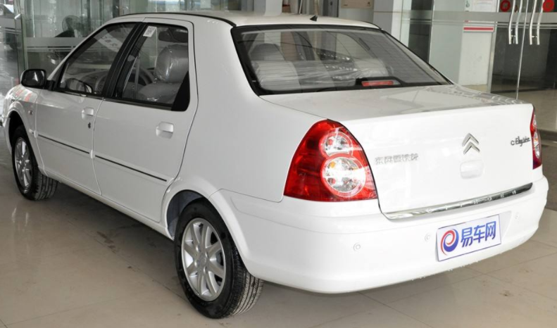

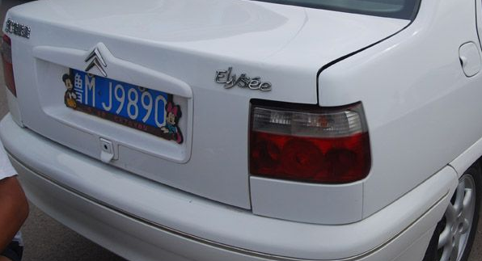

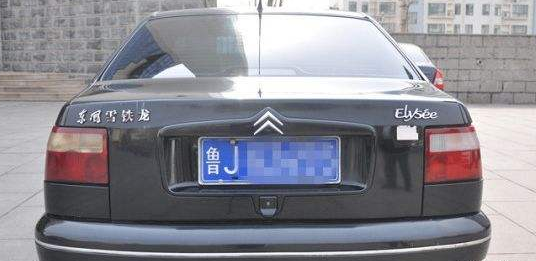


PS：
东风雪铁龙是中国最大汽车公司之一的东风汽车公司与法国PSA集团在中国的大型合资品牌。东风汽车公司始建于1969年，是中国汽车行业的骨干企业，该公司经过了多年的建设。

---


## 大众历史

德国大众公司是在1936年，当时的希特勒有一个想法是，让德国每个普通的人都能够开上廉价的汽车。就是在这个宏观的想法之下诞生德国大众汽车，经过这么多年的不断努力，终于壮大。

大众汽车是进入中国比较早的车企。想必大家都知道，八九十年代的神车大众桑塔纳。即使现在在路上，也时常能够看到它的身影。经过这么多年的发展。导致如今销量与争议都是最多的品牌之一。那么上汽和一汽到底有什么本质的区别呢

首先我们从公司成立时间来分析，一汽大众成立于1991年。在1996年的时候，一汽大众全面投产。一汽大众是中国一汽与德国大众共同经营的合资企业，一汽占股60%，而德国大众占股40%。总部位于吉林长春。目前旗下有捷达，奥迪，速腾，cc。宝来，高尔夫等车型。

上海大众有限公司是上汽集团与德国大众合资企业。成立于1985年，也是合资车企。双方股权各半，总部位于上海安亭。目前旗下有桑塔纳，途安途观，斯柯达，明锐，昊锐。polo，朗逸，帕萨特等车型。

所以从两家大众公司生产的汽车品牌可以看出，高中低档的大众车型都在生产。所以他们也是属于强大的竞争对手。可以从此分析出来，一汽大众和上汽大众的生产线是不同的。

并且一汽和上汽对于汽车的理念也是不同的观点，一系的车型生产线基本上都是依照德国的生产线照搬照套。而上汽在搬套的基础上，会针对咱中国人的用车习惯，进行适量的优化改进。使上汽更加的适合中国人的用车习惯。从车销量上可以证明这个观点是成立的。


```
上海大众具有中国特色，适合国人习惯。一汽大众照搬德国生产线
```

但假如是从技术实力上来说，似乎两者都没有什么本质上的区别。因为一汽和上汽，几乎都没有自己的顶尖汽车技术团队。所以技术上也谈不上是谁更胜一筹。

他们的品牌价值和品牌文化的角度来说，无论是一汽大众还是上海大众，都是属于大众车企没有什么本质上的区别。

并且他们的汽车生产线都是来自德国。而且零部件的采购标准也是德国人定制的。从帕萨特和迈腾上就可以看出。距离远的话，你从车头真的能分辨出来吗？

至于一汽和上汽到底谁更好，众说风云。
