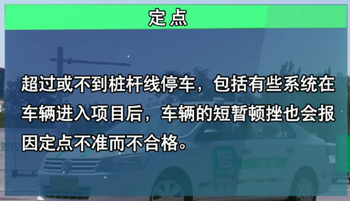

<!-- TOC depthFrom:1 depthTo:6 withLinks:1 updateOnSave:1 orderedList:0 -->

- [陡坡定点停车与起步](#陡坡定点停车与起步)
	- [项目简介](#项目简介)
	- [考试要求](#考试要求)
	- [评分标准](#评分标准)
	- [基本步骤](#基本步骤)
	- [基本方法](#基本方法)
		- [摆车](#摆车)
		- [冲坡](#冲坡)
		- [控速](#控速)
		- [看点](#看点)
	- [常见错误](#常见错误)
		- [溜车](#溜车)
		- [熄火](#熄火)
	- [补救措施](#补救措施)
	- [要点](#要点)
	- [训练场截图](#训练场截图)

<!-- /TOC -->
# 陡坡定点停车与起步

## 项目简介

上坡路定点停车与坡道起步是驾驶员考试中的一个考核点，其中包括两个考试项目﹐先是上坡路的定点停车﹐再是坡道的起步行车，是5项必考项目之一。

学好上坡路定点停车与坡道起步可以使机动车驾驶人员在坡道路段停车与起步时熟练操控车辆，**防止车辆在斜坡起步时发动机熄火或向后溜动而造成追尾。**

## 考试要求

定点停车，车辆的前保险杠要在定点停车黄线的中间，保险杠不得超越或后缩黄线50厘米，前后右轮要停在边缘黄线和白线之间（宽度30厘米）。**坡道起步，要求车辆倒溜不超过30厘米。**

1. 车身侧面与该实线距离不得超过30厘米，且不能压到实线。
2. 坡道起步，要求车辆倒溜不超过30厘米，起步时间不得超过30s

## 评分标准

1. 车辆停止后，汽车前保险杆未定于桩杆线上，且前后超出50厘米，不合格；
2. 车辆停止后，汽车前保险杆未定于桩杆线上，且前后不超出50厘米，扣10分；
3. 车辆停止后，车身距离路边缘线30厘米以上，50厘米以下，扣10分；
4. 车辆停止后，车身距离路边缘线50厘米以上，不合格；
4. 中途熄火，扣10分；
5. 起步时一旦挂挡﹐ 30秒内不驶离原地﹐不合格。

## 基本步骤

1. 听到“上坡定点停车”指令后，立刻打右转向灯，方向向场地右侧靠；
2. 即将到达路边时，方向向左回小半圈，再迅速向右回正，使车右侧与路边保持平行，并距离在50cM内(以前方停车点白线为参照物，不得越白线)；
3. 踩离合，慢速迫近停车点，当右车盖右侧中点到停车牌时踩脚刹，停车，拉手刹(听到2响为止)、关转向灯；
4. 起步前，挂1挡、打左转向灯
5. 慢抬离合至车头上扬，手握手刹柄随时准备起步；当车身有抖动感觉时或发出齿轮磨合声音时，放手刹，车即向前行进。

## 基本方法

摆车+冲+控+停车

### 摆车

### 冲坡

### 控速

### 看点

## 常见错误

### 溜车

溜车的原因就是在离合接触点离合抬得偏低或者没有给油的情况下就松开手刹造成的。

### 熄火

熄火的原因是出现溜车后急忙刹车或抬离合造成的，或者是起步时离合抬过了接触点但手刹松晚了造成的。

## 补救措施

## 要点

1. 上坡前应在最短时间内把方向调正。
2. 在上坡时候应打右转向向场地右侧靠，使车右侧与道路右边一条实线平行，车身侧面与该实线距离不得超过30厘米，且不能压到实线。
3. 注意离合器、加速踏板和驻车制动杆（手刹杆）的协调配合，放松驻车制动杆（手刹杆）的时机。
4. 上坡后马上要过单边桥了，故速度不宜过快。

## 训练场截图

