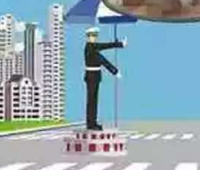

# 常错题

先减速

这种题，特么的不是还有abs么？又不说是高速公路，你说是啥就是啥。。我勒个去

只需要是个坑

这题真特么坑，我又不是驾驶中型客车

下长坡最安全的制动措施就是利用发动机制动

高速路也是这样么？

尴尬的错误

abs的作用如此

别开没用的灯，应该开的没开也是错

车子掉水里，车内压力低于车外压力，想要开门很困难，即使打开车门也会被水冲回来，可能造成更大伤害。所以应该等内外压力差不多的时候开门

这个手势很迷啊，主要是图看不清。其实你不用看太清楚图的

这道题，紧跟其后，伺机再超很有诱惑力啊

这里，必要的时候可以这样做。可以倒车也

这里是转向失控，能停车必须停车。但是在泥泞路段，转向失控，踩刹车没用啊，只能调整一下方向盘先。但不管怎样，都要减速甚至停车。

我又不考A2，出这种题，过去就是一锤子

没大注意看，上面有红边的两股先交

其实我在想必须直接停车。。你懂得

---
