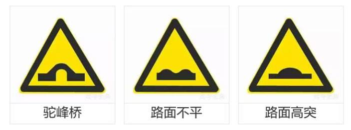

# 科目四易错点记忆

* “搬运昏迷失去知觉的伤员首先采取仰卧位” - 巨坑题，是**去枕仰卧位**
* “受伤者在车内无法自行下车时，可设法将其从车内移出，避免二次伤害” - 巨坑题，反正你选正确就是。避免+二次=对
* 进入环岛可以不用开转向灯 - 巨坑题 - 有些地区变道就要开
* 巨坑题 - 选对就是
 - 
* 红灯右转弯，如果红绿灯比较简易右转弯不受红灯影响。比较高级的红绿灯会为各个方向标明红绿灯，这个时候乖乖看信号
 - 
 - 
* “脊柱骨折的伤员，不能扶，但是可以用担架运送” - 不仅不能扶，而且不能用担架运送。
* “骨折出血” - 不管三七二十一先止血
* “烧伤伤员可以喝淡盐水” - 皮肤烧伤会损失体液，烧伤后口渴不能喝白开水，而淡盐水可以补充体液。
* “全身烧伤采取哪种紧急措施？” - 沙土覆盖会造成感染，脱衣服会把皮扯下来，灭火器喷出来东西可能对皮肤造成伤害。所以只能用水
* “动脉出血” - 管他三七二十一近心端动脉按压。近心端=靠近心脏
* “抢救出血伤员” - 管他三七二十一先止血，不然你没干完其他的就已经JJ了
* “防止二次事故” - 标记伤员的原始位置不是你该干的活儿
* “雾天在高速路上发生事故，不要下车走动？” - 你必须到护栏外面，免得后面车再撞你一波，你么你到护栏外面要不要走动？
  - 打开双闪警示灯
  - 车辆尽量停放在右侧应急车道或紧急停车带内
  - 夜间打开尾灯示宽灯
  - 车尾150m内放三角警示牌或警示物
  - 人不能在路内走动，找死么？
  - 人不能在车里等死。必须到护栏外等候
* “大雾天气” = 能见度小于50m
  - 开启雾灯，危险报警闪光灯，**近光灯**，示廓灯，前后位灯
  - 车速不超过每小时20公里
  - 必须从最近的出口驶离高速公路
* “救火时候脱去化纤衣服” - 化纤不耐高温，属于化工产品，易燃。你不脱衣服去救火等于帮倒忙+作死
* “发动机着火能开启发动机罩么？” - 开启了供氧=助燃=作死
* “燃油着火，不能用什么灭火?” - 不能用水，因为油和水不相容，水会跑到油下面，燃烧油扩散
* “对向来车正面碰撞位置为驾驶人正前方，驾驶人应急驾驶姿势是什么？” - 不要选两腿蹬直，两腿一蹬直接上西天~
  - 迅速躲开方向盘+往副驾驶躲避+两腿抬起
* “正面碰撞不可避免” - 不能转动转向盘(会造成翻车)，必须果断干错采取紧急制动。不可避免的情况下一般采用紧急制动
* “发动机行车途中突然熄火” - 不能**马上**提车检修，如果高速路上，二次事故就上天了。不能马上提车检修，选对时机
* 动图找违章数量套路-鸣喇叭不算哦
  - 遮挡号码牌
  - 接听电话也算违章哦
  - 没有系安全带也算哦
  - 闯红灯
  - 不按导向箭头行驶
  - 压实线行驶
  - 超速
  - 酒后驾驶
  - 无证驾驶
* “冰雪天气” - 起步前要开启近光灯。雪开近光灯，雾开雾灯
* “安全带作用” - 安全带只能减轻伤害，不可能没有伤害。
  - 头枕保护脖子，关安全带毛线事情
  - 发生碰撞的时候安全带没法保证正确驾驶坐姿，保证也没屁用，这个时候必须躲开碰撞，抬起双脚
  - 安全带能减轻驾驶疲劳??开玩笑，累了系系安全带就好了?
* “狭窄坡路” - 上坡先行，下坡让上坡。上坡危险系数更大所以要让，就跟上路行驶一样，哪个位置更危险就跟应该让其先行
  - 但如果下坡行驶一半的时候，上坡就该让下坡先行
  - 下坡动力充足，上坡停车容易后溜
* “前方路口怎么掉头?” - 掉头看虚线，实线不能压
* “不能掉头?” - 交叉路口，单行路，桥梁，急转弯，陡坡，隧道。反正不是正常直行路面都不可以搞动作，倒车，超车啥的
* “夜间通过没有交通信号灯的交叉路口” - 交替使用远近关灯
  - 夜间通过急转弯、坡路、拱桥、人行横道或者没有交通信号灯控制的路口需要**交替使用远近光灯示意**
* 黄色闪光灯 - 是闪光警告信号灯，要注意前方车辆，**降低车速确认安全后通过**，不是制动停在停车线前
 - 
* 减速慢行大部分时候靠谱，但是遇到人就只能停
 - 
* “检查刮水器” - 既然要刮水就肯定要在有水的地方倒腾，所以在干燥状态下肯定没得玩儿
* “临时停车” - 需要注意
  - 紧靠道路右侧
  - 开关车门不得妨碍其他车辆和行人(临时停车司机不能下车哦)
  - 站三口五、口五站三
  - 开启右转向灯
  - 起步前开启左转向灯
* 题目中，让对方车辆先行基本属于正确，反正礼让就是正确。主动礼让，确认安全后通过
  - 车辆拥挤你必须礼让
  - 对方不让超车你必须放弃超车
  - 对方开到前方特殊道路一半你刚进去也必须让对面先，尤其是上坡的时候
* “交叉路口变更车道如何驶入变更的车道？” - 实线不能跨越，所有实线都是错。在虚线区按导向箭头指示
  - 变更车道必须提前开启转向灯，必须确认安全后才可变更车道，不得影响其他车辆。凡是遇到“迅速”基本都是坑
* “警告标志，两侧变窄长度为5公里” - 这里意思是变窄的道路持续5公里都是窄的
  - 
* 右侧变窄交通警告标志说明车行道右侧缩窄，右侧变窄交通警告标志设在窄路以前适当位置。
  - 只看道路变窄的那一端，不看不变的，命名也是看变化的那一端。下图分别是左侧变窄，右侧变窄
  - 
* “隧道标志”  - 隧道标志标明车辆减速慢行。中间的黄实线表示双向通行
 - 
* 驼峰桥和路面不平 - 空心的才是桥，实心的都是路面
 -  

---
