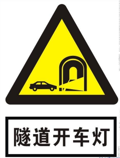
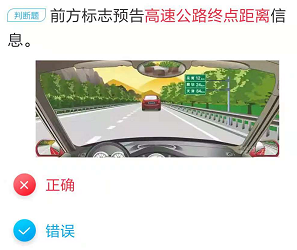

# 科目四易错点记忆

* “搬运昏迷失去知觉的伤员首先采取仰卧位” - 巨坑题，是**去枕仰卧位**
* “受伤者在车内无法自行下车时，可设法将其从车内移出，避免二次伤害” - 巨坑题，反正你选正确就是。避免+二次=对
* 进入环岛可以不用开转向灯 - 巨坑题 - 有些地区变道就要开
* 巨坑题 - 选对就是
 - 
* 巨坑题 - 选正确就是
 - 
* 红灯右转弯，如果红绿灯比较简易右转弯不受红灯影响。比较高级的红绿灯会为各个方向标明红绿灯，这个时候乖乖看信号
 - 
 - 
* “大雾天气在高速路上遇到交通事故不能继续行驶”
  - 不要做的事情就是做多余的事情，比如说沿车道到车后设置警告标志
  - 
* “泥泞路段行车如何控制车速匀速一次性通过?”
  - 泥泞路段最怕熄火，要控制好油门
  - 
  - 泥泞道路最容易出现车轮侧滑，侧滑会导致方向失控
* “泥泞道路侧滑怎么控制方向盘”
  - 一般侧滑都指的是后轮侧滑，方向盘跟侧滑同向就可以了
  - 如果前轮侧滑，那么久反向
* “3车道，车速高于90，低于110最不该在哪个车道行驶?”
  - 最左侧，为嘛？车速过快不会影响后面的车，但是车速慢了影响后车就是你的不对了
* “大风天气，突然感觉方向盘难以控制，该怎么办？”
  - 双手握紧方向盘就行了
  - 大风天气风向不固定，乱转方向盘会出事的
  - 控制好方向稳住方向减速行驶，才能在大风天气存活
  - 大风天气也不能紧急制动，譬如高速路上大风
  - 大风天气不可以超车，特殊路段特殊天气都不可以哦
* 交叉路口预告标志 - 指示各个方向终点信息
  - 白色表方向，红色表示终点，黄色表示出口
  - 
    - 各行其道是指汽车、自行车、行人各自按照道路上的表示提示前进、行走
    - 图上所示为交叉路口预告
  - 
* “脊柱骨折的伤员，不能扶，但是可以用担架运送” - 不仅不能扶，而且不能用担架运送。
* “骨折出血” - 不管三七二十一先止血
* “烧伤伤员可以喝淡盐水” - 皮肤烧伤会损失体液，烧伤后口渴不能喝白开水，而淡盐水可以补充体液。
* “全身烧伤采取哪种紧急措施？” - 沙土覆盖会造成感染，脱衣服会把皮扯下来，灭火器喷出来东西可能对皮肤造成伤害。所以只能用水
* “动脉出血” - 管他三七二十一近心端动脉按压。近心端=靠近心脏
* “抢救出血伤员” - 管他三七二十一先止血，不然你没干完其他的就已经JJ了
* “防止二次事故” - 标记伤员的原始位置不是你该干的活儿
* “雾天在高速路上发生事故，不要下车走动？” - 你必须到护栏外面，免得后面车再撞你一波，你么你到护栏外面要不要走动？
  - 打开双闪警示灯
  - 车辆尽量停放在右侧应急车道或紧急停车带内
  - 夜间打开尾灯示宽灯
  - 车尾150m内放三角警示牌或警示物
  - 人不能在路内走动，找死么？
  - 人不能在车里等死。必须到护栏外等候
* “大雾天气” = 能见度小于50m
  - 开启雾灯，危险报警闪光灯，**近光灯**，示廓灯，前后位灯
  - 车速不超过每小时20公里
  - 必须从最近的出口驶离高速公路
* “救火时候脱去化纤衣服” - 化纤不耐高温，属于化工产品，易燃。你不脱衣服去救火等于帮倒忙+作死
* “发动机着火能开启发动机罩么？” - 开启了供氧=助燃=作死
* “燃油着火，不能用什么灭火?” - 不能用水，因为油和水不相容，水会跑到油下面，燃烧油扩散
* “对向来车正面碰撞位置为驾驶人正前方，驾驶人应急驾驶姿势是什么？” - 不要选两腿蹬直，两腿一蹬直接上西天~
  - 迅速躲开方向盘+往副驾驶躲避+两腿抬起
* “正面碰撞不可避免” - 不能转动转向盘(会造成翻车)，必须果断干错采取紧急制动。不可避免的情况下一般采用紧急制动
* “发动机行车途中突然熄火” - 不能**马上**提车检修，如果高速路上，二次事故就上天了。不能马上提车检修，选对时机
* “高速公路，天气影响，能见度在100~200之间，该怎么做?”
  - 开启雾灯、近光灯、示廓灯、前后位灯
  - 车速不超过60km每小时
  - 与同车道车距保持100m以上
* “高速公路，能见度小于100m”
  - 与前车保持50m以上距离
  - 车速不超过40km每小时
  - 开启危险报警闪光灯
  - 不得在应急车道行驶
* “高速公路遇到紧急情况避免”
  - 高速路上不要轻易转动方向盘，很容易引起侧方。你能做的只有稳住方向然后采用制动措施减速
  - 高速路上突然爆胎，你能做的也只是握紧方向盘，不要转动方向盘。立即松开加速踏板，轻踩制动踏板
  - 如果车辆转向失控，碰撞不可避免，那么你只能紧急制动。这里没有说高速路啊，但就算高速路这时候也必须制动了，看情况
  - 高速公路车发生故障要到应急停车道躲避
  - 高速公路转向失灵，也不能使用紧急制动，因为是高速路，容易翻车
* 动图找违章数量套路-鸣喇叭不算哦
  - 遮挡号码牌
  - 接听电话也算违章哦
  - 没有系安全带也算哦
  - 闯红灯
  - 不按导向箭头行驶
  - 压实线行驶
  - 超速
  - 酒后驾驶
  - 无证驾驶
* “冰雪天气” - 起步前要开启近光灯。雪开近光灯，雾开雾灯
* “安全带作用” - 安全带只能减轻伤害，不可能没有伤害。
  - 头枕保护脖子，关安全带毛线事情
  - 发生碰撞的时候安全带没法保证正确驾驶坐姿，保证也没屁用，这个时候必须躲开碰撞，抬起双脚
  - 安全带能减轻驾驶疲劳??开玩笑，累了系系安全带就好了?
* “狭窄坡路” - 上坡先行，下坡让上坡。上坡危险系数更大所以要让，就跟上路行驶一样，哪个位置更危险就跟应该让其先行
  - 但如果下坡行驶一半的时候，上坡就该让下坡先行
  - 下坡动力充足，上坡停车容易后溜
* “前方路口怎么掉头?” - 掉头看虚线，实线不能压
* “不能掉头?” - 交叉路口，单行路，桥梁，急转弯，陡坡，隧道。反正不是正常直行路面都不可以搞动作，倒车，超车啥的
* “夜间通过没有交通信号灯的交叉路口” - 交替使用远近关灯
  - 夜间通过急转弯、坡路、拱桥、人行横道或者没有交通信号灯控制的路口需要**交替使用远近光灯示意**
* 黄色闪光灯 - 是闪光警告信号灯，要注意前方车辆，**降低车速确认安全后通过**，不是制动停在停车线前
 - 
* 减速慢行大部分时候靠谱，但是遇到人就只能停
 - 
* “检查刮水器” - 既然要刮水就肯定要在有水的地方倒腾，所以在干燥状态下肯定没得玩儿
* “临时停车” - 需要注意
  - 紧靠道路右侧
  - 开关车门不得妨碍其他车辆和行人(临时停车司机不能下车哦)
  - 站三口五、口五站三
  - 开启右转向灯
  - 起步前开启左转向灯
* 题目中，让对方车辆先行基本属于正确，反正礼让就是正确。主动礼让，确认安全后通过
  - 车辆拥挤你必须礼让
  - 对方不让超车你必须放弃超车
  - 对方开到前方特殊道路一半你刚进去也必须让对面先，尤其是上坡的时候
* “交叉路口变更车道如何驶入变更的车道？” - 实线不能跨越，所有实线都是错。在虚线区按导向箭头指示
  - 变更车道必须提前开启转向灯，必须确认安全后才可变更车道，不得影响其他车辆。凡是遇到“迅速”基本都是坑
* “警告标志，两侧变窄长度为5公里” - 这里意思是变窄的道路持续5公里都是窄的
  - 
* 右侧变窄交通警告标志说明车行道右侧缩窄，右侧变窄交通警告标志设在窄路以前适当位置。
  - 只看道路变窄的那一端，不看不变的，命名也是看变化的那一端。下图分别是左侧变窄，右侧变窄
  - 
* “隧道标志”  - 隧道标志标明车辆减速慢行。中间的黄实线表示双向通行
 - 
* 驼峰桥和路面不平 - 空心的才是桥，实心的都是路面
 - 
* “左转弯待转区域” - 只供左转弯车辆使用，在同向直行绿灯亮时，虽然左转弯是红色，但此时允许左转弯车辆进入带转区域等候
 - 
 - 
* 路面标记 - 白色表示最低车速，黄色表示最高车速
  - 如果路面标记和道路标记同时存在，肯定优先看道路标记，因为道路标记容易更改
* 交警没有手势，看到绿灯可以直接通行
* 行车前遇到牲畜，不要鸣喇叭，鸣喇叭会造成牲畜受惊，可能引发更严重的交通问题。减速让行，必要时停车让行
* “遇到校车停靠” - 需要看车道数
  - 如果同向两条车道，那么校车后方及邻近车道就应该停车等待
  - 如果同向三条车道，那么最左侧车道减速慢行，中间及最后侧校车后方车辆都要停车等待
* “超车”
  - 超车只能左超车
  - 提前开启左转向灯，试图回到原车道需要开启右转向灯
  - 夜间超车需要变换远近光灯
  - 超车可以鸣喇叭，但是不能持续，长时间鸣笛
  - 被超车了应该乖乖减速靠右(真乖)
  - 必须保证有足够的距离，超车前和超车后都是酱紫
* “下陡坡过程中行车制动器失效”  - 刹车失灵要想尽一切办法停车
  - 驶入紧急避险车道
  - 使用发动机制动
  - 必要时候刮擦路边障碍物
  - 使用驻车制动器制动
  - 
* “上坡路段接近破顶时，超车存在风险” - 主要是视线受阻，跟车速没半毛钱关系，这个时候应该是匀速或最高速度的，降速会导致后溜
* “夜间会车” - 距对向来车150m以外改远光灯为近光灯，目的也会考，便于双方观察前方情况
* “下坡路段停车如何使用行车制动器” - 比平路时提前。以为下坡有收到重力影响
  - 很明显上坡路停车比平路时晚一丢丢
* “上/下坡停车技巧”
  - 反正车轮胎方向要使车后溜的时候能够往路边缘方向靠就行
  - 本质就是借用路边缘增加阻力，偏向路边
* “会车”
 - 
* “急转弯”
 -  
   - 首先急转弯是不能停车的
   - 特殊路段，窄路窄桥急转弯隧道都是不能停车或掉头或超车，因为易引发事故
* “最容易发生侧滑的路面”
  - 下雨开始时的路面。刚下雨时水和路面的泥土混合形成水膜，会极大降低汽车的附着力，容易造成侧滑。相当于路面加了一层润滑剂
  - 下大雨时候，雨水会洗净路面污浊物，就不滑了
* “冰雪路面” - 冰雪路面易滑，紧急制动和急转弯都会造成侧方或者侧滑
  - 冰雪路面发现车辆偏离方向应该做啥？停止踩刹车
* “惯性冲坡”
 - 
* 道路标志
 - 
 - 
 -  开车灯不是减速慢行
 - 
   - 
   - 
 - 
   - 禁止通行 = 禁止一切车辆通行，车辆和行人不能再向前行驶及通过。红色圆圈表示禁止，白底表示空白也就是什么都没有，说明什么都不准进去
   - 禁止驶入 = 禁止机动车辆驶，人还是可以走滴
 - 
   - 错车道用来避让来车的
   - 紧急停车带不用解释了吧
 - 
   - 分流是绿底的标志且分流的线是斜的
   - 车道数增加是蓝底的，车道数量增加的线是直的
 - 
   - 
     - 这题很明显不是终点标志，仅仅告知前方经过的重要城镇的地名和距离
     - 带箭头的是终点，不带箭头的是经过的地名
     - 

---
